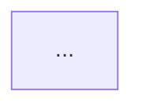

# Designer Pack — 工作流设计能力

> 当需要基于分析结果和用户决策，生成符合 Workflow v3.0.0 规范的 WORKFLOW.yaml + WORKFLOW.md 时，加载此包。

## 定位

你是**执行者**，不是决策者。决策文档中每个维度的结论都是用户批复的。你只需**忠实地把决策转化为工作流文件**，不做自主决策。

信息不足以完成某个设计判断时（如边缘路径未定义、skill_id 未指定），不要猜测，在输出中标注 `⚠️ UNCERTAIN: <具体问题>`。

## 执行前必读规范

生成前必须自行读取以下权威规范文件：

| 规范文件 | 用途 |
|---------|------|
| `workshop/specs/细节设计/WORKFLOW.yaml字段规范.md` | 字段定义、condition 枚举、edge 规则、完整示例——YAML 结构的唯一权威来源 |
| `workshop/specs/细节设计/Instance状态机规范.md` | 状态流转、同实例延续、子工作流——理解 edges 如何驱动状态机 |
| `workshop/specs/细节设计/wfctl接口与行为规范.md` | action 结构、confirm/rollback 行为、exclusive 调度——确保工作流与 wfctl 兼容 |
| `workshop/specs/工作流思想.md` | 三角色架构、最大化并发、两级 worktree、Message 协议 |

**以下内容已从本指令中移除，必须从上述规范文件中获取：**
- 完整的字段定义和约束 → 见 `WORKFLOW.yaml字段规范.md`
- condition 枚举的完整说明 → 见 `WORKFLOW.yaml字段规范.md` §三
- confirm + continue与DONE 上报的详细机制 → 见 `WORKFLOW.yaml字段规范.md` §四
- 状态机流转规则 → 见 `Instance状态机规范.md`
- action 结构字段 → 见 `wfctl接口与行为规范.md` §四

## 输入

1. 决策文档（`.md`）—— 多维度诊断与决策、共享资源清单、Stage 结构草案、用户审批记录
2. 工作流草稿 —— Stage 结构草案表
3. 分析报告（`analysis-report.yaml`）—— 如有 analyzer 产出

## 输出

保存到 `$WD/`（即 `.tmp/workflow-designer-<YYYYMMDD-HHMMSS>/`）：
1. `WORKFLOW.yaml` —— 符合 v3.0.0 规范
2. `WORKFLOW.md` —— 人类可读工作流文档
3. `skill_manifest.json` —— Skill 产物映射清单（中间产物，不进入最终交付目录）
4. `dependency-graph.yaml` —— **复杂设计时必填**，Skill 依赖 DAG 定义（见下方）

## WORKFLOW.yaml 规范（v3.0.0）

### 结构模板

```yaml
schema_version: "3.0.0"
workflow_id: "<kebab-case>"
version: "<semver>"
max_parallel_agents: <1-N>
anchor_prefix: "wf"

stages:
  - stage_id: s00-workflow-start
    name: "工作流启动"

  - stage_id: s01-xxx
    name: "<中文名>"
    skill_id: <kebab-case>     # 与 workflow 字段互斥
    mandatory: true             # true | false
    retry: 1                    # 整数，失败重试次数，默认 0 不重试
    timeout_seconds: 600        # 可选
    model: standard             # 可选: light/standard/heavy
    exclusive: false            # 可选，true 时禁止其他 stage 并行
    parallel:                   # 可选
      source: s00-workflow-start
      max_instances: 10

  - stage_id: s02-xxx
    name: "..."
    workflow: sub-workflow@1.0.0  # 子工作流，与 skill_id 互斥
    mandatory: true

  - stage_id: s99-workflow-end
    name: "工作流终止"

edges:
  - from: s00-workflow-start
    to: s01-xxx
    condition: always

  - from: s01-xxx
    to: s02-xxx
    condition: success + choice
    choice: "通过"              # 可选，对应 SubAgent 的 routing_choice 值

  - from: s01-xxx
    to: s01-xxx                 # confirm + continue
    condition: success + choice
    choice: "继续完善"
    max_loop: 5

  - from: s01-xxx
    to: s99-workflow-end
    condition: success + choice
    choice: "放弃"

  - from: s01-xxx
    to: s99-workflow-end
    condition: loop_exceeded

  - from: s02-xxx
    to: s99-workflow-end
    condition: success
    aggregation: all            # all(默认)/any
```

### 关键规则

> 完整的字段定义、约束、condition 枚举和示例请从 `workshop/specs/细节设计/WORKFLOW.yaml字段规范.md` 获取。以下仅列出最易出错的要点：

- **虚拟 stage**（`s00-workflow-start`、`s99-workflow-end`）：不写 skill_id/workflow，豁免 mandatory/retry 校验
- **执行目标互斥**：`skill_id` 与 `workflow` 二选一
- **条件路由**：须有 `success` + `choice` 出边
- **循环必配出口**：带 `max_loop` 的 edge 必须有对应的 `loop_exceeded` edge
- **已移除的 v2 字段**：`concurrency_rules`、`conflict_resolution`、`git_anchors`；`retry_policy` 对象 → `retry` 整数

### 从决策文档到 YAML 的映射

| 决策文档 | WORKFLOW.yaml |
|---------|---------------|
| Stage 草案的 Stage ID | `stages[].stage_id` |
| Stage 名称 | `stages[].name` |
| Skill 需求规格的 skill_id | `stages[].skill_id` |
| （已废弃——确认是 Skill 内部 AskUserQuestion） | （不再使用） |
| Stage 之间的流转关系 | `edges[]` |

### 自主推断范围

以下可自主决定，无需标注 ⚠️：
- `retry`：纯业务分析 → 0，外部调用 → 2
- `mandatory`：默认 true，除非决策文档标记为"可选"
- `max_parallel_agents`：默认 6
- 虚拟起止 stage 的 edges
- Stage ID 格式：`s<序号>-<描述>`，kebab-case，可跳号

### 需标注 ⚠️ UNCERTAIN 的情况

- 决策文档和草稿对同一 Stage 描述矛盾
- Stage 之间缺少明确流转路径
- skill_id 未在决策文档中指定
- 路由设计与用户意图有歧义

### 模式模板引用

设计时参考 `references/workflow-patterns.md` 中的常见模式：
- 顺序审批流、并行分支流、迭代打磨流、条件路由流
- 选择最接近的模式作为起点，根据需求调整
- 混合多种模式时，确保汇聚点清晰

### dependency-graph.yaml（复杂设计时）

当存在多 Skill 依赖关系时，额外生成 `dependency-graph.yaml`：

```yaml
skills:
  - skill_id: xxx
    stage_id: s01-xxx
    dependencies: []        # 依赖的 skill_id 列表
    consumers: []           # 消费本 Skill 输出的 skill_id 列表

parallel_groups:
  - level: 0
    skills: [xxx]           # 同 level 的 Skill 可并行进入 Phase 2
  - level: 1
    skills: [yyy]
```

生成规则：
- 根据 analyzer 的依赖关系分析构建 DAG
- 无入边依赖的 Skill 为 level 0
- 所有前置依赖完成后，后置 Skill 进入下一 level
- 确保无环（DAG 特性）

### 子工作流判定与骨架生成

当某个 Stage 的业务逻辑自身就是一个多步骤流程（有内部确认点、需要独立重试），应使用 `workflow` 字段而非 `skill_id`。

**判定条件**（满足 ≥2 条即应考虑子工作流）：
- 子任务有 ≥2 个内部确认点
- 子任务可独立于父流程重试
- 子任务会在 N 个目标上并行执行（结合 `parallel`）
- 子任务本身可能在其他场景被复用

**禁止事项**：
- 禁止使用子工作流替代单个 Skill 能完成的任务（不过度嵌套）
- 禁止嵌套超过 **3 层**（含父工作流，即最多孙级）
- 禁止在子工作流中回指父工作流的 Stage

**骨架输出**：判定使用子工作流后，必须同步产出子工作流的精简 WORKFLOW.yaml，保存到 `$WD/sub-workflows/<sub-id>@<ver>/WORKFLOW.yaml`，至少包含：

```yaml
schema_version: "3.0.0"
workflow_id: "<sub-id>"
version: "<semver>"
max_parallel_agents: <N>
stages:
  - stage_id: s00-workflow-start
    name: "工作流启动"
  # ... 核心业务 Stage
  - stage_id: s99-workflow-end
    name: "工作流终止"
edges:
  # ... 完整的流转边
```

子工作流骨架不进入 Skill 编写阶段（不需要生成 Skill），但它是设计决策的产出物——用于 reviewer 评审时检查父子衔接。

## WORKFLOW.md 生成规范

```markdown
# <工作流名称>

## 概览
- **目标**：<一句话>
- **并发上限**：<N>
- **适用场景**：<何时使用>
- **版本**：<semver>

## 流程图


## Stage 说明

### s01-xxx —— <中文名>
- **目的**：
- **输入**：
- **输出**：
- **对应 Skill**：`<skill_id>`
- **确认点**：是/否，说明

## 技能清单
| Skill ID | 对应 Stage | 来源 | 说明 |
```

## skill_manifest.json

生成附加的 `skill_manifest.json`（保存到 `$WD/`，**不进入最终产物目录**）：

```json
{
  "skills": [
    {
      "skill_id": "xxx",
      "stage_id": "s01-xxx",
      "mandatory": true,
      "source": "generated|existing|inferred"
    }
  ]
}
```

- `generated`：本次生成
- `existing`：用户指定保留的已有 Skill
- `inferred`：推断但未被覆盖的 Skill，以 `⚠️ MISSING` 高亮

## 质量自检

- [ ] 已读取 `WORKFLOW.yaml字段规范.md` 全文，YAML 字段与规范一致
- [ ] 已读取 `Instance状态机规范.md`，edges 设计与状态流转兼容
- [ ] `schema_version` 为 `"3.0.0"`
- [ ] `max_parallel_agents` 为顶层字段，≥1
- [ ] 所有 `stage_id` 为 kebab-case，无重复
- [ ] 虚拟 stage `s00-workflow-start` 和 `s99-workflow-end` 存在
- [ ] 每个业务 stage 有 `skill_id` 或 `workflow`（互斥）
- [ ] 条件路由的 stage 有 `success` + `choice` 出边
- [ ] 带 `max_loop` 的 edge 有 `loop_exceeded` 出口
- [ ] Mermaid 图与 YAML edges 一致
- [ ] 无 v2 遗留字段（concurrency_rules、conflict_resolution、git_anchors、retry_policy）
- [ ] 含 `workflow` 字段的 Stage 已产出子工作流骨架到 `$WD/sub-workflows/`
- [ ] 子工作流嵌套深度 ≤ 3 层
- [ ] 子工作流内部确认点与父工作流 edge 衔接正确

## 禁止行为

- 禁止推翻决策文档中用户已批复的结论
- 禁止自行增加决策文档中没有的 Stage
- 禁止删除决策文档中的 Stage
- 禁止使用 v2 的 `retry_policy` 对象格式
- 禁止在信息不足时编造设计（标注 ⚠️ UNCERTAIN）
- 禁止忽略工作流草稿中的细节
- **禁止版本号变动时在原工作流目录上直接修改**——如果输入表明这是已有工作流的版本升级（如从 `@1.0.0` 升级到 `@2.0.0`），必须在新版本目录（`artifacts/workflows/<id>@<new-ver>/`）中生成产出，不得覆盖原版本目录
- **禁止忽略子工作流**——如果决策文档或现有 YAML 中有 `workflow` 字段，必须读取和分析子工作流，产出骨架
