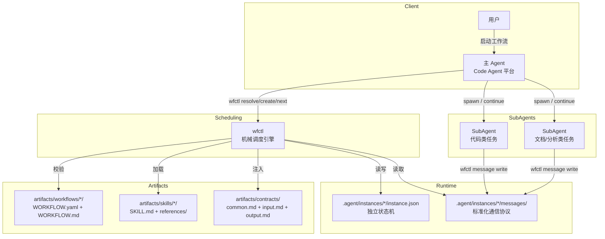

# Workflow 生产车间

> 一套面向 AI Agent 的声明式工作流编排体系——让多 Agent 协作从"手工作坊"升级为"流水线工厂"。
> 当前规范版本：**Workflow v3.0.0**


## Overview / 项目简介

本项目是 **Workflow v3.0.0** 规范的生产车间与参考实现库，致力于解决多 AI Agent 协作中的核心痛点：

- **并发无序**：多个 SubAgent 同时运行时缺乏统一调度，导致资源冲突和竞态条件
- **状态黑盒**：Agent 执行过程不可观测，失败时无法精准回退到指定阶段
- **规范漂移**：工作流定义与实际执行脱节，缺乏版本绑定和一致性校验
- **人机协同粗糙**：用户确认点分布散乱，缺乏统一的收口和上下文管理

### 它不是什么

- **不是自动写代码的机器人**——最终产物是否写入仓库由开发者决定
- **不是 CI/CD 替代品**——不构建、不部署、不监控线上服务
- **不是 SaaS 平台**——没有 Web 界面、多租户、审批流。一切通过命令行和 AI 对话完成
- **wfctl 不是独立服务**——它是主 Agent 手中的命令行工具，不守护、不监听、不持有内存状态

## Design Philosophy / 设计思想

**程序做程序的活，AI 做 AI 的活。** 工作流调度中，读 DAG、判依赖、推状态流转——这些都是机械规则，输入确定则输出确定，不应该放在 AI prompt 里。

系统由三个互不重叠的角色构成：

| 角色 | 本质 | 实现 |
|------|------|------|
| **主 Agent** | 智能决策者 — 理解意图、匹配工作流、呈现确认、全局调度 | 支持 Skill 加载与 SubAgent 调度的 Code Agent 平台（推荐 Claude Code） |
| **wfctl** | 机械调度器 — 读 YAML、判就绪、推流转、返回结构化指令 | `artifacts/scripts/wfctl/`（纯 Python，无 AI） |
| **SubAgent** | 执行者 — 在隔离 worktree 中干活，通过 Message 上报 | 被主 Agent 调度的后台 Agent |

**核心原则**：

- **最大化推进，只在语义阻塞点暂停**：实例化不需要确认，并发不需要用户指令，阶段间流转不需要人点"继续"。阻塞只发生在真正的语义决策点——方案选型、方向分歧、质量存疑
- **规范即权威**：WORKFLOW.yaml 是调度唯一权威，运行时严格 Schema 校验
- **Message 是唯一通信协议**：SubAgent 不直接对话用户，不触碰 instance 状态文件。所有通信通过 `wfctl message write` 上报，主 Agent 统一收口
- **上下文压缩**：主 Agent 持有全局视野但不全量加载。每个 stage 完成后 SubAgent 提供结构化摘要，主 Agent 只持有"当前大局 + 下一步做什么"
- **失败路径与成功路径同等重要**：每个 stage 必须定义失败行为——重试、跳过、或终止实例。可靠的工作流框架不仅取决于正常路径，同样取决于异常路径

### 权限模型：四层防线

不依赖 AI 自觉，依赖架构本身的隔离性和可校验性：

| 层 | 时机 | 机制 |
|----|------|------|
| ① worktree 隔离 | SubAgent 运行中 | 物理屏障——SubAgent 不知 `project_root`，世界局限于自身 worktree |
| ② wfctl 事后校验 | SubAgent 上报完成时 | `git status --porcelain` 获取变更，比对保护区，违规 → ERROR + deviation + 锚点回退 |
| ③ git 锚点可逆 | 任何时刻 | 违规修改可从锚点回退，reflog 保留 30 天 |
| ④ prompt 禁令 | SubAgent 启动时 | 自行读取 `common.md` 硬禁令——兜底，不依赖它生效 |

① 和 ② 是核心。③ 是补救。④ 是最后一道心理防线——架构已保障，禁令只是提醒。

## Features / 功能特性

### 工作流（5 个）

| 工作流 | 版本 | 用途 |
|--------|------|------|
| **mathematical-model** | 3.0.0 | 从选题分析到代码实现再到对抗验证的完整数学建模流水线 |
| **project-design-pipeline** | 3.0.0 | 技术栈设计 → 模块拆解 → 依赖分析 → 规范编写的设计文档生产链 |
| **module-design-pipeline** | 1.0.0 | 意图冻结 → 规范编写 → 对抗实现 → 审查验收的模块全生命周期 |
| **question-solution** | 1.0.0 | 问题求解工作流（方案设计 → 建模 → 编码 → 审查验证） |
| **study-note-processor** | 1.3.1 | 笔记解析、结构化整理与知识沉淀流水线 |

### 全局 Skill（5 个）

| Skill | 用途 |
|-------|------|
| **workflow-orchestrator** | 调度中心，工作流实例的生命周期管理与并发调度（核心） |
| **workflow-env-init** | 一键搭建完整工作流基础设施 |
| **workflow-puller** | 从生产车间拉取指定工作流及其关联 Skill |
| **workflow-updater** | 更新当前项目中的工作流或基建 Skill 到最新版本 |
| **conflict-resolver** | 工作流执行冲突的仲裁与解决 |

### 车间自用 Skill（4 个，不分发）

| Skill | 用途 |
|-------|------|
| **workflow-designer** | 工作流结构设计，产出完整 WORKFLOW.yaml + WORKFLOW.md + skills/ |
| **workflow-auditor** | 对抗式审计，检测状态机死锁、循环缺口、并发冲突、异常路径断裂 |
| **workflow-efficiency-optimizer** | Token 消耗、时间效率、Prompt 缓存命中率全面审计与瘦身 |
| **skill-tester** | 在隔离 worktree 中实际运行 Skill，验证功能正确性与边界防御 |

### 契约（3 个）

| 契约 | 用途 |
|------|------|
| **common.md** | 硬禁令（不得离开 worktree、不得触碰 `.agent/`、禁止破坏性 Git 操作）、降级熔断 |
| **input.md** | SubAgent 输入契约 |
| **output.md** | SubAgent 输出契约 |

> 所有 Skill 强制自行读取契约文件。主 Agent 不转述契约内容——只在启动 prompt 中要求 SubAgent 自行读取。

## Tech Stack / 技术栈

### 运行时
| 技术 | 版本 | 用途 |
|------|------|------|
| Python | 3.12+ | wfctl 调度引擎、基础设施脚本 |
| Git | - | 锚点管理、版本回退、worktree 隔离 |

### 核心工具

| 工具 | 用途 |
|------|------|
| **wfctl** | 机械调度引擎（15 个子命令），工作流匹配、实例创建、DAG 调度、确认仲裁、回退、状态管理 |

### 模板体系
| 模板 | 用途 |
|------|------|
| `WORKFLOW.template.md` / `.yaml` | 工作流定义标准模板 |
| `instance.template.json` | 工作流实例状态机模板 |
| `message.template.json` | Message 通信协议模板 |
| `ask-user-question.template.json` | 确认点问题模板 |
| `gitignore.template` | 消费者项目 .gitignore 模板 |

## Project Structure / 项目结构

本仓库按资产性质划分为三个区：

| 区 | 目录 | 职责 | 是否分发 |
|----|------|------|---------|
| 车间区 | `workshop/` | 规范文档 + 模板 + 参考 + 归档 | 否 |
| 产物区 | `artifacts/` | 工作流定义、全局 Skill、契约、wfctl | 是 |
| 车间自用 | `.claude/` | 本仓库自身的维护 Skill | 否 |

隐藏目录：`.agent/`（运行时状态机、Message 池）、`.tmp/`（临时草稿），二者均 gitignore。

```text
.
├── workshop/                        # 车间区（不分发）
│   ├── specs/                       # 规范文档
│   │   ├── 工作流思想.md            # 核心设计思想与架构决策
│   │   ├── 项目定位.md              # 项目定位与角色定义
│   │   ├── 目录规范.md              # 目录结构与职责规范
│   │   ├── 迁移方案.md              # v2 → v3 迁移方案
│   │   └── 细节设计/                # 8 份专项规范
│   │       ├── WORKFLOW.yaml字段规范.md
│   │       ├── Instance状态机规范.md
│   │       ├── Message通信协议规范.md
│   │       ├── Skill定义规范.md
│   │       ├── wfctl接口与行为规范.md
│   │       ├── wfctl内部设计.md
│   │       ├── worktree与git锚点规范.md
│   │       ├── 权限与校验体系规范.md
│   │       └── 消费者项目目录规范.md
│   ├── templates/                   # 标准模板库
│   ├── reference/                   # 参考材料与旧版 Skill
│   ├── audit-reports/               # 工作流审计报告
│   └── archive/                     # 旧规范文档与 Skill 归档
│
├── artifacts/                       # 产物区（分发）
│   ├── workflows/                   # 工作流定义（5 个现行）
│   │   ├── mathematical-model@3.0.0/
│   │   ├── project-design-pipeline@3.0.0/
│   │   ├── module-design-pipeline@1.1.0/
│   │   ├── question-solution@1.0.0/
│   │   └── study-note-processor@1.3.1/
│   ├── skills/                      # 全局 Skill（5 个）
│   ├── contracts/                   # 契约（common.md + input.md + output.md）
│   ├── scripts/
│   │   └── wfctl/                   # 机械调度引擎
│   │       ├── cli/                 # 15 个子命令
│   │       ├── core/                # 原子写、DAG、Git、Schema、锁
│   │       ├── services/            # 调度器、创建器、状态管理器等
│   │       └── tests/               # 分层测试
│   └── archive/                     # 历史版本归档
│
├── .claude/                         # 车间自用（不分发）
│   ├── skills/                      # 设计/审计/优化/测试 Skill
│   └── scripts/                     # 辅助脚本
│
├── .agent/                          # 运行时状态（.gitignore）
└── .tmp/                            # 过程产物草稿（.gitignore）
```

### 消费者项目部署映射

本仓库为生产车间，`artifacts/` 下的工件在消费者项目中按以下映射部署：

| 生产车间（本仓库） | 消费者项目 |
|-------------------|-----------|
| `artifacts/workflows/<id>@<ver>/` | `.claude/workflows/<id>@<ver>/` |
| `artifacts/skills/<id>/` | `.claude/skills/<id>/` |
| `artifacts/contracts/` | `.claude/contracts/` |
| `artifacts/scripts/wfctl/` | `.claude/scripts/wfctl/` |

## Architecture / 架构图



## Getting Started / 快速开始

### Prerequisites

- Python 3.12+
- Git（用于锚点管理和 worktree 隔离）

### 使用方式

本仓库是 Workflow v3.0.0 的**生产车间**，所有工作流定义与基建 Skill 均沉淀于 `artifacts/` 目录。要在任意项目中使用这些工作流：

#### 1. 加入初始化 Skill

将本仓库的 `artifacts/skills/workflow-env-init` 加入你的 Code Agent 全局 Skill 列表（适用于任何支持 Skill 加载的平台，推荐 Claude Code）。首次使用时修改其中的**生产车间目录路径**，指向本仓库所在位置。

#### 2. 初始化目标仓库

在任意需要引入工作流的项目中，调用 `workflow-env-init` Skill：

```bash
# 自动完成以下操作：
# - 创建 .claude/ 基础设施目录（workflows / skills / scripts / contracts）
# - 创建 .agent/ 运行时目录（instances / messages）
# - 写入通用契约 common.md
# - 部署 wfctl 调度引擎到 .claude/scripts/wfctl/
# - 配置 .gitignore
```

#### 3. 按需拉取与更新

| Skill | 职责 |
|-------|------|
| **workflow-orchestrator** | 调度中心，工作流实例的生命周期管理与并发调度（**核心**） |
| **workflow-puller** | 从生产车间拉取指定工作流及其关联 Skill 到当前项目 |
| **workflow-updater** | 更新当前项目中的工作流或基建 Skill 到最新版本 |

```bash
# 拉取数学建模工作流及其全部 Skill
workflow-puller --workflow mathematical-model@3.0.0

# 更新 orchestrator 到最新版本
workflow-updater --skill workflow-orchestrator
```

> 所有基建 Skill 的详细用法请参考 `artifacts/skills/<skill_id>/SKILL.md`。

## wfctl 调度引擎

wfctl 是本体系的**机械调度核心**。它是纯 Python 程序，不含 AI——每次调用即读盘、计算、返回。主 Agent 通过循环调用 `wfctl next` 获取结构化调度指令并执行：

```
wfctl next --instance <id>
  ↓ 返回 action 数组
  - spawn    → Agent(run_in_background=true)
  - continue → SendMessage(to=system_agent_id)
  - confirm  → 呈现 AskUserQuestion → wfctl confirm
  - retry / await / conflict / merge_to_main / terminate
  ↓ 每条 action 执行后重新调用 next（循环）
```

### 触发模型

| 触发源 | 行为 |
|--------|------|
| 用户发出指令 | 主 Agent 解析意图，必要时 `wfctl resolve` → `create` → 进入调度循环 |
| SubAgent 完成通知 | 主 Agent 收到平台通知，调用 `wfctl next` 获取下一步指令 |
| 用户回复确认 | 主 Agent 将结果传回 `wfctl confirm`，继续推进 |

### 命令一览

| 命令 | 用途 |
|------|------|
| `resolve` | 工作流匹配与参数解析 |
| `create` | 创建工作流实例 |
| `next` | 获取下一步调度指令（核心命令） |
| `confirm` | 处理用户确认/拒绝 |
| `pause` / `resume` | 暂停/恢复实例 |
| `rollback` | 回退到指定 stage 锚点 |
| `skip` | 跳过指定 stage |
| `status` | 项目全局状态或单实例详情 |
| `sync` | 同步 worktree 变更 |
| `deviate` | 记录偏差 |
| `identity` | SubAgent 启动后获取身份参数 |
| `message write` | SubAgent 写入标准化 Message |
| `cleanup` | 清理已完成/失败的实例 worktree |
| `terminate` | 终止实例 |

运行测试：`cd artifacts/scripts/wfctl && python -m pytest tests/`

## Workflow 规范速览

### 双文件体系

| 文件 | 读者 | 内容 | 约束 |
|------|------|------|------|
| `WORKFLOW.md` | 人类开发者、AI Agent | 名称、概览、Mermaid 流程图、Stage 自然语言描述 | 机器**不依赖**此文件做决策 |
| `WORKFLOW.yaml` | wfctl 调度引擎 | Stages、Edges、并发规则、确认点、冲突仲裁 | 调度和校验的**唯一权威** |

### WORKFLOW.yaml 示例

```yaml
schema_version: "3.0.0"
workflow_id: "math-model"
version: "2.1.0"
max_parallel_agents: 6

stages:
  - stage_id: s01
    name: "选题分析"
    skill_id: topic-analyst
    mandatory: true
    confirmation_point: true
    retry: 2
    model: standard

  - stage_id: s02
    name: "模块拆解"
    skill_id: module-breakdown
    mandatory: true

  - stage_id: s03
    name: "逐模块设计"
    parallel:
      source: s02
      max_instances: 10
    workflow: module-design@1.0.0
    exclusive: true

edges:
  - from: s00-workflow-start
    to: s01
    condition: always

  - from: s01
    to: s02
    condition: confirmed
    choice: "通过"

  - from: s01
    to: s01
    condition: rejected
    choice: "重做"
    max_loop: 3

  - from: s01
    to: s99-workflow-end
    condition: rejected
    choice: "放弃"

  - from: s01
    to: s99-workflow-end
    condition: loop_exceeded

  - from: s02
    to: s03
    condition: always

  - from: s03
    to: s99-workflow-end
    condition: success
    aggregation: all
```

> 虚拟 stage `s00-workflow-start` / `s99-workflow-end` 由 wfctl 内部处理，YAML 中可省略。

### Stage 状态流转

```
PENDING → RUNNING → DONE
              ↓
         AWAITING_CONFIRM ── confirmed → DONE
              ↓              confirmed(to=self) → PENDING (loop)
            ERROR → PENDING (retry)
              ↓
           CONFLICT → RUNNING (resolver 接手) → DONE
```

| 状态 | 含义 |
|------|------|
| `PENDING` | 等待依赖满足后调度 |
| `RUNNING` | SubAgent 执行中 |
| `AWAITING_CONFIRM` | 等待用户确认，阻塞下游。确认后流转至 DONE 或回到 PENDING（中继确认） |
| `DONE` | 完成 |
| `ERROR` | 出错，待 retry 或走 failure edge |
| `CONFLICT` | stage worktree 合入实例 worktree 时冲突，等待 conflict-resolver 消解 |

Instance 级别仅三种状态：`ACTIVE` / `COMPLETED` / `FAILED`。历史状态（SKIPPED 等）写入独立日志，不参与流转计算。

### Edge 条件语义

| 条件 | 触发场景 |
|------|---------|
| `always` | Stage 完成后无条件流转 |
| `success` | SubAgent 上报 `DONE` |
| `failure` | SubAgent 上报 `ERROR`，retry 耗尽后触发 |
| `confirmed` | `confirmation_point=true` 且用户选择确认。支持 `choice` 字段匹配不同分支 |
| `rejected` | `confirmation_point=true` 且用户选择拒绝 |
| `loop_exceeded` | 循环次数达到 `max_loop` |

## Key Mechanisms / 核心机制

### AskUserQuestion → AWAITING_CONFIRM 替换

Skill 编写时自然地使用 `AskUserQuestion` 向用户提问——它不知道工作流的存在。当 Skill 被工作流调度为 SubAgent 时，框架在启动时**先于 SKILL.md 注入替换规则**，SubAgent 自觉将 `AskUserQuestion` 转为 `AWAITING_CONFIRM` 消息：

```
Skill 写：      AskUserQuestion("选哪个方案？")
SubAgent 执行：  转为 AWAITING_CONFIRM message → 用户看到 → 用户回答
编排器：         用户答案注回同一个 SubAgent 实例
SubAgent 看到：   AskUserQuestion 返回了用户选择 → 继续工作
```

**同一份 SKILL.md 同时兼容独立使用和工作流调度**，无需任何修改。

### 多阶段连续叙事

一个 Skill 可以自然跨越多个 Stage。例如 `design-tech-stack` 覆盖三步流程（收集需求 → 架构选型 → 输出文档），WORKFLOW.yaml 将其切割为三个 Stage 以便在关键决策点挂载确认。编排器检测到多个 Stage 使用同一 `skill_id` 时，通过 `continue` action 复用同一个 SubAgent 实例——SubAgent 在内存中保持上下文，不知道每一步对应一个 Stage。

### 两级 worktree 隔离

| 场景 | worktree | 说明 |
|------|----------|------|
| 单 stage 就绪 | 实例 worktree | 不拆分，零合并开销 |
| 多 stage 并发 | 每个 stage 独立 worktree | 基于实例 worktree HEAD 创建，完成后合并回实例 worktree |
| parallel 拆分 | 每个拆分实例独立 worktree | `stage-<id>-<s_id>#<n>` |

非并发时 SubAgent 直接在实例 worktree 中工作并提交，无需合并。并发时 wfctl 自动拆分，stage 完成后按 `stage_id` 字典序依次合并回实例 worktree，有冲突时启动 `conflict-resolver` 消解。

### Git 锚点

每个 stage 完成后打 lightweight tag `wf-{instance_id}-{stage_id}`，仅存在于实例 worktree 中，不推送远程。用途：

- **回退定位**：`git checkout wf-<id>-<s_id>` 精确恢复到指定 stage 完成后的状态
- **审计追溯**：`git diff wf-<id>-s02..wf-<id>-s03` 查看单个 stage 的变更集
- **违规恢复**：事后校验发现保护区被触碰时，从锚点检出覆盖违规修改

## Roadmap / 演进路线

| 阶段 | 目标 | 状态 |
|------|------|------|
| Phase 1 | Workflow v1 原型验证（顺序流水线） | ✅ 已完成 |
| Phase 2 | Workflow v2 核心规范定稿（并发调度 + 独立状态机 + Message 协议） | ✅ 已完成 |
| Phase 3 | v3.0.0 目录重构（docs/results/reference → workshop/artifacts）+ wfctl 机械调度引擎 | ✅ 已完成 |
| Phase 4 | 工作流生态建设（数学建模 / 模块设计 / 项目设计等 5 个工作流） | ✅ 已完成 |
| Phase 5 | 编排器自动化程度提升（智能确认点压缩、动态资源调度） | 📋 规划中 |

## Contributing / 参与贡献

本项目采用**生产车间**模式运作：

1. **新增工作流**：在 `artifacts/workflows/` 下创建 `<workflow_id>@<version>/` 目录，按模板提供 `WORKFLOW.md` + `WORKFLOW.yaml` + `skills/`
2. **新增 Skill**：在 `artifacts/skills/`（全局）或工作流目录下的 `skills/`（局部）创建 `<skill_id>/` 目录。被 ≥2 个工作流引用 → 全局；仅 1 个引用 → 局部
3. **规范升级**：修改 `workshop/specs/` 下的规范文档后，需同步更新 `workshop/templates/` 中的对应模板
4. **工作流迭代**：旧版本移入 `artifacts/archive/workflows/`，现行目录仅保留最新版本

> 注意：`workshop/specs/` 下的规范为初始设计，后续会根据实际情况灵活调整。以实际文件为准，保持适应性优先。

## License

本项目基于 **Apache License 2.0** 开源。详见 [LICENSE](./LICENSE)。

---

<!-- Last synced: 2026-05-21 -->
