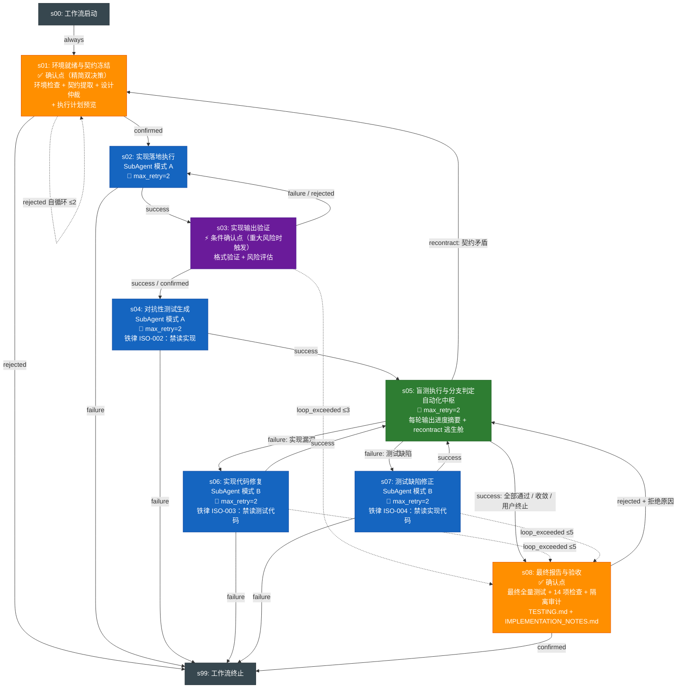

# Module Lifecycle — 核心对抗验证流水线 v1.1.0

## 概览

| 属性 | 值 |
|------|-----|
| 工作流 ID | `adversarial-module-implementation` |
| 版本 | `1.1.0` |
| 并发上限 | `max_parallel_agents: 2` |
| 适用场景 | 单个功能模块的对抗性验证全流程：从设计文档出发，经黑盒对抗测试发现实现漏洞，迭代修复直至收敛 |
| 核心机制 | 信息隔离四铁律（ISO-001~004）保证测试独立性；对抗性测试（黑盒找漏洞）而非验证性测试（白盒证正确）；新增契约重仲裁逃生舱 |

### v1.1.0 相比 v1.0.0 的变更

- **s08-report 产物扩充**：增加最终全量测试运行（内部子步骤）、生成 `TESTING.md`（运行命令说明）和 `IMPLEMENTATION_NOTES.md`（保守假设摘要）、明确展示"接受并结束 / 追加一轮修复"两个选项
- **s05-blindtest 新增 recontract 分支**：发现契约矛盾时，可通过 `branch_target="recontract"` 流转回 `s01-init` 重新冻结契约，无需终止工作流
- **s01-init 确认点精简**：从多信息展示精简为两个核心决策（契约完整性 + 执行计划可接受性），环境检查结果折叠为只读信息
- **信息隔离红线完整保留**：testgen 始终只读契约；pending-confirmations 分层处理——重大风险触发确认点，中低风险汇入 IMPLEMENTATION_NOTES.md

---

## 流程图

---

## Stage 说明

### s00-workflow-start — 工作流启动

| 属性 | 值 |
|------|-----|
| 类型 | 虚拟起始 |
| 确认点 | 否 |
| 输入 | （无） |
| 输出 | 触发 s01-init |
| 说明 | 工作流引擎标准入口，无业务逻辑。 |

### s01-init — 环境就绪与契约冻结

| 属性 | 值 |
|------|-----|
| Skill | `adversarial-module-implementation-init` |
| 确认点 | 是（用户确认契约完整性和执行计划可接受性） |
| 重试 | max_attempts=1（纯业务分析） |
| 输入 | module_id、设计文档（docs/功能设计/）、契约文件（contracts/） |
| 输出 | `contract-expectations.md`（冻结）、执行计划预览 |
| 说明 | 1. 环境检查：Python 版本、脚本完整性、契约目录存在性（折叠为只读信息） 2. 按 P0(落地规范)→P1(设计文档)→P2(项目结构文档) 提取接口契约，模糊边界条件显式纳入契约 3. 生成并冻结 contract-expectations.md 4. 展示执行计划预览（模块信息、契约条目数、SubAgent 调度计划） 5. 确认点精简为双决策：契约完整性 + 执行计划可接受性 |

### s02-impl — 实现落地执行

| 属性 | 值 |
|------|-----|
| Skill | `adversarial-module-implementation-impl-executor`（模式 A） |
| 确认点 | 否 |
| 重试 | max_attempts=2, on=[timeout, error]（SubAgent 调用） |
| 输入 | 落地规范、设计文档、项目结构文档、contract-expectations.md |
| 输出 | 实现代码文件、`function-signatures.json`、`pending-confirmations.md`（仅记录契约未覆盖盲区） |
| 说明 | SubAgent 按设计文档优雅实现模块代码。 实现顺序：类型系统 → 数据契约 → 工具 → 原子功能 → 状态机 → 组合层 → 异常处理 → 依赖适配。 **铁律 ISO-001**：禁止读取 .tmp/adversarial-tests/ 目录，禁止 AskUserQuestion。 |

### s03-validate — 实现输出验证

| 属性 | 值 |
|------|-----|
| Skill | `adversarial-module-implementation-impl-validator` |
| 确认点 | 是（条件触发：仅存在"重大风险"条目时触发） |
| 重试 | max_attempts=1（纯验证分析） |
| 输入 | `function-signatures.json`、`pending-confirmations.md` |
| 输出 | 验证通过/失败判定、风险评估分级 |
| 说明 | 1. 验证 function-signatures.json 格式与合规性 2. 评估 pending-confirmations 风险等级 3. 格式/合规不通过 → 退回 s02-impl（最多 3 次） 4. 重大风险项 → 触发确认点，用户确认后继续或退回 5. 中低风险项 → 汇入 IMPLEMENTATION_NOTES.md，不触发确认点 6. 超过 3 次退回 → 强制进入 s08-report（标注验证失败） |

### s04-testgen — 对抗性测试生成

| 属性 | 值 |
|------|-----|
| Skill | `adversarial-module-implementation-test-generator`（模式 A） |
| 确认点 | 否 |
| 重试 | max_attempts=2, on=[timeout, error]（SubAgent 调用） |
| 输入 | contract-expectations.md、function-signatures.json、落地规范异常/类型章节 |
| 输出 | 测试代码文件、`test_list.md`、`green-seeking-report.json` |
| 说明 | SubAgent 基于契约黑盒生成对抗性测试。 优先级：P0(契约禁止输入)→P1(边界值)→P2(类型破坏)→P3(状态/时序破坏)。 自检流水线（阻断级）：py_compile 语法 → import 可导入 → detect_green_seeking.py（toxicity_score ≤ 2）。 **铁律 ISO-002**：绝对禁止读取实现源码。 |

### s05-blindtest — 盲测执行与分支判定

| 属性 | 值 |
|------|-----|
| Skill | `adversarial-module-implementation-blindtest` |
| 确认点 | 否（自动化中枢，用户交互由 Skill 内部控制） |
| 重试 | max_attempts=2, on=[timeout, error]（外部测试运行） |
| 输入 | 测试代码文件、测试清单、green-seeking-report.json、上轮盲测结果（第2轮起） |
| 输出 | `failure-summary-round-N.md`、`test-defects-round-N.md` |
| 说明 | 自动化判断-分支逻辑中枢。 **流程**：运行测试 → classify_failures.py 分类 → 分支判定 → 进度输出。 **分支逻辑**（由 Skill 返回 `branch_target` 字段）： - 全部通过 / 收敛停滞 / 用户提前终止 → `success` → s08-report - 实现漏洞 / 退化 → `failure` (`branch_target="fix_impl"`) → s06-fix - 测试缺陷 → `failure` (`branch_target="fix_test"`) → s07-testfix - **契约矛盾** → `recontract` (`branch_target="recontract"`) → **s01-init**（重置循环计数器，重新冻结契约） **每轮进度输出**（不阻塞）：第 N 轮结果、通过/失败数、判定方向。 **用户提前终止**：进度输出时可选"跳过剩余修复，直接生成报告"。 **隔离合规**：运行 generate_failure_summary.py + validate_failure_summary.py（阻断级）。 |

### s06-fix — 实现代码修复

| 属性 | 值 |
|------|-----|
| Skill | `adversarial-module-implementation-impl-executor`（模式 B） |
| 确认点 | 否 |
| 重试 | max_attempts=2, on=[timeout, error]（SubAgent 调用） |
| 输入 | `failure-summary-round-N.md`（信息隔离版本）、当前实现代码、落地规范 |
| 输出 | 修改后代码、修改说明、`pending-confirmations-round-N.md` |
| 说明 | SubAgent 根据失败摘要最小化修复实现代码。 按 case ID 排序修复优先级，每处修改对应一个 case ID，保持接口契约不变。 **铁律 ISO-003**：仅可读取 failure-summary-round-N.md（隔离版本），不接触测试代码。 |

### s07-testfix — 测试缺陷修正

| 属性 | 值 |
|------|-----|
| Skill | `adversarial-module-implementation-test-generator`（模式 B） |
| 确认点 | 否 |
| 重试 | max_attempts=2, on=[timeout, error]（SubAgent 调用） |
| 输入 | `test-defects-round-N.md`、当前测试代码文件 |
| 输出 | 修正后的测试代码文件 |
| 说明 | SubAgent 根据缺陷报告修正测试代码。 修正后运行自检流水线（py_compile 语法 → import 可导入 → 趋绿扫描）。 **铁律 ISO-004**：仅可读取 test-defects-round-N.md（不含测试代码片段和具体输入值），不接触实现代码。 |

### s08-report — 最终报告与验收

| 属性 | 值 |
|------|-----|
| Skill | `adversarial-module-implementation-reporter` |
| 确认点 | 是（用户审查确认） |
| 重试 | max_attempts=1（纯生成+确认） |
| 输入 | 全流程产物（contract-expectations、function-signatures、各轮 failure-summary 和 test-defects、green-seeking-reports、pending-confirmations） |
| 输出 | `adversarial-report.md`、`TESTING.md`、`IMPLEMENTATION_NOTES.md` |
| 说明 | 1. **最终全量测试运行**：确保报告始终包含"最终运行状态"字段 2. 生成 adversarial-report.md（契约覆盖度、循环统计[轮次/失败数/修复数]、最终运行状态、最终结论） 3. 生成 **TESTING.md**（测试运行命令说明、环境要求） 4. 生成 **IMPLEMENTATION_NOTES.md**（保守假设摘要，从 pending-confirmations 整理） 5. 14 项验收检查清单 6. 运行 check_isolation.py 审计 ISO 四铁律 7. 用户审查确认，明确展示两个选项：**接受并结束** / **追加一轮修复**。若拒绝，须附拒绝原因，返回 s05-blindtest 追加修复。 |

### s99-workflow-end — 工作流终止

| 属性 | 值 |
|------|-----|
| 类型 | 虚拟终止 |
| 确认点 | 否 |
| 输入 | （无，所有退出路径汇聚点） |
| 输出 | （无） |
| 说明 | 工作流引擎标准出口。 |

---

## 技能清单

| 序号 | Skill ID | 对应 Stage | 来源 | 说明 |
|------|----------|-----------|------|------|
| 1 | `adversarial-module-implementation-init` | s01-init | Phase 2 改造 | 负责环境检查、强化契约提取（模糊边界显式仲裁）、执行计划预览、精简确认点 |
| 2 | `adversarial-module-implementation-impl-executor` | s02-impl, s06-fix | Phase 2 改造 | 双模式 Skill：模式 A 实现落地，模式 B 修复迭代 |
| 3 | `adversarial-module-implementation-impl-validator` | s03-validate | Phase 2 改造 | 验证实现输出格式与合规性，条件确认重大风险，中低风险汇入 IMPLEMENTATION_NOTES.md |
| 4 | `adversarial-module-implementation-test-generator` | s04-testgen, s07-testfix | Phase 2 改造 | 双模式 Skill：模式 A 对抗性测试生成，模式 B 测试缺陷修正 |
| 5 | `adversarial-module-implementation-blindtest` | s05-blindtest | Phase 2 改造 | 测试执行、失败分类、分支判定（含 recontract）、进度输出、用户提前终止 |
| 6 | `adversarial-module-implementation-reporter` | s08-report | Phase 2 改造 | 最终全量测试运行、生成对抗验证报告 + TESTING.md + IMPLEMENTATION_NOTES.md、14 项检查、隔离审计、接受/追加修复选项 |

---

## 共享资源

> Phase 1 识别，Phase 2 首个需要该资源的 Skill 负责建立。

| 资源 | 类型 | 路径 | 复用者 | 负责建立 |
|------|------|------|--------|---------|
| `detect_green_seeking.py` | scripts | `scripts/` | test-generator (create + fix) | test-generator |
| `subagent-prompts.md` | references | `references/` | init, impl-executor, test-generator | init |
| `failure-summary-format.md` | references | `references/` | blindtest, reporter | blindtest |
| `contract-extractor.md` | references | `references/` | init | init |
| `validate_failure_summary.py` | scripts | `scripts/` | blindtest, reporter | blindtest |
| `check_isolation.py` | scripts | `scripts/` | reporter | reporter |
| `classify_failures.py` | scripts | `scripts/` | blindtest | blindtest |
| `report-template.md` | references | `references/` | reporter | reporter |
| `TESTING.md` 模板 | references | `references/` | reporter | reporter |
| `IMPLEMENTATION_NOTES.md` 模板 | references | `references/` | reporter | reporter |

---

## Loop Exceeded 应急路径

当循环达到最大次数仍无法收敛时，走应急路径进入报告阶段，确保工作流不会无限循环。

| 循环位置 | 触发条件 | 应急路径 | 说明 |
|----------|---------|---------|------|
| s01-init 自循环 | 用户拒绝契约/执行计划超过 2 次 | → s99-workflow-end | 用户明确拒绝，终止工作流 |
| s03-validate → s02-impl | 验证失败/退回超过 3 次 | → s08-report | 强制生成报告，标注"实现验证未通过" |
| s06-fix → s05-blindtest | 对抗循环超过 5 轮 | → s08-report | 强制生成报告，含完整循环统计和最终运行状态 |
| s07-testfix → s05-blindtest | 对抗循环超过 5 轮 | → s08-report | 与 s06 共享同一次数计数器 |

> s06 和 s07 共享 `loop_counter_stage: s05-blindtest`，即对抗循环总轮次上限为 5 轮（不含首轮，即最多 6 轮盲测执行）。

### 用户提前终止

除 loop_exceeded 应急路径外，用户在 s05-blindtest 每轮进度输出时，可选择"跳过剩余修复，直接生成报告"。此路径不经过 loop_exceeded，直接以 success 条件进入 s08-report。

### 契约重仲裁逃生舱

s05-blindtest 在盲测过程中发现契约矛盾时，可通过 `branch_target="recontract"` 直接流转回 s01-init，重新提取并冻结契约。此路径**不占用**对抗循环计数器，回到 s01-init 后其自循环计数器独立运作（最多 2 次拒绝后终止）。

---

## 项目级同步与回退机制

### Git Anchors

- 工作流每次启动时自动打 tag（`wf/adversarial-module-implementation/{module_id}/{iso_timestamp}`）
- `preserve_paths: [".agent/"]` — `.agent/` 目录在 git 操作中保留不覆盖

### 信息隔离四铁律

| 规则 | 约束对象 | 约束内容 | 执行方式 |
|------|---------|---------|---------|
| ISO-001 | s02-impl SubAgent | 禁止读取 .tmp/adversarial-tests/ 目录 | Prompt 铁律 + check_isolation.py 审计 |
| ISO-002 | s04-testgen SubAgent | 禁止读取实现源码文件 | Prompt 铁律 + check_isolation.py 审计 |
| ISO-003 | s06-fix SubAgent | 仅可读 failure-summary（隔离版本），禁读测试代码 | validate_failure_summary.py 阻断级 + Prompt 铁律 |
| ISO-004 | s07-testfix SubAgent | 仅可读 test-defects（不含代码片段），禁读实现代码 | Prompt 铁律 + 事后审计 |

### 冲突解决优先级

- P0：项目结构设计文档（目录规范、模块边界）— 最高优先级
- P1：落地规范（精确编码规格、接口契约、类型定义）
- P2：设计文档（模块功能描述、业务逻辑）
- 同优先级冲突 → 记录到 pending-confirmations.md，由 s01-init 或 s03-validate 向用户确认
- 未覆盖场景 → 升级为确认点向用户确认

---

## 已决项归档

以下设计点已在 Phase 1 与用户确认解决：

1. **[U1] s05-blindtest 多 failure 出边歧义消除**：✅ 编排器读取 Skill 返回的 `branch_target` 字段（`fix_impl` → s06-fix / `fix_test` → s07-testfix / `recontract` → s01-init）。
2. **[U2] "退化→重仲裁" 路径**：✅ 退化归类为 failure（`branch_target="fix_impl"`），直接进入 s06-fix 修复循环，不返回 s01-init。
3. **[U3] s08-report 拒绝后路径**：✅ 用户拒绝须附拒绝原因，返回 s05-blindtest 追加修复（非终止）。
4. **[U4] 对抗循环上限值**：✅ 接受 5 轮上限（max_loop=5，即最多 6 轮盲测执行）。
5. **[U5] s01-init 确认点精简**：✅ 精简为双决策（契约完整性 + 执行计划可接受性），环境信息折叠为只读。
6. **[U6] s08-report 产物扩充**：✅ 增加最终全量测试运行、TESTING.md、IMPLEMENTATION_NOTES.md、接受/追加修复选项。
7. **[U7] recontract 逃生舱**：✅ s05-blindtest 新增 `branch_target="recontract"` 返回 s01-init，不占用对抗循环计数器。
