# adversarial-module-implementation@2.0.0

> 存量检测 -> 增量路径判定 -> 定向实现/测试 -> 盲测收敛 -> 报告

---

## 工作流概览

| 属性 | 值 |
|------|-----|
| 工作流 ID | `adversarial-module-implementation` |
| 版本 | `2.0.0` |
| Stage 数量 | 25（含 2 个虚拟 stage） |
| 确认点数量 | 10 |
| 最大并发 | 4 |
| 父工作流 | 无（独立使用） |

### v2.0.0 相比 v1.1.0 的变更

- **新增阶段零**：存量制品检测（s01-detect）与增量路径判定（s02-path），自动识别模块状态并路由到最优执行路径
- **4 条增量路径**：
  - `full_implementation`：完整对抗流水线（等价 v1.1.0 全量）
  - `incremental_update`：差异驱动的最小化修改（新增）
  - `code_only`：逆向工程补充设计文档与测试（新增）
  - `code_design_conflict`：差异仲裁后修正代码或设计（新增）
- **降级策略**：差异分析失败自动降级为 full_implementation（而非终止）
- **全收敛**：所有 loop_exceeded 收敛到 s13-report，标注异常退出原因，不静默终止
- **ISO 规则扩展**：新增 ISO-005（逆向工程禁读测试）和 ISO-006（差异分析阶段允许读代码+设计但禁读测试）
- **并发提升**：max_parallel_agents 从 2 提升到 4
- **Stage 重编号**：s01-init→s03-full-init / s02-impl→s04-full-impl / s03-validate→s05-full-validate / s04-testgen→s06-full-testgen / s05-blindtest→s10-blindtest / s06-fix→s11-fix-impl / s07-testfix→s12-fix-test / s08-report→s13-report

### 适用场景

1. **full_implementation** -- 无代码、无测试 → 从头完整对抗流水线
2. **incremental_update** -- 有代码、有测试、设计文档有变更 → 仅修改变更部分
3. **code_only** -- 有代码、无设计文档、无测试 → 逆向工程后补充测试
4. **code_design_conflict** -- 有代码、有设计文档、代码与设计不一致 → 逐条仲裁修正

---

## 流程图

```mermaid
flowchart TD
    %% ===== 虚拟起止 =====
    s00["s00-workflow-start<br/>工作流启动"]
    s99["s99-workflow-end<br/>工作流终止"]

    %% ===== 阶段零：存量检测与路径判定 =====
    s01["s01-detect<br/>存量制品检测<br/>扫描四类存量→JSON报告<br/>模型: light"]
    s02["s02-path<br/>增量路径判定<br/>✅ 确认点<br/>4路分支路由"]

    %% ===== 路径 1：full_implementation =====
    s03f["s03-full-init<br/>环境就绪与契约冻结<br/>✅ 确认点<br/>等价 v1.1.0 s01-init"]
    s04f["s04-full-impl<br/>实现落地执行<br/>模式 A 全量实现<br/>🔒 exclusive | 模型: heavy<br/>ISO-001: 禁读测试"]
    s05f["s05-full-validate<br/>实现输出验证<br/>⚡ 条件确认点<br/>仅重大风险时触发"]
    s06f["s06-full-testgen<br/>对抗性测试生成<br/>模式 A 全量生成<br/>🔒 exclusive | 模型: heavy<br/>ISO-002: 禁读实现"]

    %% ===== 路径 2：incremental_update =====
    s03id["s03-incr-diff<br/>设计变更差异分析<br/>对比设计→差异报告<br/>ISO-006: 禁读测试"]
    s04ic["s04-incr-contract<br/>增量契约更新<br/>✅ 确认点"]
    s05ii["s05-incr-impl<br/>增量实现更新<br/>模式 C 最小化修改<br/>🔒 exclusive | 模型: heavy<br/>ISO-001 变体"]
    s06iv["s06-incr-validate<br/>增量实现验证<br/>⚡ 条件确认点"]
    s07it["s07-incr-test<br/>增量测试更新<br/>模式 C 增量更新<br/>🔒 exclusive | 模型: heavy<br/>ISO-002"]

    %% ===== 路径 3：code_only =====
    s03cr["s03-code-reverse<br/>逆向推导设计意图<br/>✅ 确认点<br/>🔒 exclusive | 模型: heavy<br/>ISO-005: 禁读测试"]
    s04cc["s04-code-contract<br/>从逆向结果生成契约<br/>✅ 确认点"]
    s05ct["s05-code-testgen<br/>对抗性测试生成<br/>模式 A 全量生成<br/>🔒 exclusive | 模型: heavy<br/>ISO-002"]

    %% ===== 路径 4：code_design_conflict =====
    s03cd["s03-conflict-diff<br/>代码与设计差异对比<br/>输出差异报告<br/>ISO-006: 禁读测试"]
    s04ca["s04-conflict-arbitrate<br/>差异仲裁<br/>✅ 确认点<br/>批量通过+逐条否决"]
    s05cr["s05-conflict-resolve<br/>按仲裁结果修正<br/>模式 C 增量修正<br/>🔒 exclusive | 模型: heavy"]
    s06cv["s06-conflict-validate<br/>修正后验证<br/>⚡ 条件确认点"]
    s07cte["s07-conflict-test<br/>测试增量更新<br/>模式 C 增量更新<br/>🔒 exclusive | 模型: heavy<br/>ISO-002"]

    %% ===== 共享收敛区 =====
    s10["s10-blindtest<br/>盲测执行与分支判定<br/>自动化中枢<br/>全路径收敛点<br/>branch_target 4路分支"]
    s11["s11-fix-impl<br/>实现代码修复<br/>模式 B 最小化修复<br/>🔒 exclusive | 模型: heavy<br/>ISO-003: 仅读失败摘要"]
    s12["s12-fix-test<br/>测试缺陷修正<br/>模式 B 修正测试<br/>🔒 exclusive | 模型: heavy<br/>ISO-004: 仅读测试缺陷"]
    s13["s13-report<br/>最终报告与验收<br/>✅ 确认点<br/>全量测试+审计+3份文档<br/>全路径收敛点"]

    %% ===== 主流程边 =====
    s00 --> s01
    s01 --> s02

    %% s02 路由（4 confirmed + 1 rejected）
    s02 -->|"full_implementation"| s03f
    s02 -->|"incremental_update"| s03id
    s02 -->|"code_only"| s03cr
    s02 -->|"code_design_conflict"| s03cd
    s02 -->|"rejected: 放弃"| s99

    %% 路径 1 边
    s03f -->|"confirmed: 确认"| s04f
    s03f -.->|"rejected: 重做 ≤2"| s03f
    s03f -->|"rejected: 放弃"| s99
    s03f -.->|loop_exceeded| s99
    s04f -->|success| s05f
    s04f -->|failure| s99
    s05f -->|"success / confirmed: 接受"| s06f
    s05f -->|"failure / rejected: 退回 ≤3"| s04f
    s05f -.->|loop_exceeded ≤3| s13
    s06f -->|success| s10
    s06f -->|failure| s99

    %% 路径 2 边
    s03id -->|success| s04ic
    s03id -->|"failure: 降级"| s03f
    s04ic -->|"confirmed: 确认"| s05ii
    s04ic -.->|"confirmed: 继续完善 ≤3"| s04ic
    s04ic -->|"rejected: 放弃"| s99
    s04ic -.->|loop_exceeded| s99
    s05ii -->|success| s06iv
    s05ii -->|failure| s99
    s06iv -->|"success / confirmed: 接受"| s07it
    s06iv -->|"failure / rejected: 退回 ≤3"| s05ii
    s06iv -.->|loop_exceeded ≤3| s13
    s07it -->|success| s10
    s07it -->|failure| s99

    %% 路径 3 边
    s03cr -->|"confirmed: 确认逆推结果"| s04cc
    s03cr -.->|"confirmed: 继续完善 ≤3"| s03cr
    s03cr -->|"rejected: 放弃"| s99
    s03cr -.->|loop_exceeded| s99
    s04cc -->|"confirmed: 确认"| s05ct
    s04cc -.->|"confirmed: 继续完善 ≤3"| s04cc
    s04cc -->|"rejected: 放弃"| s99
    s04cc -.->|loop_exceeded| s99
    s05ct -->|success| s10
    s05ct -->|failure| s99

    %% 路径 4 边
    s03cd -->|success| s04ca
    s03cd -->|"failure: 降级"| s03f
    s04ca -->|"confirmed: 确认裁决"| s05cr
    s04ca -.->|"confirmed: 继续仲裁 ≤3"| s04ca
    s04ca -->|"rejected: 放弃"| s99
    s04ca -.->|loop_exceeded| s99
    s05cr -->|success| s06cv
    s05cr -->|failure| s99
    s06cv -->|"success / confirmed: 接受"| s07cte
    s06cv -->|"failure / rejected: 退回 ≤3"| s05cr
    s06cv -.->|loop_exceeded ≤3| s13
    s07cte -->|success| s10
    s07cte -->|failure| s99

    %% 共享收敛区边
    s10 -->|"success: all-pass | max-rounds | stagnation | user-terminated"| s13
    s10 -->|"failure: fix_impl"| s11
    s10 -->|"failure: fix_test"| s12
    s10 -->|"success: recontract"| s03f
    s11 -->|"success ≤5"| s10
    s11 -.->|loop_exceeded| s13
    s11 -->|failure| s99
    s12 -->|"success ≤5"| s10
    s12 -.->|loop_exceeded| s13
    s12 -->|failure| s99
    s13 -->|"confirmed: 接受并结束"| s99
    s13 -->|"rejected: 追加修复"| s10

    %% ===== 样式 =====
    classDef startEnd fill:#37474f,stroke:#263238,color:#fff
    classDef confirm fill:#ff8f00,stroke:#e65100,color:#fff
    classDef subagent fill:#1565c0,stroke:#0d47a1,color:#fff
    classDef exclusive fill:#4527a0,stroke:#311b92,color:#fff
    classDef auto fill:#2e7d32,stroke:#1b5e20,color:#fff
    classDef validate fill:#6a1b9a,stroke:#4a148c,color:#fff
    classDef report fill:#c62828,stroke:#b71c1c,color:#fff
    classDef detect fill:#00838f,stroke:#006064,color:#fff

    class s00,s99 startEnd
    class s02,s03f,s04ic,s04cc,s03cr,s04ca confirm
    class s04f,s06f,s05ii,s07it,s05ct,s05cr,s07cte,s11,s12 exclusive
    class s10 auto
    class s05f,s06iv,s06cv validate
    class s13 report
    class s01,s03id,s03cd detect
```

---

## Stage 说明表

| Stage ID | 名称 | confirmation_point | Skill | 模型 | 超时(s) | exclusive | 所属路径 |
|----------|------|-------------------|-------|------|---------|-----------|---------|
| s00-workflow-start | 工作流启动 | false | — (虚拟) | — | — | — | 共用 |
| s01-detect | 存量制品检测 | false | existing-asset-detector (NEW) | light | 120 | — | 共用 |
| s02-path | 增量路径判定 | **true** | incremental-path-determiner (NEW) | standard | — | — | 共用 |
| s03-full-init | 环境就绪与契约冻结 | **true** | contract-initializer | standard | 300 | — | full |
| s04-full-impl | 实现落地执行 | false | impl-executor (模式A) | heavy | 900 | **yes** | full |
| s05-full-validate | 实现输出验证 | **true** (条件) | impl-validator | standard | 120 | — | full |
| s06-full-testgen | 对抗性测试生成 | false | test-generator (模式A) | heavy | 600 | **yes** | full |
| s03-incr-diff | 设计变更差异分析 | false | diff-arbitrator (NEW, 模式A) | standard | 300 | — | incr |
| s04-incr-contract | 增量契约更新 | **true** | contract-initializer (contract-update) | standard | 300 | — | incr |
| s05-incr-impl | 增量实现更新 | false | impl-executor (模式C) | heavy | 600 | **yes** | incr |
| s06-incr-validate | 增量实现验证 | **true** (条件) | impl-validator | standard | 120 | — | incr |
| s07-incr-test | 增量测试更新 | false | test-generator (模式C) | heavy | 600 | **yes** | incr |
| s03-code-reverse | 逆向推导设计意图 | **true** | reverse-engineering-analyzer (NEW) | heavy | 900 | **yes** | code |
| s04-code-contract | 从逆向结果生成契约 | **true** | contract-initializer (from-reverse) | standard | 300 | — | code |
| s05-code-testgen | 对抗性测试生成 | false | test-generator (模式A) | heavy | 600 | **yes** | code |
| s03-conflict-diff | 代码与设计差异对比 | false | diff-arbitrator (NEW, 模式B) | standard | 300 | — | conflict |
| s04-conflict-arbitrate | 差异仲裁 | **true** | diff-arbitrator (NEW, 模式C, continue) | standard | 300 | — | conflict |
| s05-conflict-resolve | 按仲裁结果修正 | false | impl-executor (模式C) | heavy | 600 | **yes** | conflict |
| s06-conflict-validate | 修正后验证 | **true** (条件) | impl-validator | standard | 120 | — | conflict |
| s07-conflict-test | 测试增量更新 | false | test-generator (模式C) | heavy | 600 | **yes** | conflict |
| s10-blindtest | 盲测执行与分支判定 | **true** | blindtest-runner | standard | 600 | — | 共用 |
| s11-fix-impl | 实现代码修复 | false | impl-executor (模式B, continue) | heavy | 600 | **yes** | 共用 |
| s12-fix-test | 测试缺陷修正 | false | test-generator (模式B, continue) | heavy | 600 | **yes** | 共用 |
| s13-report | 最终报告与验收 | **true** | report-generator | standard | 300 | — | 共用 |
| s99-workflow-end | 工作流终止 | false | — (虚拟) | — | — | — | 共用 |

---

## 确认点分布

| 确认点 | Stage | 决策内容 | 类型 | 路径 |
|--------|-------|---------|------|------|
| AQ-004 | s02-path | 增量路径选择（自动推荐优先，边界时确认） | 终局确认（4路分支） | 共用 |
| AQ-001 | s03-full-init | 契约完整性 + 执行计划可接受性 | 终局确认 | full |
| AQ-002 | s05-full-validate | 重大风险验收（条件触发） | 条件确认 | full |
| AQ-001' | s04-incr-contract | 增量契约变更确认 | 终局确认 | incr |
| AQ-002' | s06-incr-validate | 增量变更重大风险验收（条件触发） | 条件确认 | incr |
| AQ-005 | s03-code-reverse | 逆向工程结果确认 | 终局确认 | code |
| AQ-001'' | s04-code-contract | 逆向生成的契约确认 | 终局确认 | code |
| AQ-006 | s04-conflict-arbitrate | 差异仲裁逐条确认（批量通过+逐条否决） | 终局确认 | conflict |
| AQ-002'' | s06-conflict-validate | 修正后重大风险验收（条件触发） | 条件确认 | conflict |
| AQ-007 | s10-blindtest | 盲测分支信号确认（all_pass/fix_impl/fix_test/recontract），编排器自动映射 | 自动确认（编排器解析 branch_target → choice） | 共用 |
| AQ-003 | s13-report | 最终验收（接受并结束/追加修复/loop_exceeded终止） | 终局确认 | 共用 |

用户实际看到的确认点 <= 4（因为 4 条路径互斥，每条路径最多触发 3-4 个确认点）。

---

## 降级与异常路径

| 异常场景 | 行为 | 说明 |
|---------|------|------|
| s01-detect 检测失败 | always → s02-path | s02-path 收到底线数据时默认推荐 full_implementation |
| s03-incr-diff 差异分析失败 | failure → s03-full-init | 降级为 full_implementation（而非终止） |
| s03-conflict-diff 差异分析失败 | failure → s03-full-init | 同上，降级为 full_implementation |
| s03-code-reverse 逆向工程失败 | rejected → s99 | 用户选择放弃；无代码理解基础，无法继续 |
| 路径内验证循环超限 | loop_exceeded → s13-report | 全收敛，生成报告标注异常退出原因 |
| 盲测修复循环超限 | loop_exceeded → s13-report | 全收敛，保留 v1.1.0 行为 |
| recontract 逃生舱 | s10 → s03-full-init | 不占用对抗循环计数器 |
| 用户拒绝路径判定 | rejected → s99 | 用户明确放弃，不路由 |

---

## 技能清单

### 全局 Skill（artifacts/skills/）

无。所有 Skill 均为本工作流局部 Skill。

### 局部 Skill（本工作流 skills/）

| skill_id | 对应 Stage | 模式 | 状态 |
|----------|-----------|------|------|
| existing-asset-detector | s01-detect | core | **NEW** |
| incremental-path-determiner | s02-path | core | **NEW** |
| diff-arbitrator | s03-incr-diff, s03-conflict-diff, s04-conflict-arbitrate | 模式A(差异对比) / 模式B(冲突对比) / 模式C(仲裁) | **NEW** |
| reverse-engineering-analyzer | s03-code-reverse | core | **NEW** |
| contract-initializer | s03-full-init, s04-incr-contract, s04-code-contract | core / contract-update / from-reverse / recontract | 复用+扩展 |
| impl-executor | s04-full-impl, s05-incr-impl, s05-conflict-resolve, s11-fix-impl | 模式A(全量) / 模式B(修复) / 模式C(增量) | 复用+扩展 |
| impl-validator | s05-full-validate, s06-incr-validate, s06-conflict-validate | core | 复用 |
| test-generator | s06-full-testgen, s07-incr-test, s05-code-testgen, s07-conflict-test, s12-fix-test | 模式A(全量) / 模式B(修复) / 模式C(增量) | 复用+扩展 |
| blindtest-runner | s10-blindtest | core | 复用 |
| report-generator | s13-report | core | 复用+扩展 |

### 同 Skill 跨 Stage 延续（wfctl continue action）

| Skill | 延续链 | 机制 |
|-------|--------|------|
| impl-executor | 路径内 impl → s11-fix-impl | 映射表命中后 continue，保持代码上下文 |
| test-generator | 路径内 testgen → s12-fix-test | 映射表命中后 continue，保持契约理解上下文 |
| diff-arbitrator | s03-conflict-diff → s04-conflict-arbitrate | 跨 Stage continue，复用差异分析上下文 |

---

## 信息隔离规则

| 规则 | 约束对象 | 约束内容 | 适用路径 |
|------|---------|---------|---------|
| ISO-001 | impl-executor (模式A/C) | 禁止读取测试目录 | full, incr, conflict |
| ISO-002 | test-generator (模式A/C) | 禁止读取实现源码 | 全路径 |
| ISO-003 | impl-executor (模式B) | 仅读 failure-summary（隔离版），禁读测试代码 | 修复循环 |
| ISO-004 | test-generator (模式B) | 仅读 test-defects（隔离版），禁读实现代码 | 修复循环 |
| **ISO-005 (新)** | reverse-engineering-analyzer | 禁止读取测试相关文件 | code_only |
| **ISO-006 (新)** | diff-arbitrator | 可同时读代码+设计文档，但禁读测试代码；分析结果不得泄漏代码细节到下游 | incr, conflict |

---

## 工作流级共享资源

| 资源 | 类型 | 路径 | 建立者 |
|------|------|------|--------|
| detect_existing_assets.py | script | scripts/ | existing-asset-detector |
| diff_code_design.py | script | scripts/ | diff-arbitrator |
| adversarial-strategies.md | reference | references/ | test-generator |
| data-format-spec.md | reference | references/ | init |
| failure-summary-format.md | reference | references/ | blindtest |
| subagent-prompts.md | reference | references/ | init |
| report-template.md | reference | references/ | reporter |
| check_isolation.py | script | scripts/ | reporter |

---

## 最终产物清单

无论哪条路径，最终都产出相同的 4 份产物：

| 产物 | 说明 | 增量场景差异 |
|------|------|-------------|
| 实现代码 | 模块源代码文件 | — |
| 测试代码 | 对抗性测试套件 | incr/conflict 含回归测试结果 |
| adversarial-report.md | 对抗验证报告 | 含场景类型和路径来源字段 |
| TESTING.md | 测试运行命令说明 | — |
| IMPLEMENTATION_NOTES.md | 实现说明 | 增量场景含"变更范围"章节 + "回归测试结果"章节 |
| (code_only) 逆向设计文档 | 存放于消费者项目 `docs/功能设计/` | 仅 code_only 路径产出 |

---

## 已知限制

- **R02 (s10-blindtest branch_target)**：v3.0.0 schema 的 condition 枚举无法原生表达多路分支。当前使用 success + failure 混用，编排器需解析 Skill Message 的 `branch_target` 字段做二次路由。建议 v3.1.0 协议新增 `branch_<target>` condition。
