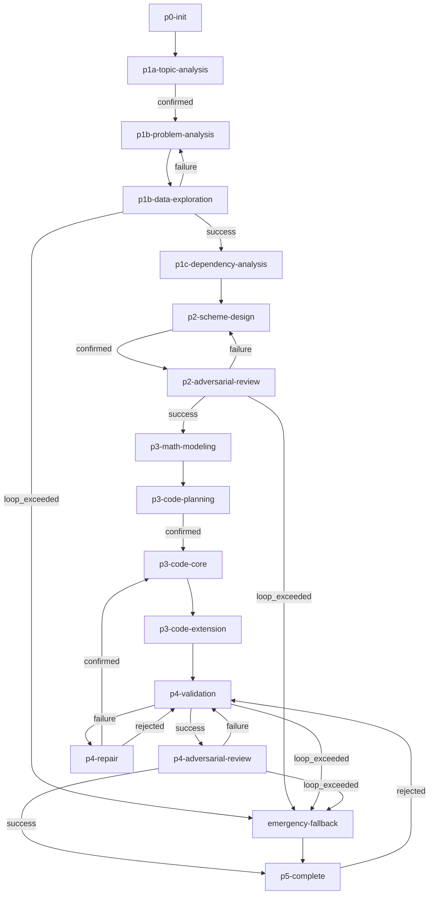

# 数学建模标准工作流 v2.1.0

## 概览
- **目标**：为数学建模竞赛提供从问题分析、方案设计、公式推导、代码实现到验证评估的完整流水线
- **并发上限**：6 个 Agent 可同时执行（支持多小问并行）
- **适用场景**：数学建模竞赛、需要严格数学推导与代码验证的建模任务
- **版本变更**（v2.0.0 → v2.1.0）：
  1. 新增 `workflow-director` Skill，补足 p0-init / p4-repair / p5-complete 三阶段的编排能力
  2. 修复 p3-code-extension 与 p4-validation 的数据竞争：extension 完成后才进入 P4
  3. 新增 data-scout 失败回退路径：数据不合格时回退到 p1b-problem-analysis 重新分析
  4. 新增 P4 精细化修复回路：p4-repair 阶段解析 quality-inspector 报告，支持内/中/外三级回退

## 流程图

> **注意**：P4-repair 的 `confirmed` edge 默认指向 p3-code-core（内循环）。workflow-director 会根据用户在 p4-repair 阶段的选择做**动态路由**：若用户选择"修正假设"则跳转 p3-math-modeling（中循环），若选择"重新拆解"则跳转 p1b-problem-analysis（外循环）。

## Stage 说明

### p0-init —— 初始化
- **目的**：创建工作目录结构、初始化 MANIFEST 和 VERSION.md
- **输入**：用户指定的 problem_id 和赛题名称
- **输出**：PROBLEM_ROOT 目录结构、MANIFEST、v1/VERSION.md
- **对应 Skill**：`workflow-director`
- **v2.1.0 变更**：新增 stage，由 workflow-director 执行初始化

### p1a-topic-analysis —— 选题分析
- **目的**：评估赛题可行性、识别歧义、分析数据可得性
- **输入**：赛题原文
- **输出**：GLOBAL_SHARED/P1a-选题分析.md、歧义分析报告
- **对应 Skill**：`topic-analyst`
- **注意**：此阶段结束后需用户确认是否继续；若存在多个选题，workflow-director 会调度多次 topic-analyst 完成多选题对比后再请求确认

### p1b-problem-analysis —— 小问分析
- **目的**：针对单个小问进行外科手术式拆解，提取约束、声明假设、定义 I/O 映射
- **输入**：赛题原文、P1a 产出
- **输出**：PROBLEM_SHARED/P1b-小问分析_Task[N].md
- **对应 Skill**：`problem-decomposer`
- **并行规则**：不同小问的 P1b 可以并行执行

### p1b-data-exploration —— 数据侦察
- **目的**：针对小问涉及的字段做定向数据质量诊断和 EDA
- **输入**：P1b 小问分析中的数据需求清单
- **输出**：PROBLEM_SHARED/P1b-数据探索报告_Task[N].md
- **对应 Skill**：`data-scout`
- **v2.1.0 变更**：
  - 新增 failure edge：数据质量评级为"不合格"时返回 `ERROR`，回退到 p1b-problem-analysis 重新分析（最多 2 轮）
  - 新增 loop_exceeded edge：回退 2 次仍不合格则进入 emergency-fallback

### p1c-dependency-analysis —— 依赖分析
- **目的**：分析多小问间的输入输出依赖关系，确定执行 DAG
- **输入**：所有小问的 P1b 产出
- **输出**：GLOBAL_SHARED/P1c-小问依赖分析.md
- **对应 Skill**：`dependency-analyst`

### p2-scheme-design —— 方案设计
- **目的**：为每个小问设计至少三套候选建模方案，输出对比总结与选型建议
- **输入**：P1b 小问分析（含 problem_type、数据需求、假设列表）
- **输出**：VERSION_DOCS/P2-模型选型_*.md
- **对应 Skill**：`model-architect`
- **注意**：此阶段结束后需用户确认锁定方案
- **并行规则**：不同小问的 P2 可以并行执行

### p2-adversarial-review —— 方案对抗审查
- **目的**：以评委视角攻击三套方案，寻找漏洞和遗漏
- **输入**：P2 选型报告、P1b 小问分析、P1b 数据探索报告
- **输出**：VERSION_DOCS/P2-对抗审查_方案设计.md
- **对应 Skill**：`scheme-reviewer`
- **循环机制**：发现致命缺陷时回退到 p2-scheme-design 修复，最多 3 轮

### p3-math-modeling —— 数学建模
- **目的**：完成符号体系构建、公式推导、假设验证、可解性分析、误差与敏感性分析
- **输入**：P2 选型报告、P1b 假设列表
- **输出**：VERSION_DOCS/P3-公式推导_*.md、P3-符号体系与假设_*.md、P3-误差与敏感性分析_*.md
- **对应 Skill**：`math-modeler`
- **并行规则**：不同小问的 P3 math-modeler 可以并行执行

### p3-code-planning —— 代码规划
- **目的**：展示代码实现规划，包括函数签名、变量映射、依赖清单、可视化规划
- **输入**：math-modeler 的全部数学文档
- **输出**：规划文档（内存中展示）
- **对应 Skill**：`code-planner`
- **注意**：此阶段结束后需用户确认后方可生成代码

### p3-code-core —— 核心代码实现
- **目的**：生成主脚本、验证脚本、单元测试，运行 Toy Model 验证
- **输入**：用户确认后的代码规划
- **输出**：VERSION_SCRIPTS/main_*.py、evaluate_*.py、test_toy_model.py、utils/*.py
- **对应 Skill**：`code-builder`

### p3-code-extension —— 扩展实现
- **目的**：生成并运行敏感性分析脚本
- **输入**：核心代码实现完成
- **输出**：VERSION_SCRIPTS/sensitivity_analysis.py、results/comparison/*
- **对应 Skill**：`code-builder`
- **可选**：时间门控临近时可跳过
- **v2.1.0 变更**：修复与 P4 的数据竞争。原版本中 p3-code-core 可直接进入 p4-validation，导致 P4 可能在 sensitivity_matrix.csv 未生成时启动。现改为 p3-code-core → p3-code-extension → p4-validation 的严格串行。

### p4-validation —— 验证评估
- **目的**：独立审查验证结果、统计反向验证假设、四维度量化评分
- **输入**：P3 全部产出、代码与结果
- **输出**：VERSION_DOCS/P4-技术评估报告_*.md、P4-赛题覆盖度检查_*.md 等
- **对应 Skill**：`quality-inspector`
- **并行规则**：不同小问的 P4 可以并行执行
- **v2.1.0 变更**：
  - 返回状态精细化映射：
    - 优秀通过/基本通过/指标不足 → `DONE` → success → p4-adversarial-review
    - 假设失效/代码缺陷/赛题偏离 → `ERROR` → failure → p4-repair
  - 新增 p4-repair 阶段，支持内/中/外三级回退

### p4-repair —— 修复路由
- **目的**：解析 quality-inspector 的精细化评估结果，向用户呈现修复选项，动态路由到对应修复目标
- **输入**：quality-inspector 的 Result Report（含 `iteration_decision`、`upstream_feedback`）
- **输出**：修复路由决策
- **对应 Skill**：`workflow-director`
- **v2.1.0 新增阶段**
- **动态路由规则**：
  - 内循环（调参/代码修复）→ 回退到 p3-code-core
  - 中循环（假设修正/模型降级）→ 回退到 p3-math-modeling
  - 外循环（赛题偏离/重新拆解）→ 回退到 p1b-problem-analysis
  - 用户拒绝修复 → 回到 p4-validation 重新评估
- **注意**：由于 Workflow v2 edge condition 限制，`confirmed` edge 默认指向 p3-code-core。workflow-director 根据用户实际选择通过 `stage_direction` 或修改 instance 状态实现动态路由。

### p4-adversarial-review —— 验证对抗审查
- **目的**：攻击验证评估结果、构造系统化反例、审查论文呈现质量
- **输入**：quality-inspector 评估报告、P3 全部产出、P1b 假设列表、data-scout 数据风险
- **输出**：VERSION_DOCS/P4-对抗审查_验证评估.md
- **对应 Skill**：`validation-reviewer`
- **循环机制**：发现致命缺陷时回退到 p4-validation 修复，最多 3 轮

### p5-complete —— 工作流完成
- **目的**：汇报工作流完成状态，冻结版本
- **输入**：全部上游产出
- **输出**：版本冻结状态、最终汇报
- **对应 Skill**：`workflow-director`
- **注意**：此阶段结束后版本标记为 frozen；若用户拒绝确认，可回退到 p4-validation 修改（最多 1 次）
- **v2.1.0 变更**：由 workflow-director 执行完成收尾

### emergency-fallback —— 应急降级
- **目的**：时间门控触发或模型完全失效时激活保底方案
- **输入**：当前所有产出、时间约束
- **输出**：VERSION_SCRIPTS/main_fallback.py、VERSION_DOCS/应急-降级说明.md
- **对应 Skill**：`emergency-fallback`
- **注意**：应急方案完成后直接进入 p5-complete
- **v2.1.0 新增触发点**：p1b-data-exploration 的 loop_exceeded 也会触发应急降级

## 并发规则说明

- **最大并行 Agent 数**：6
- **允许并行的 Stage**：
  - `p1b-problem-analysis`（不同小问间并行）
  - `p1b-data-exploration`（不同小问间并行）
  - `p2-scheme-design`（不同小问间并行）
  - `p3-math-modeling`（不同小问间并行）
  - `p4-validation`（不同小问间并行）
- **资源冲突检查**：启用（`resource_conflict_check: true`）
- **调度约束**：单个小问内部的 Stage 仍需串行执行；workflow-director 负责按 P1c 产出的 DAG 为各小问创建独立的 Stage 实例

## 循环机制说明

本工作流包含 5 组循环回退机制：

### 1. P1b 数据侦察降级循环
- **触发点**：`p1b-data-exploration` 数据质量评级为"不合格"（`failure`）
- **回退目标**：`p1b-problem-analysis`
- **最大循环次数**：2 次
- **循环计数器 Stage**：`p1b-data-exploration`
- **超限处理**：达到 2 次后，流转至 `emergency-fallback` 激活保底方案

### 2. P2 方案审查循环
- **触发点**：`p2-adversarial-review` 发现致命缺陷（`failure`）
- **回退目标**：`p2-scheme-design`
- **最大循环次数**：3 次
- **循环计数器 Stage**：`p2-adversarial-review`
- **超限处理**：达到 3 次后，流转至 `emergency-fallback` 激活保底方案

### 3. P4 验证评估修复循环
- **触发点**：`p4-validation` 发现致命缺陷（假设失效/代码缺陷/赛题偏离，返回 `ERROR`/`failure`）
- **回退目标**：`p4-repair`（由 workflow-director 动态路由到实际修复目标）
- **最大循环次数**：3 次
- **循环计数器 Stage**：`p4-validation`
- **修复路由**：
  - 内循环 → p3-code-core（调参/代码修复）
  - 中循环 → p3-math-modeling（假设修正/模型降级）
  - 外循环 → p1b-problem-analysis（赛题偏离/重新拆解）
- **超限处理**：达到 3 次后，流转至 `emergency-fallback` 激活保底方案

### 4. P4 对抗审查循环
- **触发点**：`p4-adversarial-review` 发现致命缺陷（`failure`）
- **回退目标**：`p4-validation`
- **最大循环次数**：3 次
- **循环计数器 Stage**：`p4-adversarial-review`
- **超限处理**：达到 3 次后，流转至 `emergency-fallback` 激活保底方案

### 5. P5 完成确认回退
- **触发点**：用户在 `p5-complete` 阶段拒绝确认（`rejected`）
- **回退目标**：`p4-validation`
- **最大循环次数**：1 次
- **循环计数器 Stage**：`p5-complete`
- **用途**：允许用户在最终冻结版本前要求回退修改
