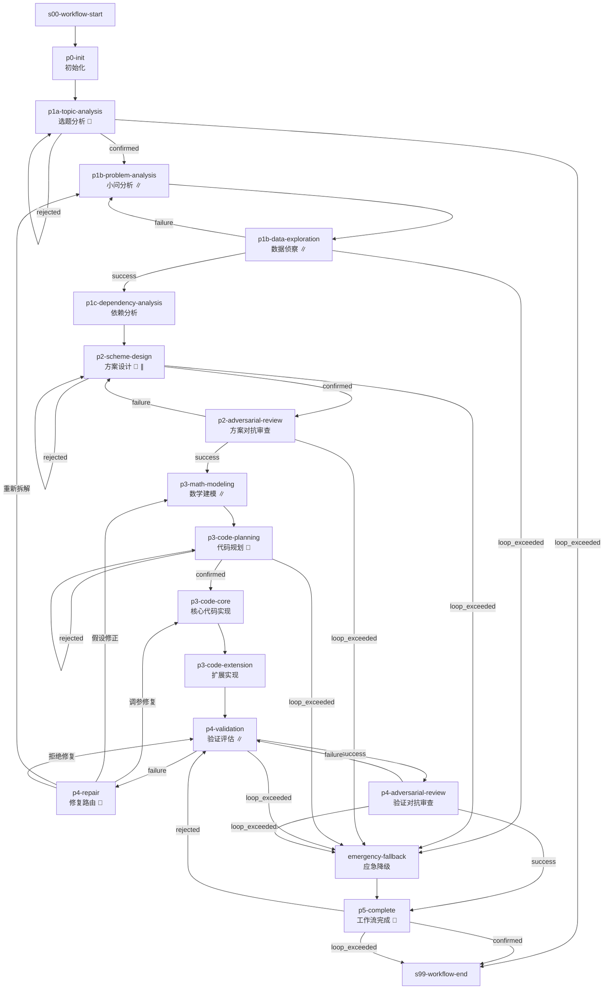

# 数学建模标准工作流 (mathematical-model)

> 为数学建模竞赛提供从问题分析、方案设计、公式推导、代码实现到验证评估的完整流水线

---

## 工作流概览

- **工作流 ID**：`mathematical-model`
- **版本**：`2.2.0`
- **Stage 数量**：18（含 2 个虚拟节点）
- **确认点数量**：5（p1a / p2 / p3-code-planning / p4-repair / p5-complete）
- **最大并发**：6

### 适用场景

数学建模竞赛、需要严格数学推导与代码验证的建模任务。支持多小问并行处理。

### 流程图

> 🔔 = 确认点  ∥ = 支持并行

---

## Stage 说明

### s00-workflow-start — 工作流启动
虚拟起始点，无条件流转到 p0-init。

### p0-init — 初始化
- **目标**：`workflow-director`
- **确认点**：否
- **描述**：创建工作目录结构、初始化 MANIFEST 和 VERSION.md

### p1a-topic-analysis — 选题分析
- **目标**：`topic-analyst`
- **确认点**：是
- **描述**：评估赛题可行性、识别歧义、分析数据可得性
- **确认选项**：`确认继续` → p1b / `重新分析` → 重做（最多 2 轮）/ 超限 → 终止

### p1b-problem-analysis — 小问分析
- **目标**：`problem-decomposer`
- **确认点**：否
- **并行**：按 p1a 产出的小问拆分，最多 6 个并行实例
- **描述**：针对单个小问进行外科手术式拆解，提取约束、声明假设、定义 I/O 映射

### p1b-data-exploration — 数据侦察
- **目标**：`data-scout`
- **确认点**：否
- **Retry**：1 次
- **并行**：按 p1b 产出的小问拆分，最多 6 个并行实例
- **描述**：针对小问字段做定向数据质量诊断和 EDA。数据不合格时回退到 p1b（最多 2 轮），超限进入应急降级

### p1c-dependency-analysis — 依赖分析
- **目标**：`dependency-analyst`
- **确认点**：否
- **描述**：分析多小问间的输入输出依赖关系，确定执行 DAG

### p2-scheme-design — 方案设计
- **目标**：`model-architect`
- **确认点**：是
- **并行**：按依赖分析 DAG 拆分，最多 6 个并行实例
- **描述**：为每个小问设计至少三套候选建模方案，输出对比总结与选型建议
- **确认选项**：`锁定方案` → p2-adversarial-review / `重新设计` → 重做（最多 2 轮）/ 超限 → 应急

### p2-adversarial-review — 方案对抗审查
- **目标**：`scheme-reviewer`
- **确认点**：否
- **描述**：以评委视角攻击方案，寻找漏洞和遗漏。发现致命缺陷时回退到 p2（最多 3 轮），超限进入应急

### p3-math-modeling — 数学建模
- **目标**：`math-modeler`
- **确认点**：否
- **Retry**：1 次
- **并行**：按审查通过的方案拆分，最多 6 个并行实例
- **描述**：完成符号体系构建、公式推导、假设验证、误差与敏感性分析

### p3-code-planning — 代码规划
- **目标**：`code-planner`
- **确认点**：是
- **描述**：展示代码实现规划，包括函数签名、变量映射、依赖清单、可视化规划
- **确认选项**：`确认生成` → p3-code-core / `重新规划` → 重做（最多 2 轮）/ 超限 → 应急

### p3-code-core — 核心代码实现
- **目标**：`code-builder`
- **确认点**：否
- **Retry**：1 次
- **描述**：生成主脚本、验证脚本、单元测试并运行 Toy Model 验证

### p3-code-extension — 扩展实现
- **目标**：`code-builder`
- **确认点**：否
- **可选**：是（时间紧张时可跳过）
- **Retry**：1 次
- **描述**：生成并运行敏感性分析脚本

### p4-validation — 验证评估
- **目标**：`quality-inspector`
- **确认点**：否
- **Retry**：1 次
- **并行**：按小问拆分，最多 6 个并行实例
- **描述**：独立审查验证结果、统计反向验证假设、四维度量化评分。失败时进入 p4-repair 修复路由（最多 3 轮），超限进入应急

### p4-repair — 修复路由
- **目标**：`workflow-director`
- **确认点**：是
- **描述**：解析 quality-inspector 评估结果，向用户呈现三级修复选项
- **动态路由**：
  - `调参修复` → p3-code-core（内循环：调参/代码修复）
  - `假设修正` → p3-math-modeling（中循环：假设修正/模型降级）
  - `重新拆解` → p1b-problem-analysis（外循环：赛题偏离/重新拆解）
  - `拒绝修复` → p4-validation（重新评估）

### p4-adversarial-review — 验证对抗审查
- **目标**：`validation-reviewer`
- **确认点**：否
- **描述**：攻击验证评估结果、构造系统化反例、审查论文呈现质量。发现致命缺陷时回退到 p4（最多 3 轮），超限进入应急

### p5-complete — 工作流完成
- **目标**：`workflow-director`
- **确认点**：是
- **描述**：汇报工作流完成状态，冻结版本
- **确认选项**：`确认完成` → 终止 / `回退修改` → p4（最多 1 轮）/ 超限 → 终止

### emergency-fallback — 应急降级
- **目标**：`emergency-fallback`
- **确认点**：否
- **可选**：是
- **描述**：时间门控触发或模型完全失效时激活保底方案，完成后进入 p5-complete

### s99-workflow-end — 工作流终止
虚拟终止点，所有完成路径汇聚于此。

---

## 技能清单

| Skill ID | 对应 Stage | 说明 |
|----------|-----------|------|
| workflow-director | p0-init, p4-repair, p5-complete | 工作流编排：初始化、修复路由、完成收尾 |
| topic-analyst | p1a-topic-analysis | 赛题可行性评估、歧义识别、数据可得性分析 |
| problem-decomposer | p1b-problem-analysis | 小问拆解、约束提取、假设声明、I/O 映射 |
| data-scout | p1b-data-exploration | 定向数据质量诊断和 EDA |
| dependency-analyst | p1c-dependency-analysis | 多小问依赖关系分析与执行 DAG |
| model-architect | p2-scheme-design | 多套候选建模方案设计与对比 |
| scheme-reviewer | p2-adversarial-review | 方案对抗审查，评委视角攻击 |
| math-modeler | p3-math-modeling | 符号体系、公式推导、假设验证、敏感性分析 |
| code-planner | p3-code-planning | 代码实现规划、函数签名、变量映射 |
| code-builder | p3-code-core, p3-code-extension | 核心代码生成、扩展实现、测试验证 |
| quality-inspector | p4-validation | 四维度量化评分、假设反向验证 |
| validation-reviewer | p4-adversarial-review | 验证对抗审查、反例构造、论文质量审查 |
| emergency-fallback | emergency-fallback | 应急降级保底方案 |

---

## 循环机制说明

本工作流包含 5 组循环回退机制：

### 1. P1b 数据侦察降级循环
- **触发点**：`p1b-data-exploration` 数据质量不合格（failure）
- **回退目标**：`p1b-problem-analysis`，最多 2 轮
- **超限**：进入 `emergency-fallback`

### 2. P2 方案审查循环
- **触发点**：`p2-adversarial-review` 发现致命缺陷（failure）
- **回退目标**：`p2-scheme-design`，最多 3 轮
- **超限**：进入 `emergency-fallback`

### 3. P4 验证评估修复循环
- **触发点**：`p4-validation` 假设失效/代码缺陷/赛题偏离（failure）
- **回退目标**：`p4-repair`（确认点动态路由），最多 3 轮
- **修复路由**：内循环（调参）→ p3-code-core / 中循环（修正假设）→ p3-math-modeling / 外循环（重新拆解）→ p1b
- **超限**：进入 `emergency-fallback`

### 4. P4 对抗审查循环
- **触发点**：`p4-adversarial-review` 发现致命缺陷（failure）
- **回退目标**：`p4-validation`，最多 3 轮
- **超限**：进入 `emergency-fallback`

### 5. P5 完成确认回退
- **触发点**：用户在 `p5-complete` 拒绝确认（rejected）
- **回退目标**：`p4-validation`，最多 1 轮
- **超限**：自动终止

---

## 并发规则

- **最大并行 Agent 数**：6
- **支持并行的 Stage**：p1b-problem-analysis、p1b-data-exploration、p2-scheme-design、p3-math-modeling、p4-validation
- **并行拆分来源**：上游 stage 产出的小问/方案拆分目标
- **聚合策略**：需全部并行实例完成后（`aggregation: all`）才解锁下游
- **约束**：单个小问内部的 Stage 串行执行

---

## v2.2.0 变更摘要

| 变更项 | v2.1.0 | v2.2.0 | 理由 |
|--------|--------|--------|------|
| schema_version | `2.0.0` | **`3.0.0`** | 对齐工作流规范 v3.0.0 |
| 虚拟 stage | 无 | **s00-workflow-start / s99-workflow-end** | v3.0.0 要求显式虚拟起止节点 |
| 顶层结构 | concurrency_rules + conflict_resolution + git_anchors | **max_parallel_agents + anchor_prefix** | v3.0.0 简化顶层 |
| retry_policy | `{max_attempts: N, on: [...]}` | **`retry: N-1`** | v3.0.0 整数重试次数 |
| p4-repair 路由 | 注释描述动态路由，edge 仅指向 p3-code-core | **4 条 choice edge 实现真动态路由** | v3.0.0 choice 机制原生支持多路 confirmed |
| 确认点 rejected | 仅 p4-repair/p5-complete 有 rejected edge | **所有确认点均定义 rejected 自循环 + loop_exceeded** | v3.0.0 要求确认点完整定义选项 |
| 并行声明 | `allowed_parallel_stages` 列表 | **per-stage `parallel: {source, max_instances}`** | v3.0.0 并行语义下沉到 stage |
| SKILL.md | 旧版 frontmatter | **v3.0.0 格式（仅 name + description）** | 对齐 Skill 规范 v3.0.0 |

## v2.1.0 变更摘要

- 新增 `workflow-director` Skill，补足 p0-init / p4-repair / p5-complete 三阶段
- 修复 p3-code-extension 与 p4-validation 的数据竞争：严格串行
- 新增 data-scout 失败回退路径
- 新增 P4 精细化修复回路（内/中/外三级回退）
