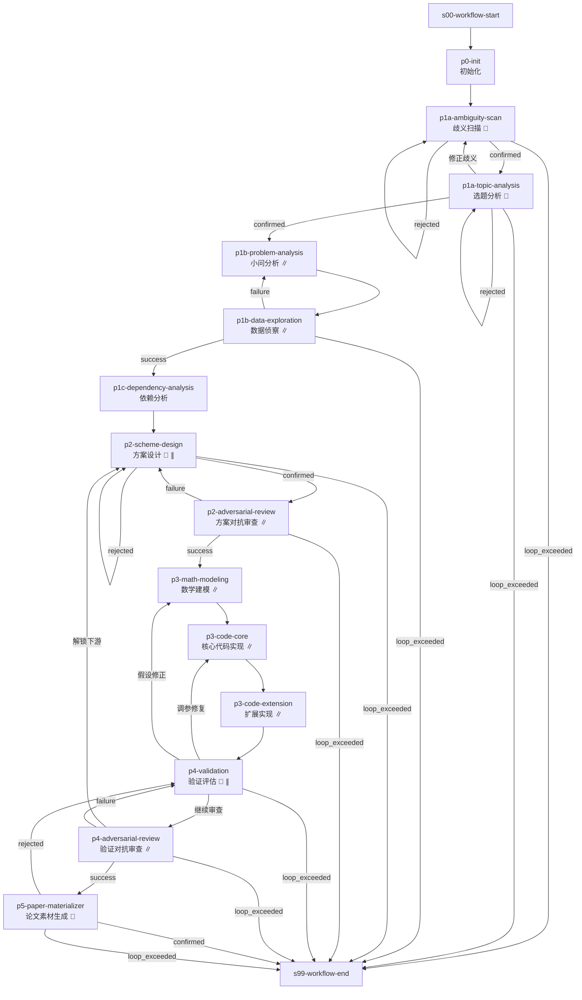

# 数学建模标准工作流 (mathematical-model)

> v2.3.0：小问流水线模型，确认点下沉，砍掉 workflow-director 中介层，恢复论文素材生成

---

## 工作流概览

- **工作流 ID**：`mathematical-model`
- **版本**：`2.3.0`
- **Stage 数量**：16（含 2 个虚拟节点）
- **确认点数量**：5（p1a-ambiguity-scan / p1a-topic-analysis / p2 / p4-validation / p5-paper-materializer）
- **最大并发**：6
- **架构模型**：小问流水线（p1c 分水岭后各小问独立运行 p2-p3-p4）

### 适用场景

数学建模竞赛，支持多小问独立流水线并行、依赖小问自动串行。

### 流程图

> **图例**：🔔 = 确认点  ∥ = 支持并行（小问独立运行）

### 架构说明：小问流水线模型

p1c 依赖分析完成后，所有小问根据其依赖关系分为两类：

| 类型 | 启动时机 | p2 触发边 |
|------|---------|----------|
| **独立小问** | p1c 完成即启动 | `p1c → p2`（always） |
| **依赖小问** | 等上游小问的 p4-adv 完成后启动 | `p4-adv → p2`（success, 解锁下游） |

每个小问独立运行 `p2 → p2-adv → p3-math → p3-core → p3-ext → p4 → p4-adv` 完整流水线，互不等待。

### 确认点设计

**p1a 双层确认**：歧义扫描（p1a-ambiguity-scan）作为硬门控先于选题分析执行——高危歧义必须确认解读方向后再进入 SWOT/模型速查，避免"解读基础未定就跑完整分析"的浪费。选题分析（p1a-topic-analysis）被否决时可通过"修正歧义"回到歧义扫描重新解读。

**确认点下沉（p4-validation）**：p4-validation 同时承载"验收评审"和"修复路由"——quality-inspector 产出评估报告后，用户直接做三选一：
- **继续审查**：质量过关，进入对抗审查
- **调参修复**：回退到 p3-code-core 微调
- **假设修正**：回退到 p3-math 修正模型

无需中间人 Skill（原 workflow-director p4-repair）翻译。

双层防御机制：
- **第一层 p2-adv**：方案锁死前对抗审查，扼杀方案级缺陷
- **第二层 p4-adv**：验证通过后对抗审查，扼杀验证级缺陷

---

## Stage 说明

### s00-workflow-start -- 工作流启动
虚拟起始点，无条件流转到 p0-init。

### p0-init -- 初始化
- **目标**：`init`
- **确认点**：否
- **描述**：创建工作目录结构、初始化 MANIFEST 和 VERSION.md

### p1a-ambiguity-scan -- 歧义扫描
- **目标**：`topic-analyst`
- **确认点**：是（硬门控——高危歧义必须确认解读方向后才能继续）
- **描述**：对赛题原文进行系统化歧义扫描（T01-T06），逐句标注嫌疑词/短语，判定歧义等级。高危歧义需用户确认解读方向后再进入选题分析
- **确认选项**：`确认解读` → p1a-topic-analysis / `重新扫描` → 重做（最多 2 轮）/ 超限 → 终止

### p1a-topic-analysis -- 选题分析
- **目标**：`topic-analyst`
- **确认点**：是（全局选题确认）
- **描述**：基于已确认的歧义解读，评估赛题可行性、分析数据可得性、执行 SWOT 分析、模型族谱速查、三维可行性评分
- **确认选项**：`确认继续` → p1b / `重新分析` → 重做（最多 2 轮）/ `修正歧义` → 回到 p1a-ambiguity-scan / 超限 → 终止

### p1b-problem-analysis -- 小问分析
- **目标**：`problem-decomposer`
- **确认点**：否
- **并行**：按 p1a 产出的小问拆分，最多 6 个并行实例
- **描述**：针对单个小问进行拆解，提取约束、声明假设、定义 I/O 映射

### p1b-data-exploration -- 数据侦察
- **目标**：`data-scout`
- **确认点**：否
- **Retry**：1 次
- **并行**：按 p1b 产出的小问拆分，最多 6 个并行实例
- **描述**：针对小问字段做定向数据质量诊断和 EDA。数据不合格时回退到 p1b（最多 2 轮），超限终止

### p1c-dependency-analysis -- 依赖分析
- **目标**：`dependency-analyst`
- **确认点**：否
- **描述**：分析多小问间的输入输出依赖关系，输出 lane 分组（独立/串行）和调度指令

### p2-scheme-design -- 方案设计
- **目标**：`model-architect`
- **确认点**：是（小问独立确认）
- **并行**：按依赖分析分组拆分，最多 6 个并行实例
- **描述**：为每个小问设计多套候选建模方案，输出对比总结与选型建议
- **确认选项**：`锁定方案` → p2-adv / `重新设计` → 重做（最多 2 轮）/ 超限 → 终止

### p2-adversarial-review -- 方案对抗审查
- **目标**：`scheme-reviewer`
- **确认点**：否
- **并行**：按 p2 拆分，每个小问独立审查
- **描述**：以评委视角攻击方案（双层防御第一层）。致命缺陷回退 p2（最多 3 轮），超限终止

### p3-math-modeling -- 数学建模
- **目标**：`math-modeler`
- **确认点**：否
- **Retry**：1 次
- **并行**：按审查通过的方案拆分，每个小问独立建模
- **描述**：完成符号体系构建、公式推导、假设验证

### p3-code-core -- 核心代码实现
- **目标**：`code-builder`
- **确认点**：否
- **Retry**：1 次
- **并行**：按数学建模产出拆分，每个小问独立实现
- **描述**：第一步规划代码结构，随后生成主脚本、验证脚本、单元测试并运行 Toy Model 验证

### p3-code-extension -- 扩展实现
- **目标**：`code-builder`
- **确认点**：否
- **Retry**：1 次
- **并行**：按核心代码产出拆分，每个小问独立扩展
- **描述**：生成并运行敏感性分析脚本（mandatory）

### p4-validation -- 验证评估
- **目标**：`quality-inspector`
- **确认点**：是（小问独立确认，修复路由下沉到此处）
- **Retry**：1 次
- **并行**：按小问拆分，每个小问独立验证
- **描述**：独立审查验证结果、四维度量化评分、产出评估报告。用户基于报告选择：
  - `继续审查` → p4-adv（质量过关，进入对抗审查）
  - `调参修复` → p3-code-core（内循环：调参/代码修复，最多 3 轮）
  - `假设修正` → p3-math-modeling（中循环：假设修正/模型降级，最多 3 轮）
  - 超限 → 终止

### p4-adversarial-review -- 验证对抗审查
- **目标**：`validation-reviewer`
- **确认点**：否
- **并行**：按 p4 实例拆分
- **描述**：攻击验证评估结果、构造反例（双层防御第二层）。致命缺陷回退 p4（最多 3 轮），超限终止
- **跨小问依赖**：成功后通过 `解锁下游` 边触发依赖小问的 p2 启动

### p5-paper-materializer -- 论文素材生成
- **目标**：`paper-materializer`
- **确认点**：是（全局汇聚确认）
- **描述**：所有小问汇聚后，从全流程产物生成论文写作素材（模型解释、图表说明、摘要元素、符号说明、参考文献等）
- **确认选项**：`确认完成` → 终止 / `回退修改` → p4（最多 1 轮）/ 超限 → 终止

### s99-workflow-end -- 工作流终止
虚拟终止点。

---

## 技能清单

| Skill ID | 对应 Stage | 说明 |
|----------|-----------|------|
| init | p0-init | 轻量初始化：创建目录、MANIFEST、VERSION.md |
| topic-analyst | p1a-ambiguity-scan, p1a-topic-analysis | 赛题歧义扫描(T01-T06) + 选题可行性评估、歧义识别、数据可得性分析 |
| problem-decomposer | p1b-problem-analysis | 小问拆解、约束提取、假设声明、I/O 映射 |
| data-scout | p1b-data-exploration | 定向数据质量诊断和 EDA |
| dependency-analyst | p1c-dependency-analysis | 多小问依赖关系分析与调度指令生成 |
| model-architect | p2-scheme-design | 多套候选建模方案设计与对比选型 |
| scheme-reviewer | p2-adversarial-review | 方案对抗审查（第一层防御） |
| math-modeler | p3-math-modeling | 符号体系、公式推导、假设验证 |
| code-builder | p3-code-core, p3-code-extension | 代码规划 + 核心代码生成 + 扩展实现 |
| quality-inspector | p4-validation | 四维度量化评分、评估报告、确认路由 |
| validation-reviewer | p4-adversarial-review | 验证对抗审查、反例构造（第二层防御） |
| paper-materializer | p5-paper-materializer | 论文写作素材生成（模型解释、图表说明、摘要、参考文献等） |

---

## 循环机制说明

### 1. P1a 歧义扫描循环
- **触发**：`p1a-ambiguity-scan` rejected → 重新扫描，最多 2 轮
- **超限**：终止

### 2. P1a 选题分析循环
- **触发**：`p1a-topic-analysis` rejected → 重新分析（最多 2 轮）或 修正歧义 → `p1a-ambiguity-scan`
- **超限**：终止

### 3. P1b 数据侦察降级循环
- **触发**：`p1b-data-exploration` failure → `p1b-problem-analysis`，最多 2 轮
- **超限**：终止

### 4. P2 方案审查循环
- **触发**：`p2-adversarial-review` failure → `p2-scheme-design`，最多 3 轮
- **超限**：终止

### 5. P4 验证修复循环（确认点下沉）
- **触发**：用户在 `p4-validation` 选择"调参修复"或"假设修正"
- **修复路由**：调参 → p3-code-core / 修正假设 → p3-math / 继续审查 → p4-adv
- **超限**：3 轮后终止

### 6. P4 对抗审查循环
- **触发**：`p4-adversarial-review` failure → `p4-validation`，最多 3 轮
- **超限**：终止

### 7. P5 完成确认回退
- **触发**：`p5-paper-materializer` rejected → `p4-validation`，最多 1 轮
- **超限**：终止

---

## 并发规则

- **最大并行 Agent 数**：6
- **流水线架构**：p1c 分流后，每个小问独立运行完整 p2→p3→p4 流水线
- **汇聚点**：p1b-data → p1c（全局）、p4-adv → p5（全局）
- **跨小问依赖**：依赖小问等待上游 p4-adv 成功后由 `解锁下游` 边触发 p2 启动

---

## v2.3.0 变更摘要

| 变更项 | v2.2.0 | v2.3.0 | 理由 |
|--------|--------|--------|------|
| workflow-director | p0-init/p4-repair/p5-complete 三段式编排 | **移除** | 中介 Skill，路由已在 edges 中表达 |
| p4-repair | 独立 Stage + 确认点 | **移除**（确认点下沉到 p4-validation） | 用户直接基于 quality-inspector 报告决策 |
| p4-validation | 无确认点 | **confirmation_point: true** | 承载修复路由确认 |
| p5-complete | 版本冻结 + 确认 | **替换为 p5-paper-materializer** | 恢复丢失的论文素材生成环节 |
| p0-init Skill | workflow-director | **init**（轻量） | 单一职责初始化 |
| p3-code-planning | 独立 Stage | **融入 p3-code-core** | 代码规划作为内部步骤 |
| emergency-fallback | 有 | **移除** | 无意义保底机制 |
| 小问并行模式 | Stage 级 barrier 并行 | **小问流水线** | 独立小问互不等待 |
| p1a 结构 | 单 Stage | **拆分为歧义扫描 + 选题分析** | 歧义扫描硬门控先于选题分析，避免误解基础上浪费分析 |
| 确认点数 | 5 | **5** | p1a 一拆二（+1歧义扫描确认点），p3-code-planning 和 p4-repair 移除（-2），p4-validation 获确认（+1），净持平 |
| Stage 数 | 18 | **16** | 砍 3 个（workflow-director×2 + emergency-fallback + code-planner），加 1 个（p1a-ambiguity-scan），净 -2 |
| Skill 数 | 13 | **12** | 砍 workflow-director/emergency-fallback/code-planner(+3)，加 init/paper-materializer(+2) |
