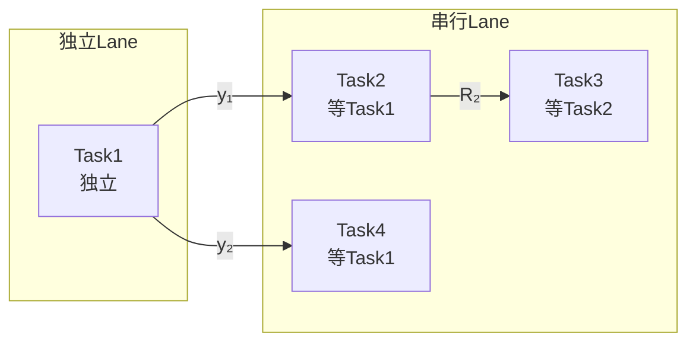

# Reference：输出文档模板规范 -- P1c 小问依赖分析

本文件定义 dependency-analyst 的详细输出模板。SKILL.md 中的"输出文档规范"章节引用本文件。

---

## P1c：小问依赖关系分析模板

文件路径：`GLOBAL_SHARED/P1c-小问依赖分析.md`

> v2.3.0 新增：Lane 分组、依赖链描述、调度指令摘要。p1c 是分流点，产出直接驱动编排器路由决策。

```markdown
# [赛题名称] 小问依赖关系分析

## 版本记录
| 日期 | 版本 | 修改内容 | 修改原因 |
| :--- | :--- | :--- | :--- |
| YYYY-MM-DD | v1.0 | 初稿生成 | 首次依赖分析 |

---

## 1. 小问依赖矩阵

> 行 = 输出方（上游），列 = 输入方（下游）。
> [✓] 表示该小问的输出被另一个小问作为输入使用。

| 输出\输入 | Task1 | Task2 | Task3 | Task4 |
|:---|:---:|:---:|:---:|:---:|
| Task1 输出 | — | [✓] | [ ] | [✓] |
| Task2 输出 | [ ] | — | [✓] | [ ] |
| Task3 输出 | [ ] | [ ] | — | [ ] |
| Task4 输出 | [ ] | [ ] | [ ] | — |

**依赖概述**：
- Task1 输出 → Task2 输入、Task4 输入（共 2 个下游）
- Task2 输出 → Task3 输入（共 1 个下游）
- Task3 无下游依赖
- Task4 无下游依赖

---

## 2. 依赖关系说明

### 2.1 直接依赖

| 依赖方向 | 传递内容 | 数据类型 | 影响 |
|:---|:---|:---|:---|
| Task1 → Task2 | Task1 的输出 y₁（最优配方）作为 Task2 的输入 x₂₁（原料配比） | 数值向量 → 数值标量 | Task2 必须等待 Task1 完成 |
| Task1 → Task4 | Task1 的输出 y₂（成本基线）作为 Task4 的输入 x₄₁（对比基准） | 数值 | Task4 必须等待 Task1 完成 |
| Task2 → Task3 | Task2 的输出 R₂（资源分配结果）作为 Task3 的输入 x₃₁（可用资源约束） | 数值向量 | Task3 必须等待 Task2 完成 |

### 2.2 间接依赖

> 通过中间小问传递的依赖关系。不产生新的调度约束，仅记录供理解。

| 依赖链 | 传递路径 | 影响 |
|:---|:---|:---|
| Task1 → Task3 | Task1 → Task2 → Task3 | 已被直接依赖覆盖，无需额外调度约束 |

### 2.3 共用数据

> 多个小问共用但非传递关系的数据源。提示下游避免重复侦察。

| 数据字段 | 共用小问 | 来源文件 | 建议 |
|:---|:---|:---|:---|
| 附件 A 原始数据 | Task1, Task2, Task3 | data.csv | Task1 的数据侦察结果可复用 |
| 附件 B 参数表 | Task2, Task4 | params.xlsx | Task2 的数据侦察结果可复用 |

---

## 3. Lane 分组

> v2.3.0 新增。Lane 分组直接决定工作流引擎的调度路由。

### 3.1 独立 Lane（p1c 完成后立即启动 p2）

| 小问 | 判定依据 | p2 启动时机 |
|:---|:---|:---|
| Task1 | 输入全部来自附件数据，无小问间依赖 | p1c 完成 |

### 3.2 串行 Lane（等待上游 p4-adv 完成后启动 p2）

| 小问 | 等待的上游 | 依赖内容 | p2 启动时机 |
|:---|:---|:---|:---|
| Task2 | Task1 | Task1 的输出 y₁ 作为本小问输入 | Task1.p4-adv 完成 |
| Task3 | Task2 | Task2 的输出 R₂ 作为本小问输入 | Task2.p4-adv 完成 |
| Task4 | Task1 | Task1 的输出 y₂ 作为本小问输入 | Task1.p4-adv 完成 |

---

## 4. 依赖链描述

> v2.3.0 新增。对每条串行依赖链展开详细说明。

### 依赖链 1：Task1 → Task2

- **依赖方向**：小问(Task2) 依赖 小问(Task1)
- **依赖原因**：Task2 的输入 x₂₁（原料配比）由 Task1 的模型输出 y₁（最优配方）计算得到。Task2 的建模以 Task1 的优化结果为前提。
- **数据流向**：Task1.p4（验证评估） → Task2.p2（方案设计）
- **依赖强度**：**强**——无替代数据源，Task2 无法绕过 Task1 独立求解。
- **调度路由**：`Task1.p4-adv 完成 → Task2.p2 启动`

### 依赖链 2：Task2 → Task3

- **依赖方向**：小问(Task3) 依赖 小问(Task2)
- **依赖原因**：Task3 的输入 x₃₁（可用资源约束）直接引用 Task2 的输出 R₂（资源分配结果）。Task3 在 Task2 的分配框架下做进一步优化。
- **数据流向**：Task2.p4（验证评估） → Task3.p2（方案设计）
- **依赖强度**：**强**——输入值由上游模型产出。
- **调度路由**：`Task2.p4-adv 完成 → Task3.p2 启动`

### 依赖链 3：Task1 → Task4

- **依赖方向**：小问(Task4) 依赖 小问(Task1)
- **依赖原因**：Task4 的输入 x₄₁（对比基准）来自 Task1 的输出 y₂（成本基线）。
- **数据流向**：Task1.p4（验证评估） → Task4.p2（方案设计）
- **依赖强度**：**中**——可用估计值替代，但精度受损。
- **调度路由**：`Task1.p4-adv 完成 → Task4.p2 启动`

---

## 5. 依赖关系 DAG



---

## 6. 数据复用提示

| 共用数据 | 涉及小问 | 建议侦察方 | 复用策略 |
|:---|:---|:---|:---|
| 附件 A (data.csv) | Task1, Task2, Task3 | Task1（最先启动的独立小问） | Task1 的数据侦察结果写入 GLOBAL_SHARED，Task2/Task3 直接读取 |
| 附件 B (params.xlsx) | Task2, Task4 | Task2 | Task2 侦察后 Task4 复用 |

---

## 7. 调度指令摘要

> v2.3.0 新增。编排器根据本章节做出 p1c 分流路由决策。

### 7.1 独立启动（p1c 完成 → 立即启动 p2）

| 小问 ID | Lane ID | 启动边 | 备注 |
|:---|:---|:---|:---|
| Task1 | L0 | p1c → p2 | 无上游依赖，独立运行完整流水线 |

### 7.2 串行启动（上游 p4-adv 完成 → 解锁下游 p2）

| 下游小问 | 等待上游 | 解锁边 | 备注 |
|:---|:---|:---|:---|
| Task2 | Task1 | Task1.p4-adv → Task2.p2 | 强依赖，无替代数据 |
| Task3 | Task2 | Task2.p4-adv → Task3.p2 | 强依赖 |
| Task4 | Task1 | Task1.p4-adv → Task4.p2 | 中依赖，可用估计值 |

### 7.3 结构化的调度摘要

```
# 独立 Lane（p1c 完成后立即启动 p2）
INDEPENDENT: Task1

# 串行 Lane（上游 p4-adv 完成后启动 p2）
SERIAL: Task2 ← Task1
SERIAL: Task3 ← Task2
SERIAL: Task4 ← Task1
```

---

## 8. 执行时间预估

> 基于 Lane 分组估算最短完工时间（不考虑修复循环）。

| Lane | 小问 | 预估耗时（分钟） | 关键路径？ |
|:---|:---|:---|:---|
| 独立 | Task1 | T₁ | 是 |
| 串行 | Task2 | T₂ | 是（等 Task1） |
| 串行 | Task3 | T₃ | 是（等 Task2） |
| 串行 | Task4 | T₄ | 否（等 Task1，可与 Task2/Task3 并行） |

**预估总耗时**：max(并行时间) = T₁ + max(T₂ + T₃, T₄)

> 若存在多条并行串行链，总耗时取最长关键路径。
```
