# Module Integration Workflow v1.1.0

## Overview

**模块集成联调工作流** 是在所有模块独立实现完成后，对跨模块调用关系进行系统性验证和修复的集成联调流水线。从所有模块的落地规范出发，构建跨模块调用链和接口兼容性矩阵，构造并逐一执行跨模块调用场景，对失败进行根因诊断和修复（含落地规范同步修正），最终产出联调报告供用户验收。

### 核心特征

- **无确认自动化分析**：接口依赖分析阶段全程自动（s01-analyze），读取所有模块落地规范，构建调用链和兼容性矩阵，无需用户介入
- **SubAgent 执行联调**：联调执行阶段（s02-execute）由 SubAgent 独立构造跨模块调用场景、执行、诊断、修复，Skill 内部修复循环最多 5 轮（非 Stage 级自循环）
- **落地规范同步修正**：修复涉及接口变更时，同步更新落地规范文档，保持设计与实现一致
- **报告级用户验收**：最终报告始终由用户审查确认（s03-report），用户拒绝可追加修复（≤2 次）
- **渐进收敛**：修复循环驱动，5 轮上限后仍携 fix_log.md 进入报告，标注未解决问题

### 阶段总览（3 业务阶段 + 虚拟起止）

| Stage ID | 名称 | Skill ID | 确认点 | 职责 |
|:---|:---|:---|:---|:---|
| s00-workflow-start | 工作流启动 | - | 无 | 虚拟起始阶段 |
| s01-analyze | 接口依赖分析 | module-integration-analyzer | 无 | 读所有模块落地规范 → 构建跨模块调用链 → 生成兼容性矩阵 → 输出 integration_plan.json |
| s02-execute | 联调执行 | module-integration-executor | 无 | SubAgent 构造跨模块调用场景 → 执行 → 诊断失败 → Skill 内部修复循环（≤5轮）+同步落地规范 → 输出 fix_log.md |
| s03-report | 联调报告 | module-integration-reporter | 始终 | 汇总修复记录+跨模块接口变更+最终兼容性结论 → 用户确认 |
| s99-workflow-end | 工作流终止 | - | 无 | 虚拟终止阶段 |

---

## Mermaid Flowchart

```mermaid
flowchart TD
    s00-start["&#9654; s00-workflow-start<br/>工作流启动<br/>（虚拟起始）"]

    s01-analyze["&#128269; s01-analyze<br/>接口依赖分析<br/>Skill: module-integration-analyzer<br/>确认点: 无<br/>输出: integration_plan.json"]

    s02-execute["&#9881; s02-execute<br/>联调执行<br/>Skill: module-integration-executor<br/>确认点: 无<br/>Skill 内部修复循环 ≤5 轮<br/>模式 B: s03 拒绝后增量修复"]

    s03-report["&#128196; s03-report<br/>联调报告<br/>Skill: module-integration-reporter<br/>&#9989; 始终确认: 用户验收<br/>拒绝追加修复: ≤2 次"]

    s99-end["&#9632; s99-workflow-end<br/>工作流终止<br/>（虚拟终止）"]

    s00-start -->|"always"| s01-analyze

    s01-analyze -->|"always"| s02-execute

    s02-execute -->|"always"| s03-report

    s03-report -->|"&#9989; confirmed"| s99-end
    s03-report -->|"&#10060; rejected [max 2]"| s02-execute
    s03-report -->|"&#128683; loop_exceeded"| s99-end

    classDef virtual fill:#f5f5f5,stroke:#9e9e9e,stroke-dasharray: 5 5
    classDef analyze fill:#e3f2fd,stroke:#1565c0
    classDef execute fill:#e8f5e9,stroke:#2e7d32
    classDef report fill:#fff3e0,stroke:#e65100
    classDef confirm fill:#fff9c4,stroke:#f57f17

    class s00-start,s99-end virtual
    class s01-analyze analyze
    class s02-execute execute
    class s03-report report
    class s03-report confirm
```

**图例说明**:
- 实线箭头 (`-->`): 流程边
- `success`: 全部通过，进入下一阶段
- `failure`: 存在失败场景，触发自循环修复
- `confirmed`: 用户确认的门控边
- `rejected`: 用户拒绝，返回追加修复（附反馈意见）
- `loop_exceeded`: 循环次数达到上限
- 黄色节点：含确认点的阶段

---

## Stage Descriptions

### s00-workflow-start — 工作流启动

- **Skill ID**: 无（虚拟阶段）
- **确认点**: 无
- **说明**: 虚拟起始阶段，不执行任何逻辑，仅作为工作流入口。直接流转到 `s01-analyze`。

---

### s01-analyze — 接口依赖分析

- **Skill ID**: `module-integration-analyzer`
- **确认点**: 无（全自动执行）
- **输入**: 无（自驱动读取 `docs/功能设计/` 下所有模块的落地规范）
- **输出**: `integration_plan.json`
- **重试策略**: max_attempts=1

**执行流程**：

1. **扫描模块落地规范**：遍历 `docs/功能设计/` 目录，识别所有模块的 `-落地规范.md` 文件。
2. **提取对外接口定义**：从每个模块的落地规范中提取精确的编码规格：
   - 函数签名（函数名、参数名、参数类型、返回值类型）
   - 类型定义（model/interface/type alias）
   - 异常条件（抛出哪些异常、在什么条件下抛出）
   - 状态机约定（状态枚举、合法状态转移）
3. **构建跨模块调用链**：识别模块间的依赖关系：
   - import/调用关系（哪个模块导入了哪个模块的符号）
   - 共享数据结构（哪些类型在多个模块间传递）
   - 接口消费方（每个接口被哪些模块调用）
4. **生成接口兼容性矩阵**：逐对检查调用方期望 vs 提供方实际签名：
   - 类型匹配检查
   - 参数完整性检查（调用方传递的参数是否与提供方签名一致）
   - 异常处理覆盖检查（调用方是否处理了提供方可能抛出的异常）
   - 状态转移合规检查（调用序列是否符合状态机约定）
5. **标记潜在不兼容点**：按严重程度分类标记（阻断级 / 高风险 / 低风险）。
6. **输出 `integration_plan.json`**：包含跨模块调用链（有向图）、兼容性矩阵（NxN 矩阵）、不兼容点清单（含严重程度和定位信息）。

**异常处理**：
- 落地规范文件缺失 → 标记 `⚠️ 缺失`，跳过该模块
- 落地规范格式不规范 → 尝试降级解析，无法解析则标记并跳过

---

### s02-execute — 联调执行

- **Skill ID**: `module-integration-executor`
- **确认点**: 无（SubAgent 全自动执行）
- **输入**: `integration_plan.json`（来自 s01-analyze）
- **输出**: `fix_log.md`（或 `fix_log-appendix-{N}.md` 当模式 B 增量修复时）
- **重试策略**: max_attempts=2, on: [timeout, error]（SubAgent 调用重试）
- **内部循环上限**: 5 轮

> SubAgent model: sonnet（默认）。

**执行流程**：

**A. 场景构造**：
1. 读取 `integration_plan.json`，按调用链优先级排序跨模块调用场景：
   - P0: 共享数据结构场景（类型在模块间传递的正确性）
   - P1: 基础接口场景（单个接口的跨模块调用）
   - P2: 组合调用场景（多个接口的编排调用）
   - P3: 端到端场景（完整业务流程的跨模块协作）

**B. 逐一执行**：
1. 按优先级顺序逐个场景构造实际调用代码或导入测试。
2. 执行每个场景，记录结果（通过 / 失败）。
3. 收集失败信息：错误类型、堆栈信息、失败上下文。

**C. 根因诊断**（仅对失败场景）：
1. 判断失败性质：
   - **实现缺陷**：代码实现与自己的落地规范不一致
   - **设计缺陷**：落地规范本身有逻辑错误
   - **契约矛盾**：两个模块的落地规范对同一接口定义冲突
2. 定位具体文件和行号，3-5 句话呈现根因。

**D. 修复与同步**：
1. 按影响场景数排序修复优先级。
2. 最小化修复：仅修改必要代码，每处修改对应一个 case ID。
3. 若修复涉及接口变更（签名/类型/异常），同步更新落地规范文档。
4. 重新验证：仅重新运行受影响场景。

**E. 循环控制**：
- 全部通过 → 结束循环，进入 s03-report
- 存在失败 → 修复后重新验证（自循环，最多 5 轮）
- 达到 5 轮上限 → 结束循环，携带 fix_log.md 进入 s03-report（报告中标注未解决问题）

**F. 输出 fix_log.md**：
- 每轮修复记录：轮次编号、本轮的失败场景数、成功场景数
- 每个 case 的明细：场景编号、失败根因、修改内容（文件+行号+修改类型）、验证结果
- 未解决项清单（当达到上限时）

**铁律（s02-execute SubAgent 行为约束）**：
- 修复代码时必须同步更新落地规范（当修复涉及接口变更时）
- 每次修复后必须重新验证受影响场景
- 不可跳过场景或降低验证标准

---

### s03-report — 联调报告

- **Skill ID**: `module-integration-reporter`
- **确认点**: 是（始终触发）
- **输入**: `integration_plan.json`（来自 s01-analyze）+ `fix_log.md`（来自 s02-execute）
- **输出**: `docs/integration-reports/{module_ids}-{date}/integration-report.md`
- **重试策略**: max_attempts=1
- **拒绝追加修复上限**: 2 次

**执行流程**：

1. **收集中间产物**：读取 `s01-analyze` 产出的 `integration_plan.json` 和 `s02-execute` 产出的 `fix_log.md`。
2. **汇总生成联调报告**：
   - **修复记录摘要**：
     - 总执行轮次
     - 每轮场景总数、通过数、失败数
     - 修复 case 总数（按实现缺陷 / 设计缺陷 / 契约矛盾分类）
   - **跨模块接口变更列表**：
     - 因联调修改的接口签名变更（旧签名 → 新签名）
     - 类型定义变更
     - 异常条件变更
     - 落地规范同步更新记录（哪些落地规范文件被修改）
   - **最终兼容性结论**：
     - 兼容矩阵最终状态（哪些模块对已验证兼容、哪些仍存在已知问题）
     - 未解决的已知问题（含严重程度和建议后续行动）
     - 最终结论（全部通过 / 部分通过 / 存在阻断问题）
3. **保存报告**：输出到 `docs/integration-reports/{module_ids}-{date}/integration-report.md`。
4. **用户确认**：向用户呈现修复记录摘要、接口变更列表和兼容性结论。用户可：
   - **确认** → 工作流完成
   - **拒绝（附 rejection_context）** → 返回 `s02-execute` 以模式 B 增量修复（≤2 次）。rejection_context 包含：需追加验证的模块对、具体场景编号、补充意见

**异常处理**：
- `integration_plan.json` 或 `fix_log.md` 缺失 → 标记 `⚠️ 缺失`，在报告中注明
- 报告生成失败 → retry_policy 重试（最多 1 次）

---

### s99-workflow-end — 工作流终止

- **Skill ID**: 无（虚拟阶段）
- **确认点**: 无
- **说明**: 虚拟终止阶段，所有退出路径汇聚于此。不执行任何逻辑。

---

## Quick Reference

### Skill 与阶段映射

| Skill ID | 覆盖阶段 | 类型 | 来源 |
|:---|:---|:---|:---|
| module-integration-analyzer | s01-analyze | 分析（自动） | 全新创建 |
| module-integration-executor | s02-execute | SubAgent 调用（双模式） | 全新创建（模式 A 全量联调 + 模式 B 增量修复） |
| module-integration-reporter | s03-report | 生成+确认 | 全新创建 |

### 确认点汇总

| 阶段 | 条件 | 触发场景 | 行为 |
|:---|:---|:---|:---|
| s01-analyze | 无 | — | 全自动执行 |
| s02-execute | 无 | — | SubAgent 全自动执行 |
| s03-report | 始终 | 联调报告生成后 | 向用户呈现修复摘要、接口变更、兼容性结论，确认或追加修复 |

### 循环与上限

| 循环 | 涉及边 | 最大次数 | 计数器阶段 | 说明 |
|:---|:---|:---|:---|:---|
| 联调 Skill 内部修复循环 | Skill 内部 | 5 | Skill 内部 | SubAgent 在 Skill 内部构造场景→执行→诊断→修复→重新验证。全部通过或达上限后输出 fix_log.md |
| 用户拒绝增量修复 | s03-report → s02-execute | 2 | s03-report | 用户拒绝报告并附 rejection_context，s02-executor 以模式 B 增量修复（仅指定模块对/场景） |

### 数据流（中间产物传递）

| 产物文件 | 产出阶段 | 消费阶段 | 格式 | 说明 |
|:---|:---|:---|:---|:---|
| integration_plan.json | s01-analyze | s02-execute, s03-report | JSON | 跨模块调用链 + 兼容性矩阵 + 不兼容点清单 |
| fix_log.md | s02-execute | s03-report | Markdown | 每轮修复记录（场景编号、根因、修改、验证结果） |
| integration-report.md | s03-report | —（最终产物） | Markdown | 修复汇总 + 接口变更 + 兼容性结论 + 诚实声明 |

---

## 变更记录

| 版本 | 日期 | 变更内容 |
|:---|:---|:---|
| 1.0.0 | 2026-05-12 | 初始版本：3 Stage + 3 Skill，s02 Stage 级自循环修复 ≤5 轮 |
| 1.1.0 | 2026-05-12 | 优化：去掉 s02 Stage 级自循环（修复循环全在 Skill 内部）；s02-executor 新增模式 B（增量修复）；清理所有 UNCERTAIN 标记；标准化报告路径 |
