# Module Lifecycle Workflow v1.0.0

## Overview

**模块全生命周期工作流** 将模块实现、对抗性盲测验证、正式验收测试、模块审查、缺陷修复和 Git 工作树同步整合为统一的多阶段流水线。

### 核心特征

- **信息隔离**：实现者不知测试内容，测试者不知实现细节 —— 通过 SubAgent prompt 铁律 + 脚本验证强制执行
- **对抗性验证**：黑盒测试主动寻找实现漏洞，而非验证正确行为
- **渐进收敛**：失败驱动循环修复，最多 3 轮对抗迭代，检测退化与收敛停滞
- **多入口点**：支持从任意功能组独立启动（核心流水线 / 模块审查 / 缺陷修复 / 验收测试 / Git 同步）

### 功能组 (5 组，共 27 阶段)

| 功能组 | 阶段数 | Skill ID | 入口点 | 默认执行 |
|:---|:---|:---|:---|:---|
| 核心对抗验证流水线 | 9 | module-lifecycle-preflight/contract/impl-executor/impl-validator/test-generator/blindtest/reporter | orch-preflight | 是 |
| 模块审查 | 4 | module-lifecycle-reviewer | review-identify | 否（可选触发） |
| 缺陷修复 | 4 | module-lifecycle-defect-fixer | fix-diagnose | 否（可选触发） |
| 正式验收测试编写 | 5 | module-lifecycle-test-writer | testw-prep | 否（可选触发） |
| Git 工作树同步 | 5 | module-lifecycle-git-sync | gitsync-check | 否（可选触发） |

---

## Mermaid Flowchart

```mermaid
flowchart TD
    %% ============================================
    %% Group 1: Core Adversarial Pipeline
    %% ============================================
    orch-preflight["🔧 orch-preflight<br/>前置环境同步与就绪检查<br/>Skill: module-lifecycle-preflight<br/>确认点: 无"]
    
    orch-contract["📋 orch-contract<br/>契约提取与设计仲裁<br/>Skill: module-lifecycle-contract<br/>✅ 确认点: AQ-001, AQ-002, AQ-004"]
    
    exec-impl["⚙️ exec-impl<br/>实现落地执行 (SubAgent)<br/>Skill: module-lifecycle-impl-executor<br/>确认点: 无<br/>铁律: 不可读测试 / 不可AskUser"]
    
    orch-impl-validate["🔍 orch-impl-validate<br/>实现输出验证<br/>Skill: module-lifecycle-impl-validator<br/>⚠️ 条件确认: AQ-003 (重大风险时)"]
    
    testgen-create["🧪 testgen-create<br/>对抗性测试生成 (SubAgent)<br/>Skill: module-lifecycle-test-generator<br/>确认点: 无<br/>铁律: 禁止读实现代码"]
    
    orch-blindtest["🎯 orch-blindtest<br/>盲测执行与失败分类<br/>Skill: module-lifecycle-blindtest<br/>确认点: 无<br/>自动分支判定中枢"]
    
    exec-fix["🔨 exec-fix<br/>实现代码修复 (SubAgent)<br/>Skill: module-lifecycle-impl-executor<br/>确认点: 无<br/>铁律: 不接触测试代码"]
    
    testgen-fix["🔧 testgen-fix<br/>测试缺陷修正 (SubAgent)<br/>Skill: module-lifecycle-test-generator<br/>确认点: 无<br/>铁律: 不接触实现代码"]
    
    orch-report["📊 orch-report<br/>完成汇报与验收<br/>Skill: module-lifecycle-reporter<br/>确认点: 无<br/>14项验收检查清单"]

    %% ============================================
    %% Group 2: Module Review
    %% ============================================
    review-identify["🔎 review-identify<br/>模块编号识别与文档定位<br/>Skill: module-lifecycle-reviewer<br/>⚠️ 条件确认: AQ-005 (模糊范围时)"]
    
    review-analyze["📝 review-analyze<br/>规格提取与落地检查<br/>Skill: module-lifecycle-reviewer<br/>确认点: 无"]
    
    review-verify["🔗 review-verify<br/>联动验证<br/>Skill: module-lifecycle-reviewer<br/>确认点: 无"]
    
    review-report["📄 review-report<br/>审查报告生成与输出<br/>Skill: module-lifecycle-reviewer<br/>✅ 确认点: AQ-006"]

    %% ============================================
    %% Group 3: Defect Fixing
    %% ============================================
    fix-diagnose["🔬 fix-diagnose<br/>缺陷诊断与根因分析<br/>Skill: module-lifecycle-defect-fixer<br/>⚠️ 条件确认: AQ-007 (无法定位时)"]
    
    fix-proposal["📋 fix-proposal<br/>修复方案确认<br/>Skill: module-lifecycle-defect-fixer<br/>✅ 确认点: AQ-008, AQ-009<br/>内部循环: 最多5次"]
    
    fix-execute["🔨 fix-execute<br/>执行修复<br/>Skill: module-lifecycle-defect-fixer<br/>确认点: 无"]
    
    fix-report["📢 fix-report<br/>修复结果汇报<br/>Skill: module-lifecycle-defect-fixer<br/>确认点: 无"]

    %% ============================================
    %% Group 4: Test Writing
    %% ============================================
    testw-prep["📖 testw-prep<br/>遗留审查与契约读取<br/>Skill: module-lifecycle-test-writer<br/>⚠️ 条件确认: AQ-010 (重大差异时)"]
    
    testw-scenario["🗺️ testw-scenario<br/>测试场景提取<br/>Skill: module-lifecycle-test-writer<br/>确认点: 无"]
    
    testw-code["✍️ testw-code<br/>验收测试编写<br/>Skill: module-lifecycle-test-writer<br/>确认点: 无"]
    
    testw-verify["✅ testw-verify<br/>静态自检与运行验证<br/>Skill: module-lifecycle-test-writer<br/>⚠️ 条件确认: AQ-011 (契约矛盾时)"]
    
    testw-report["📊 testw-report<br/>测试报告输出<br/>Skill: module-lifecycle-test-writer<br/>确认点: 无"]

    %% ============================================
    %% Group 5: Git Worktree Sync
    %% ============================================
    gitsync-check["🔍 gitsync-check<br/>前置检查与分支确定<br/>Skill: module-lifecycle-git-sync<br/>⚠️ 条件确认: AQ-012 (无默认分支时)"]
    
    gitsync-sync["🔄 gitsync-sync<br/>同步主分支到当前分支<br/>Skill: module-lifecycle-git-sync<br/>⚠️ 条件确认: AQ-013 (冲突时)"]
    
    gitsync-commit["💾 gitsync-commit<br/>分阶段提交<br/>Skill: module-lifecycle-git-sync<br/>确认点: 无"]
    
    gitsync-merge["🚀 gitsync-merge<br/>合并到主分支并推送<br/>Skill: module-lifecycle-git-sync<br/>⚠️ 条件确认: AQ-014 (冲突时)"]
    
    gitsync-cleanup["🧹 gitsync-cleanup<br/>清理 Worktree<br/>Skill: module-lifecycle-git-sync<br/>确认点: 无"]

    %% ============================================
    %% Group 1 Edges (Core Pipeline)
    %% ============================================
    orch-preflight -->|"always"| orch-contract
    orch-contract -->|"✅ confirmed"| exec-impl
    exec-impl -->|"always"| orch-impl-validate
    
    orch-impl-validate -->|"❌ failure [max 3]"| exec-impl
    orch-impl-validate -->|"always"| testgen-create
    orch-impl-validate -->|"❌ contract-issue [max 1]"| orch-contract
    
    testgen-create -->|"always"| orch-blindtest
    
    orch-blindtest -->|"✅ all-pass"| orch-report
    orch-blindtest -->|"🛑 max-rounds (3)"| orch-report
    orch-blindtest -->|"🛑 stagnation"| orch-report
    orch-blindtest -->|"🐛 impl-bug"| exec-fix
    orch-blindtest -->|"🧪 test-defect"| testgen-fix
    orch-blindtest -->|"⚠️ regression [max 1]"| orch-contract
    
    exec-fix -->|"always [max 3 loops]"| orch-blindtest
    testgen-fix -->|"always [max 3 loops]"| orch-blindtest

    %% Cross-group: Core → Other groups
    orch-report -.->|"📌 optional"| testw-prep
    orch-report -.->|"📌 optional"| review-identify
    orch-preflight -.->|"📌 optional"| gitsync-check

    %% ============================================
    %% Group 2 Edges (Module Review)
    %% ============================================
    review-identify -->|"always"| review-analyze
    review-analyze -->|"always"| review-verify
    review-verify -->|"always"| review-report
    review-report -.->|"📌 optional"| fix-diagnose

    %% ============================================
    %% Group 3 Edges (Defect Fixing)
    %% ============================================
    fix-diagnose -->|"always"| fix-proposal
    fix-diagnose -->|"❓ info-insufficient [max 3]"| fix-diagnose
    fix-proposal -->|"❌ rejected [max 5]"| fix-proposal
    fix-proposal -->|"✅ confirmed"| fix-execute
    fix-execute -->|"always"| fix-report

    %% Cross-group: Defect Fixing → Others
    fix-report -.->|"📌 optional"| orch-blindtest
    fix-report -.->|"📌 optional"| review-identify

    %% ============================================
    %% Group 4 Edges (Test Writing)
    %% ============================================
    testw-prep -->|"always"| testw-scenario
    testw-scenario -->|"always"| testw-code
    testw-code -->|"always"| testw-verify
    testw-verify -->|"🐛 test-bug [max 3]"| testw-code
    testw-verify -->|"always"| testw-report
    testw-verify -->|"❓ contract-question [max 1]"| testw-prep

    %% ============================================
    %% Group 5 Edges (Git Sync)
    %% ============================================
    gitsync-check -->|"always"| gitsync-sync
    gitsync-sync -->|"always"| gitsync-commit
    gitsync-sync -->|"⚠️ conflict-retry [max 3]"| gitsync-sync
    gitsync-commit -->|"always"| gitsync-merge
    gitsync-merge -->|"always"| gitsync-cleanup
    gitsync-merge -->|"⚠️ conflict-retry [max 3]"| gitsync-merge

    %% ============================================
    %% Styles
    %% ============================================
    classDef core fill:#e1f5fe,stroke:#01579b
    classDef review fill:#f3e5f5,stroke:#4a148c
    classDef fix fill:#ffebee,stroke:#b71c1c
    classDef testw fill:#e8f5e9,stroke:#1b5e20
    classDef gitsync fill:#fff3e0,stroke:#e65100
    classDef confirm fill:#fff9c4,stroke:#f57f17

    class orch-preflight,orch-contract,exec-impl,orch-impl-validate,testgen-create,orch-blindtest,exec-fix,testgen-fix,orch-report core
    class review-identify,review-analyze,review-verify,review-report review
    class fix-diagnose,fix-proposal,fix-execute,fix-report fix
    class testw-prep,testw-scenario,testw-code,testw-verify,testw-report testw
    class gitsync-check,gitsync-sync,gitsync-commit,gitsync-merge,gitsync-cleanup gitsync
    class orch-contract,orch-impl-validate,review-identify,review-report,fix-diagnose,fix-proposal,testw-prep,testw-verify,gitsync-check,gitsync-sync,gitsync-merge confirm
```

**图例说明**:
- 实线箭头 (`-->`): 组内流程边（sequential / conditional / gated）
- 虚线箭头 (`-.->`): 跨组可选边（optional —— 用户手动触发）
- `✅ confirmed`: 需用户确认的门控边
- `❌ failure`: 失败回退边（带最大重试次数）
- `🐛 impl-bug` / `🧪 test-defect`: 盲测自动分支判定
- `🛑`: 循环终止条件
- 黄色节点：含确认点的阶段

---

## Stage Descriptions

### Group 1: 核心对抗验证流水线 (Core Adversarial Pipeline)

这是工作流的默认主干。从 `orch-preflight` 开始，依次经过契约提取、实现落地、验证、对抗性测试生成、盲测执行，最终产出验收报告。失败时循环修复直至通过或达到上限。

#### orch-preflight -- 前置环境同步与就绪检查
- **Skill**: module-lifecycle-preflight
- **类型**: script_call
- **确认点**: 无
- **输入**: `module_id`
- **输出**: 无
- **说明**: 流水线就绪检查。检测 git worktree 状态，同步主分支最新代码，检查 docs/ 目录设计文档是否有未同步变更，运行 preflight_check.py 验证 Python 版本、脚本完整性、契约目录存在性、SubAgent 可用性。不通过则阻断流水线。

#### orch-contract -- 契约提取与设计仲裁
- **Skill**: module-lifecycle-contract
- **类型**: analysis
- **确认点**: 是 (AQ-001, AQ-002, AQ-004)
- **输入**: 设计文档、落地规范、契约文件
- **输出**: `contract-expectations.md` (冻结文件)
- **说明**: 从多份文档中按 P0→P1→P2 优先级提取接口契约，生成并冻结契约期望清单。处理设计文档冲突（未覆盖场景 / 契约模糊→用户确认），向用户展示执行计划预览并等待确认。这是启动实现落地前的最后一道用户门控。

#### exec-impl -- 实现落地执行
- **Skill**: module-lifecycle-impl-executor
- **类型**: subagent_call (model: opus)
- **确认点**: 无
- **输入**: 落地规范、设计文档、项目结构设计文档、contract-expectations.md
- **输出**: 实现代码文件列表、function-signatures.json、pending-confirmations.md
- **说明**: SubAgent 独立运行——解析设计、扫描现有代码、差异比对、按实现顺序编写代码、生成函数签名清单。铁律：SubAgent 不可运行测试、不可读取 `.tmp/adversarial-tests/`、不可 AskUserQuestion。所有决策以保守假设处理，待确认事项通过 pending-confirmations.md 上浮。

#### orch-impl-validate -- 实现输出验证
- **Skill**: module-lifecycle-impl-validator
- **类型**: validation
- **确认点**: 是 (AQ-003, 条件性: 仅当存在重大风险项时)
- **输入**: function-signatures.json, pending-confirmations.md
- **输出**: 无
- **说明**: 验证函数签名 JSON 格式与合规性；检查待确认事项，评估风险等级。重大风险项升级为用户确认。验证不通过则退回 exec-impl 修正（最多重试 3 次）。

#### testgen-create -- 对抗性测试生成
- **Skill**: module-lifecycle-test-generator
- **类型**: subagent_call (model: opus)
- **确认点**: 无
- **输入**: contract-expectations.md, function-signatures.json, 落地规范（异常处理/类型定义章节）
- **输出**: 测试代码文件、测试清单、green-seeking-report.json
- **说明**: SubAgent 黑盒操作——仅基于接口契约生成破坏性测试（P0 契约禁止输入→P1 边界值→P2 类型破坏→P3 状态/时序破坏）。强制自检流水线：语法→导入→趋绿扫描（toxicity_score ≤ 2，阻断级门控）。铁律：绝对禁止读取实现源码。

#### orch-blindtest -- 盲测执行与失败分类
- **Skill**: module-lifecycle-blindtest
- **类型**: script_call
- **确认点**: 无
- **输入**: 测试代码文件、测试清单、green-seeking-report.json、上轮结果（从第2轮起）
- **输出**: 测试输出、failure-summary-round-{N}.md（如需）、test-defects-round-{N}.md（如需）
- **说明**: 自动化的判断-分支逻辑中枢。运行对抗性测试 → classify_failures.py 辅助分类 + 人工复核 → 分支判定（全部通过→报告 / 实现漏洞→修复 / 测试缺陷→修正 / 退化→重新仲裁）。包含回归检查和收敛停滞检测。validate_failure_summary.py 阻断级信息隔离合规验证。

#### exec-fix -- 实现代码修复
- **Skill**: module-lifecycle-impl-executor
- **类型**: subagent_call (model: opus)
- **确认点**: 无
- **输入**: failure-summary-round-{N}.md（信息隔离版本，不含测试代码/输入值/路径）、当前实现代码、落地规范
- **输出**: 修改后的代码、修改说明（含 case ID）、pending-confirmations-round-{N}.md
- **说明**: SubAgent 根据失败摘要进行最小化修复——仅改实现代码，不改测试，每处修改对应一个 case ID。铁律：不接触测试代码。修复后流转回 orch-blindtest（最多 3 轮）。

#### testgen-fix -- 测试缺陷修正
- **Skill**: module-lifecycle-test-generator
- **类型**: subagent_call (model: opus)
- **确认点**: 无
- **输入**: test-defects-round-{N}.md（不含测试代码片段，仅缺陷类型和修复方向）、当前测试代码
- **输出**: 修正后的测试代码文件
- **说明**: SubAgent 根据缺陷报告修正测试代码。铁律：不接触实现代码，仅修改测试文件。修正后流转回 orch-blindtest（最多 3 轮）。

#### orch-report -- 完成汇报与验收
- **Skill**: module-lifecycle-reporter
- **类型**: generation
- **确认点**: 无
- **输入**: 全部轮次的盲测结果、修复记录、契约文件
- **输出**: `docs/testing-design/{module_id}/adversarial-report.md`
- **说明**: 生成最终对抗性验证报告（含 14 项验收检查清单）。运行 validate_contract_consistency.py 和 check_isolation.py 进行事后审计。未勾选项在诚实声明中标注。

---

### Group 2: 模块审查 (Module Review)

独立的模块审查流水线，对照设计文档检查代码落地情况和模块间联动实现度。可从 `review-identify` 独立启动，或从 `orch-report` 可选触发。

#### review-identify -- 模块编号识别与文档定位
- **Skill**: module-lifecycle-reviewer
- **类型**: analysis
- **确认点**: 是 (AQ-005, 条件性: 仅当用户使用模糊范围词时)
- **说明**: 从用户输入提取模块编号。模糊范围词时扫描并请用户确认。四优先级搜索定位设计文档（独立双文件→旧版单文件→总设计文档→其他位置），两份文档都必须定位。

#### review-analyze -- 规格提取与落地检查
- **Skill**: module-lifecycle-reviewer
- **类型**: analysis
- **确认点**: 无
- **说明**: 从落地规范提取交付物清单和接口契约；从设计文档提取模块边界和联动关系。逐项验证代码落地（文件存在性、非空、语法、符号、签名、逻辑、测试覆盖）。

#### review-verify -- 联动验证
- **Skill**: module-lifecycle-reviewer
- **类型**: analysis
- **确认点**: 无
- **说明**: 构建预期联动图，grep 静态分析实际调用链，接口签名匹配，数据流验证。标记联动状态（已实现/部分实现/未实现/无法验证）。

#### review-report -- 审查报告生成与输出
- **Skill**: module-lifecycle-reviewer
- **类型**: generation
- **确认点**: 是 (AQ-006)
- **说明**: 获取时间戳，生成摘要+详细附录双栏审查报告，保存至 `docs/审查报告/`。向用户输出总体结论和关键问题摘要供审查。

---

### Group 3: 缺陷修复 (Defect Fixing)

先诊断、后提案、循环确认、再动手的缺陷修复流水线。支持从 traceback/审查报告/口头描述等多种输入类型启动。

#### fix-diagnose -- 缺陷诊断与根因分析
- **Skill**: module-lifecycle-defect-fixer
- **类型**: analysis
- **确认点**: 是 (AQ-007, 条件性: 仅当无法定位时)
- **说明**: 根据输入类型定位相关代码和设计文档。无法定位时向用户追问。根因分析：判断缺陷性质（实现 bug vs 设计缺陷），3-5句话呈现根因和关键证据。

#### fix-proposal -- 修复方案确认
- **Skill**: module-lifecycle-defect-fixer
- **类型**: communication
- **确认点**: 是 (AQ-008, AQ-009)
- **说明**: 核心门控——呈现完整修复方案（根因+方案+影响范围+测试建议），循环确认直到用户明确同意（"可以"、"OK"、"就这样修"）。用户不同意则调整后重新呈现（内部循环，最多 5 次）。用户表述模糊时追问确认。

#### fix-execute -- 执行修复
- **Skill**: module-lifecycle-defect-fixer
- **类型**: generation
- **确认点**: 无
- **说明**: 按确认方案修改代码。若为设计缺陷，同步修正设计文档。若适合，补充回归测试。自检修复覆盖度、是否引入新问题、代码与文档一致性。

#### fix-report -- 修复结果汇报
- **Skill**: module-lifecycle-defect-fixer
- **类型**: communication
- **确认点**: 无
- **说明**: 向用户汇报根因（一句话）、修改内容列表（代码/文档/测试）、后续建议。

---

### Group 4: 正式验收测试编写 (Test Writing)

在对抗循环完成后，基于契约和实现代码编写白盒验收测试。产出进入版本控制的正式测试套件。

#### testw-prep -- 遗留审查与契约读取
- **Skill**: module-lifecycle-test-writer
- **类型**: analysis
- **确认点**: 是 (AQ-010, 条件性: 仅当发现重大差异时)
- **说明**: 遗留问题审查并修复（门控：未修复完毕不可进入后续）。按 P0→P1→P2→P3 读取设计文档，白盒读取实现代码，对比差异。复用 orchestrator 产物（contract-expectations.md, function-signatures.json）。

#### testw-scenario -- 测试场景提取
- **Skill**: module-lifecycle-test-writer
- **类型**: generation
- **确认点**: 无
- **输出**: `docs/testing-design/{module_id}/test-scenarios.md`
- **说明**: 提取四类场景（正常路径/边界路径/错误路径/集成路径）并写入场景清单。满足覆盖度目标。

#### testw-code -- 验收测试编写
- **Skill**: module-lifecycle-test-writer
- **类型**: generation
- **确认点**: 无
- **说明**: 根据场景清单编写正式验收测试，每个测试含场景编号+契约依据+实现分支注释。强断言标准（值/结构/行为/异常至少一项）。Mock 仅替换外部依赖。路径覆盖自检。

#### testw-verify -- 静态自检与运行验证
- **Skill**: module-lifecycle-test-writer
- **类型**: validation
- **确认点**: 是 (AQ-011, 条件性: 仅当测试期望与契约矛盾时)
- **说明**: 语法检查→导入验证→趋绿扫描（建议性）→pytest 运行。结果处理：测试 bug→修复测试；实现缺陷→记录不修改断言；契约疑问→向用户确认。

#### testw-report -- 测试报告输出
- **Skill**: module-lifecycle-test-writer
- **类型**: generation
- **确认点**: 无
- **输出**: `docs/testing-design/{module_id}/test-report.md`
- **说明**: validate_header_consistency.py 数量一致性门控（非零即阻塞）。生成正式测试报告（概要+契约覆盖度+实现差异+运行结果+待确认项+诚实声明）。

---

### Group 5: Git 工作树同步 (Git Worktree Sync)

将 worktree 中的更改安全地合并回主分支的 Git 同步流水线。支持前置环境准备和结果提交两种场景。

#### gitsync-check -- 前置检查与分支确定
- **Skill**: module-lifecycle-git-sync
- **类型**: script_call
- **确认点**: 是 (AQ-012, 条件性: 仅当默认分支均不存在时)
- **说明**: git rev-parse + worktree list + branch 确认环境。按 dev > main > master 优先级确定目标主分支。不在 worktree 或当前即主分支则停止。

#### gitsync-sync -- 同步主分支到当前分支
- **Skill**: module-lifecycle-git-sync
- **类型**: script_call
- **确认点**: 是 (AQ-013, 条件性: 仅当合并冲突且无法自动解决时)
- **说明**: git fetch → git merge。冲突时先尝试自动解决（文本文件双方保留、配置文件远程优先），无法自动解决时展示冲突请用户处理。

#### gitsync-commit -- 分阶段提交
- **Skill**: module-lifecycle-git-sync
- **类型**: script_call
- **确认点**: 无
- **说明**: 按功能模块分析变更，分组后使用 Conventional Commits 格式（中文）依次 git add + git commit。

#### gitsync-merge -- 合并到主分支并推送
- **Skill**: module-lifecycle-git-sync
- **类型**: script_call
- **确认点**: 是 (AQ-014, 条件性: 仅当合并冲突时)
- **说明**: 查找主 worktree → git pull → git merge feature-branch → git push。冲突无法自动解决时询问用户。

#### gitsync-cleanup -- 清理 Worktree
- **Skill**: module-lifecycle-git-sync
- **类型**: script_call
- **确认点**: 无
- **说明**: git worktree remove（保留分支 commit 历史，不删除分支）。

---

## 快速参考

### 11 个 Skill 与阶段映射

| Skill ID | 覆盖阶段 | 源 Skill |
|:---|:---|:---|
| module-lifecycle-preflight | orch-preflight | 新建 |
| module-lifecycle-contract | orch-contract | 新建 |
| module-lifecycle-impl-executor | exec-impl, exec-fix | adversarial-implementation-executor |
| module-lifecycle-impl-validator | orch-impl-validate | 新建 |
| module-lifecycle-test-generator | testgen-create, testgen-fix | adversarial-test-generator |
| module-lifecycle-blindtest | orch-blindtest | 新建 |
| module-lifecycle-reporter | orch-report | 新建 |
| module-lifecycle-reviewer | review-identify, review-analyze, review-verify, review-report | module-implementation-review |
| module-lifecycle-defect-fixer | fix-diagnose, fix-proposal, fix-execute, fix-report | defect-fixer |
| module-lifecycle-test-writer | testw-prep, testw-scenario, testw-code, testw-verify, testw-report | module-test-writer |
| module-lifecycle-git-sync | gitsync-check, gitsync-sync, gitsync-commit, gitsync-merge, gitsync-cleanup | git-worktree-sync |

### 确认点汇总

| 确认点 | 阶段 | 条件 | 触发场景 |
|:---|:---|:---|:---|
| AQ-001 | orch-contract | 始终 | 设计文档冲突仲裁 |
| AQ-002 | orch-contract | 始终 | 执行计划预览确认 |
| AQ-003 | orch-impl-validate | 条件 | 重大风险项 |
| AQ-004 | orch-contract | 条件 | 契约模糊或矛盾 |
| AQ-005 | review-identify | 条件 | 模糊范围词 |
| AQ-006 | review-report | 始终 | 审查报告输出 |
| AQ-007 | fix-diagnose | 条件 | 无法定位缺陷 |
| AQ-008 | fix-proposal | 始终 | 修复方案确认（核心门控） |
| AQ-009 | fix-proposal | 条件 | 用户表述模糊 |
| AQ-010 | testw-prep | 条件 | 重大实现差异 |
| AQ-011 | testw-verify | 条件 | 契约矛盾 |
| AQ-012 | gitsync-check | 条件 | 无默认分支 |
| AQ-013 | gitsync-sync | 条件 | 合并冲突 |
| AQ-014 | gitsync-merge | 条件 | 推送前冲突 |

### 循环与上限

| 循环 | 涉及边 | 最大次数 | 计数器阶段 |
|:---|:---|:---|:---|
| 对抗修复循环 | exec-fix → orch-blindtest | 3 | orch-blindtest |
| 对抗修正循环 | testgen-fix → orch-blindtest | 3 | orch-blindtest |
| 实现验证重试 | orch-impl-validate → exec-impl | 3 | orch-impl-validate |
| 方案确认循环 | fix-proposal → fix-proposal | 5 | fix-proposal |
| 诊断信息补充 | fix-diagnose → fix-diagnose | 3 | fix-diagnose |
| 同步冲突重试 | gitsync-sync → gitsync-sync | 3 | gitsync-sync |
| 合并冲突重试 | gitsync-merge → gitsync-merge | 3 | gitsync-merge |
| 测试 bug 修复 | testw-verify → testw-code | 3 | testw-verify |
