# Module Review Workflow v1.0.0

## Overview

**模块审查工作流** 是对照功能设计文档检查代码落地情况与模块间联动实现度的独立审查流水线。从用户输入的模块编号出发，通过四级优先级定位设计文档与落地规范，逐项审计代码实现完整性，构建并验证跨模块联动图，最终产出摘要+详细附录双栏审查报告。

### 核心特征

- **条件确认入口**：仅当用户使用模糊范围词（"所有模块"/"全部模块"）时触发确认
- **自动化中间审计**：实现审计阶段全程自动执行，无需用户介入
- **报告级用户验收**：最终报告始终由用户审查确认，支持反馈驱动的多次修订
- **四级优先级文档定位**：P0（独立双文件）> P1（旧版单文件）> P2（总设计文档）> P3（其他位置）
- **降级容错**：设计文档缺失时标记并继续；报告模板缺失时使用内嵌降级模板

### 阶段总览（3 业务阶段 + 虚拟起止）

| Stage ID | 名称 | Skill ID | 确认点 | 职责 |
|:---|:---|:---|:---|:---|
| s00-workflow-start | 工作流启动 | - | 无 | 虚拟起始阶段 |
| s01-identify | 模块定位 | module-review-identify | 条件（模糊范围词时） | 解析模块编号，四级优先级定位设计文档 |
| s02-audit | 实现审计 | module-review-auditor | 无 | 规格提取、逐项审计、联动验证 |
| s03-report | 审查报告 | module-review-reporter | 始终 | 生成双栏审查报告，用户验收 |
| s99-workflow-end | 工作流终止 | - | 无 | 虚拟终止阶段 |

---

## Mermaid Flowchart

```mermaid
flowchart TD
    s00-start["&#9654; s00-workflow-start<br/>工作流启动<br/>（虚拟起始）"]

    s01-identify["&#128269; s01-identify<br/>模块定位<br/>Skill: module-review-identify<br/>&#9888; 条件确认: 模糊范围词时触发<br/>自循环上限: 2 次"]

    s02-audit["&#128221; s02-audit<br/>实现审计<br/>Skill: module-review-auditor<br/>确认点: 无<br/>自动执行: 实现检查 + 联动验证"]

    s03-report["&#128196; s03-report<br/>审查报告<br/>Skill: module-review-reporter<br/>&#9989; 始终确认: 用户验收<br/>自循环上限: 3 次"]

    s99-end["&#9632; s99-workflow-end<br/>工作流终止<br/>（虚拟终止）"]

    s00-start -->|"always"| s01-identify

    s01-identify -->|"&#9989; confirmed"| s02-audit
    s01-identify -->|"&#10060; rejected [max 2]"| s01-identify
    s01-identify -->|"&#128683; loop_exceeded"| s99-end

    s02-audit -->|"always"| s03-report

    s03-report -->|"&#9989; confirmed"| s99-end
    s03-report -->|"&#10060; rejected [max 3]"| s03-report
    s03-report -->|"&#128683; loop_exceeded"| s99-end

    classDef virtual fill:#f5f5f5,stroke:#9e9e9e,stroke-dasharray: 5 5
    classDef identify fill:#e3f2fd,stroke:#1565c0
    classDef audit fill:#e8f5e9,stroke:#2e7d32
    classDef report fill:#fff3e0,stroke:#e65100
    classDef confirm fill:#fff9c4,stroke:#f57f17

    class s00-start,s99-end virtual
    class s01-identify identify
    class s02-audit audit
    class s03-report report
    class s01-identify,s03-report confirm
```

**图例说明**:
- 实线箭头 (`-->`): 流程边
- `confirmed`: 用户确认的门控边（s01: 明确输入时自动确认）
- `rejected`: 用户拒绝，触发自循环（附反馈意见）
- `loop_exceeded`: 自循环次数达到上限，终止
- 黄色节点：含确认点的阶段

---

## Stage Descriptions

### s00-workflow-start — 工作流启动

- **Skill ID**: 无（虚拟阶段）
- **确认点**: 无
- **说明**: 虚拟起始阶段，不执行任何逻辑，仅作为工作流入口。直接流转到 `s01-identify`。

---

### s01-identify — 模块定位

- **Skill ID**: `module-review-identify`
- **确认点**: 是（**条件性**：仅当用户使用模糊范围词时触发）
- **输入**: 用户输入的模块编号（自由文本）
- **输出**: `identified_modules.json`（模块编号 + 设计文档路径 + 落地规范路径映射）
- **自循环上限**: 2 次

**执行流程**：

1. **解析模块编号**：从用户输入中提取模块标识（支持格式：`M01` / `M02` / `模块1` / `Module-A` 等）。
2. **条件确认**：若用户使用模糊范围词（"所有模块" / "全部模块" / "全部" 等），扫描 `docs/功能设计/` 目录列出所有可用模块编号，请用户确认审查范围后再继续。输入明确时（如 `M01 M03`）自动确认，不触发用户交互。
3. **四级优先级文档定位**：
   - **P0**: 独立双文件 — `[编号]-[名称]-设计文档.md` + `[编号]-[名称]-落地规范.md`（位于 `docs/功能设计/[分组]/[编号]-[名称]/`）
   - **P1**: 旧版单文件 — 仅有设计文档无落地规范（兼容旧项目）
   - **P2**: 总设计文档 — 项目级设计文档（如 `docs/功能设计/总体设计.md`）
   - **P3**: 其他位置 — `docs/` 下其余可能包含模块规格的文件
4. **输出 identified_modules.json**：包含每个模块的编号、名称、设计文档绝对路径、落地规范绝对路径、定位优先级。

**确认点行为**：
- 输入明确（具体模块编号列表）→ 自动确认，直接进入 `s02-audit`
- 输入模糊（范围词）→ 扫描后向用户展示模块列表，用户确认或调整范围
- 用户拒绝 → 重新确认（自循环最多 2 次）
- 超过 2 次 → 终止工作流

**异常处理**：
- 模块未找到任何文档 → 记录为 `⚠️ 缺失` 但仍然纳入 `identified_modules.json`，由 `s02-audit` 处理

---

### s02-audit — 实现审计

- **Skill ID**: `module-review-auditor`
- **确认点**: 无（全自动执行）
- **输入**: `identified_modules.json`
- **输出**: `implementation_check.json` + `integration_result.json`
- **引用资源**: `references/review-checklist.md`、`references/integration-patterns.md`

**执行流程**：

**A. 规格提取**：
1. 从落地规范提取**交付物清单**（应实现的所有文件/类/函数）和**接口契约**（精确的类型定义、参数列表、返回值、异常条件）。
2. 从设计文档提取**模块边界**（模块职责与对外接口）和**联动关系**（与其他模块的调用/数据流/事件传递关系）。

**B. 逐项实现审计（四维度）**：
1. **交付物完整性**：文件存在性 → 文件非空验证 → 语法有效性检查（`python -m py_compile` 或等价静态检查）。
2. **接口实现**：核心符号存在性验证（类/函数/常量是否确实存在于代码中）→ 接口签名匹配（参数名、类型、返回值是否与契约一致）。
3. **核心逻辑实现**：占位符检测（`TODO` / `pass` / `raise NotImplementedError` / 空函数体 视为**部分实现**，需标记）→ 条件路由分支覆盖度检查。
4. **测试覆盖**：测试文件存在性验证 → 测试场景覆盖统计（按契约条款逐项映射）。

**C. 多模块联动验证**（当审查涉及 ≥2 个模块时执行）：
1. **构建预期联动图**：从设计文档提取模块间调用关系、数据流方向、共享数据结构。
2. **grep 静态分析**：在代码中搜索实际调用链（如 `import`、`from X import Y`、API 调用、事件订阅等）。
3. **接口签名逐项匹配**：验证模块 A 提供的接口是否与模块 B 消费的接口签名一致。
4. **数据流端点验证**：确认数据在模块间的完整传递路径（生产端→中间层→消费端）。
5. **状态标记**：
   - `已实现`：文件存在 + 调用正确 + 签名匹配
   - `部分实现`：文件存在但有缺漏（部分函数缺失或签名不匹配）
   - `未实现`：文件不存在或完全无调用
   - `无法验证`：设计文档未定义联动或代码不可访问

**异常处理**：
- 设计文档缺失 → 标记 `⚠️ 缺失`，跳过规格提取，仅检查代码文件存在性
- 模块未找到任何文档 → 记录为 `无法审查`，跳过该模块
- 报告模板缺失 → 使用内嵌降级文本模板

---

### s03-report — 审查报告

- **Skill ID**: `module-review-reporter`
- **确认点**: 是（始终触发）
- **输入**: `identified_modules.json` + `implementation_check.json` + `integration_result.json`
- **输出**: `docs/审查报告/模块审查-{module_ids}-{date}.md`
- **引用资源**: `references/report-template.md`（降级模板）、`scripts/get_timestamp.py`
- **自循环上限**: 3 次

**执行流程**：

1. **收集中间产物**：读取 `s01-identify` 和 `s02-audit` 产出的全部 JSON 文件。
2. **获取时间戳**：调用 `scripts/get_timestamp.py` 获取跨平台准确的审查时间。
3. **生成审查报告**（引用 `references/report-template.md`）：
   - **摘要栏**：
     - 总体结论（通过 / 部分通过 / 严重问题 — 一句话总结）
     - 关键问题列表（按严重程度排序）
     - 审查范围（审查了哪些模块、哪些维度）
     - 审查时间 + 版本记录
   - **详细附录**：
     - 交付物检查表（每模块每文件的检查结果）
     - 接口验证表（每接口的签名匹配状态）
     - 联动矩阵（NxN 模块联动状态矩阵）
     - 测试覆盖统计表
   - **冲突核查指引**：标注审查过程中发现的潜在设计文档矛盾
4. **保存报告**：输出到 `docs/审查报告/模块审查-{module_ids}-{date}.md`
5. **用户确认**：向用户呈现总体结论和关键问题摘要。用户可：
   - **确认** → 工作流完成
   - **拒绝（附补充意见）** → 按反馈重新生成报告（自循环 ≤3 次）。反馈类型包括：补充遗漏模块、调整结论措辞、追加联动检查、修正判定级别等。

**降级策略**：
- `references/report-template.md` 缺失 → 使用内嵌降级模板生成基本报告
- `scripts/get_timestamp.py` 不可用 → 使用 Python `datetime` 内置模块降级

---

### s99-workflow-end — 工作流终止

- **Skill ID**: 无（虚拟阶段）
- **确认点**: 无
- **说明**: 虚拟终止阶段，所有退出路径汇聚于此。不执行任何逻辑。

---

## Quick Reference

### Skill 与阶段映射

| Skill ID | 覆盖阶段 | 类型 | 来源 |
|:---|:---|:---|:---|
| module-review-identify | s01-identify | 分析+条件确认 | 从 module-implementation-review 拆分 |
| module-review-auditor | s02-audit | 纯分析（自动） | 从 module-implementation-review 拆分（合并 analyze+verify） |
| module-review-reporter | s03-report | 生成+确认 | 从 module-implementation-review 拆分 |

### 确认点汇总

| 阶段 | 条件 | 触发场景 | 行为 |
|:---|:---|:---|:---|
| s01-identify | 条件（模糊范围词） | 用户使用"所有"/"全部"等词 | 扫描目录列出模块编号后请用户确认 |
| s03-report | 始终 | 审查报告生成后 | 向用户呈现结论摘要，确认或补充意见 |

### 循环与上限

| 循环 | 涉及边 | 最大次数 | 计数器阶段 | 说明 |
|:---|:---|:---|:---|:---|
| 模块范围重新确认 | s01-identify → s01-identify | 2 | s01-identify | 用户对识别的模块范围不满意，调整后重新确认 |
| 报告重新生成 | s03-report → s03-report | 3 | s03-report | 用户补充意见后按反馈重新生成报告 |

### 共享资源

| 资源 | 类型 | 使用者 | 负责人 | 说明 |
|:---|:---|:---|:---|:---|
| references/report-template.md | reference | s03-report | s03-report | 审查报告降级模板 |
| references/review-checklist.md | reference | s02-audit | s02-audit | 实现审计逐项检查清单 |
| references/integration-patterns.md | reference | s02-audit | s02-audit | 跨模块联动模式参考 |
| scripts/get_timestamp.py | script | s03-report | workflow | 跨平台时间戳获取脚本（工作流级共享） |

### 数据流（中间产物传递）

| 产物文件 | 产出阶段 | 消费阶段 | 格式 |
|:---|:---|:---|:---|
| identified_modules.json | s01-identify | s02-audit, s03-report | JSON |
| implementation_check.json | s02-audit | s03-report | JSON |
| integration_result.json | s02-audit | s03-report | JSON |
| docs/审查报告/模块审查-{ids}-{date}.md | s03-report | —（最终产物） | Markdown |

---

## 变更记录

| 版本 | 日期 | 变更内容 |
|:---|:---|:---|
| 1.0.0 | 2026-05-12 | 初始版本：从 module-lifecycle@1.0.0 Group 2 提取，合并 analyze+verify → audit，3 Stage + 3 Skill 结构 |
