# Module Testing Workflow v1.0.0

## Overview

**模块验收测试工作流** 是对抗性验证完成后的正式测试套件产出流水线。从设计文档契约和已实现代码出发，通过白盒方式读取设计文档与实现代码，提取四类验收测试场景并编写测试代码，最终产出进入版本控制的验收测试套件与测试报告。

### 核心特征

- **条件确认入口**：仅当检测到设计文档与实现代码存在重大差异时触发用户确认
- **条件仲裁出口**：仅当测试期望与契约存在暧昧/冲突时触发用户仲裁
- **内部自修正**：测试代码自身 bug 在 Skill 内部循环修正，不升为 Stage 级回退
- **四级文档优先级**：P0（独立双文件设计文档+落地规范） > P1（旧版单文件） > P2（总设计文档） > P3（其他位置）
- **阻断级质量门控**：s03-report 强制运行 `validate_header_consistency.py`，不通过则阻断
- **orchestrator 产物复用**：复用前一阶段（对抗性验证）产出的 `contract-expectations.md` 和 `function-signatures.json`

### 阶段总览（3 业务阶段 + 虚拟起止）

| Stage ID | 名称 | Skill ID | 确认点 | 职责 |
|:---|:---|:---|:---|:---|
| s00-workflow-start | 工作流启动 | - | 无 | 虚拟起始阶段 |
| s01-prep | 就绪与契约读取 | module-test-prep | 条件（重大差异时） | 四级文档定位 → 白盒读取实现 → 差异比对 |
| s02-write | 场景提取与测试编写 | module-test-writer | 条件（契约矛盾时） | 提取四类场景 → 编写测试 → 自检 → 运行 |
| s03-report | 测试报告输出 | module-test-reporter | 无 | 门控验证 → 生成报告 |
| s99-workflow-end | 工作流终止 | - | 无 | 虚拟终止阶段 |

---

## Mermaid Flowchart

```mermaid
flowchart TD
    s00-start["&#9654; s00-workflow-start<br/>工作流启动<br/>（虚拟起始）"]

    s01-prep["&#128269; s01-prep<br/>就绪与契约读取<br/>Skill: module-test-prep<br/>&#9888; 条件确认: 重大差异时触发<br/>自循环上限: 2 次"]

    s02-write["&#9998; s02-write<br/>场景提取与测试编写<br/>Skill: module-test-writer<br/>&#9888; 条件确认: 契约矛盾时触发<br/>自循环上限: 2 次<br/>内部自修正: 测试 bug 自行修复"]

    s03-report["&#128196; s03-report<br/>测试报告输出<br/>Skill: module-test-reporter<br/>确认点: 无<br/>&#128737; 门控: validate_header_consistency.py"]

    s99-end["&#9632; s99-workflow-end<br/>工作流终止<br/>（虚拟终止）"]

    s00-start -->|"always"| s01-prep

    s01-prep -->|"&#9989; confirmed"| s02-write
    s01-prep -->|"&#10060; rejected [max 2]"| s01-prep
    s01-prep -->|"&#128683; loop_exceeded"| s99-end

    s02-write -->|"&#9989; confirmed"| s03-report
    s02-write -->|"&#10060; rejected [max 2]"| s02-write
    s02-write -->|"&#128683; loop_exceeded"| s99-end

    s03-report -->|"always"| s99-end

    classDef virtual fill:#f5f5f5,stroke:#9e9e9e,stroke-dasharray: 5 5
    classDef prep fill:#e3f2fd,stroke:#1565c0
    classDef write fill:#e8f5e9,stroke:#2e7d32
    classDef report fill:#fff3e0,stroke:#e65100
    classDef confirm fill:#fff9c4,stroke:#f57f17

    class s00-start,s99-end virtual
    class s01-prep prep
    class s02-write write
    class s03-report report
    class s01-prep,s02-write confirm
```

**图例说明**:
- 实线箭头 (`-->`): 流程边
- `confirmed`: 用户确认（重大差异/契约矛盾时）或自动通过（无触发条件时）
- `rejected`: 用户拒绝，触发自循环（附反馈意见）
- `loop_exceeded`: 自循环次数达到上限，终止
- 黄色节点：含确认点的阶段

---

## Stage Descriptions

### s00-workflow-start — 工作流启动

- **Skill ID**: 无（虚拟阶段）
- **确认点**: 无
- **说明**: 虚拟起始阶段，不执行任何逻辑，仅作为工作流入口。直接流转到 `s01-prep`。

---

### s01-prep — 就绪与契约读取

- **Skill ID**: `module-test-prep`
- **确认点**: 是（**条件性**：仅当 P0-P3 设计文档与实现代码存在重大差异时触发）
- **输入**: 无（自驱动读取项目 docs/ 和代码）
- **输出**: `prep_result.json`（契约理解 + 差异记录）
- **自循环上限**: 2 次

**执行流程**：

1. **遗留问题审查**：读取 orchestrator 前置产物（`contract-expectations.md`、`function-signatures.json`），了解对抗性验证阶段发现的问题。
2. **四级文档定位**：
   - **P0**: 独立双文件 — `[编号]-[名称]-设计文档.md` + `[编号]-[名称]-落地规范.md`（位于 `docs/功能设计/[分组]/[编号]-[名称]/`）
   - **P1**: 旧版单文件 — 仅有设计文档无落地规范（兼容旧项目）
   - **P2**: 总设计文档 — 项目级设计文档
   - **P3**: 其他位置 — `docs/` 下其余可能包含模块规格的文件
3. **白盒读取实现代码**：读取模块的全部实现源码文件。
4. **逐项差异比对**：将实现代码与设计文档契约逐项对比：
   - 接口签名（函数名、参数名、参数类型、返回值类型）
   - 类型定义（model/interface/type alias）
   - 异常条件（抛出哪些异常、在什么条件下抛出）
   - 状态机（状态枚举、合法状态转移）
5. **输出 `prep_result.json`**：包含契约理解的结构化摘要和差异记录（差异项、严重程度、影响范围）。

**确认点行为**：
- 无差异或仅微小差异 → 自动确认，直接进入 `s02-write`
- 存在重大差异 → 向用户展示差异列表，用户决定处理方向（按契约修正实现 vs 按实现修正契约）
- 用户拒绝（对差异处理方案不满意）→ 重新比对（自循环最多 2 次）
- 超过 2 次 → 终止工作流

**异常处理**：
- 设计文档缺失 → 降级到下一优先级定位
- orchestrator 产物缺失 → 跳过遗留问题审查，直接进行文档定位
- 实现代码不存在 → 标记差异，用户确认后决定是否继续

---

### s02-write — 场景提取与测试编写

- **Skill ID**: `module-test-writer`
- **确认点**: 是（**条件性**：仅当测试期望与契约存在暧昧/冲突/不可判定时触发）
- **输入**: `prep_result.json`（来自 s01-prep）
- **输出**: `test-scenarios.md` + `run_results.json` + 验收测试代码文件
- **引用资源**: `references/test-example.md`、`references/assertion-standards.md`、`references/mock-standards.md`、`references/quality-checklist.md`
- **自循环上限**: 2 次

**执行流程**：

**A. 场景提取**：
1. 读取 `prep_result.json`，获取契约理解和差异记录。
2. 提取四类验收测试场景：
   - **正向验收**：合法输入 → 预期输出（核心功能路径）
   - **边界条件**：边界值、空值、极值、零值（覆盖契约中定义的范围边界）
   - **异常路径**：契约定义的异常输入 → 预期异常（类型、消息）
   - **业务规则**：契约中定义的业务约束、状态转移规则（验证状态机行为）

**B. 测试编写**：
1. 引用 `references/test-example.md` 确保代码格式一致
2. 引用 `references/assertion-standards.md` 确保断言规范
3. 引用 `references/mock-standards.md` 编写 Mock（如需要）
4. 引用 `references/quality-checklist.md` 逐项自检

**C. 内部自检流水线**：
1. **语法检查**：`python -m py_compile` 确保测试代码无语法错误
2. **导入验证**：`python -c "import test_module"` 确保可正确导入
3. **趋绿检测**：确保测试有实质断言（非空函数体、非 `pass`）

**D. 运行验证与内部修正**：
1. 运行测试套件（如 `pytest`）
2. **测试代码自身 bug**：Skill 内部自行修复后重跑（不升为 Stage 循环）
3. **实现缺陷**：记录到 `run_results.json`，不修改断言（断言基于契约编写，实现不符合契约是缺陷而非测试问题）

**确认点行为**：
- 测试期望与契约一致 → 自动确认，进入 `s03-report`
- 测试期望与契约矛盾（契约暧昧/冲突/不可判定）→ 向用户展示矛盾点，用户仲裁以哪个契约版本为准
- 用户拒绝（对仲裁结果不满意）→ 重新提取场景并编写测试（自循环最多 2 次）
- 超过 2 次 → 终止工作流

**异常处理**：
- 测试运行超时 → retry_policy 重试（最多 2 次）
- 测试代码 bug（语法错误/导入错误）→ 内部自修正循环
- 依赖缺失 → 记录并标记，按契约继续编写可编写的部分

---

### s03-report — 测试报告输出

- **Skill ID**: `module-test-reporter`
- **确认点**: 无（全自动执行）
- **输入**: `test-scenarios.md` + `run_results.json`（来自 s02-write）
- **输出**: `test-report.md`
- **引用资源**: `references/report-template.md`、`scripts/validate_header_consistency.py`

**执行流程**：

1. **收集中间产物**：读取 `s02-write` 产出的 `test-scenarios.md` 和 `run_results.json`。
2. **阻断级门控 — validate_header_consistency.py**：
   - 扫描所有验收测试文件，验证文件头注释块的一致性（模块名称、作者、创建时间、关联设计文档引用等）
   - 不通过 → 阻断当前阶段，由 retry_policy 重试（最多 1 次）
   - 通过 → 记录一致性检查结果，继续生成报告
3. **生成 test-report.md**（引用 `references/report-template.md` 降级模板）：
   - **摘要栏**：
     - 测试范围（覆盖了哪些模块、哪些契约条目）
     - 覆盖率概览（四类场景的覆盖率百分比）
     - 测试结果统计（通过/失败/跳过 计数）
     - 实现缺陷汇总（由测试发现但非测试自身问题的缺陷列表）
     - orchestrator 前置产物关联（引用 contract-expectations.md 的状态）
   - **详细附录**：
     - 测试场景矩阵（每场景的描述、覆盖的契约条目、状态）
     - 测试结果明细（每测试用例的运行结果）
     - 实现缺陷详情（缺陷描述、关联测试用例、严重程度）
     - 契约覆盖热力图（哪些契约条目有/无测试覆盖）
4. **产出最终交付物**：
   - 验收测试代码文件 → 建议进入版本控制（`tests/` 或项目约定的测试目录）
   - `test-scenarios.md` → 测试场景文档（归档）
   - `test-report.md` → 测试报告（归档）

**异常处理**：
- `validate_header_consistency.py` 执行失败 → 记录错误，尝试降级检查（手动逐文件验证），仍失败则标记报告
- `references/report-template.md` 缺失 → 使用内嵌降级模板生成基本报告
- `test-scenarios.md` 或 `run_results.json` 缺失 → 标记为 `⚠️ 缺失`，在报告中注明

---

### s99-workflow-end — 工作流终止

- **Skill ID**: 无（虚拟阶段）
- **确认点**: 无
- **说明**: 虚拟终止阶段，所有退出路径汇聚于此。不执行任何逻辑。

---

## Quick Reference

### Skill 与阶段映射

| Skill ID | 覆盖阶段 | 类型 | 来源 |
|:---|:---|:---|:---|
| module-test-prep | s01-prep | 分析 + 条件确认 | 从 module-lifecycle@1.0.0 Group 4 提取（合并 scenario 前序步骤） |
| module-test-writer | s02-write | 外部调用 + 条件确认 | 从 module-lifecycle@1.0.0 Group 4 提取（合并 scenario+code+verify） |
| module-test-reporter | s03-report | 生成 + 门控 | 从 module-lifecycle@1.0.0 Group 4 提取（合并 report 阶段） |

### 确认点汇总

| 阶段 | 条件 | 触发场景 | 行为 |
|:---|:---|:---|:---|
| s01-prep | 条件（重大差异） | P0-P3 文档与实现代码存在重大不一致 | 展示差异，用户决定按契约还是按实现处理 |
| s02-write | 条件（契约矛盾） | 契约暧昧/冲突/不可判定导致测试断言无法确定 | 展示矛盾，用户仲裁以哪个契约版本为准 |
| s03-report | 无 | — | 全自动执行 |

### 循环与上限

| 循环 | 涉及边 | 最大次数 | 计数器阶段 | 说明 |
|:---|:---|:---|:---|:---|
| 差异重新比对 | s01-prep → s01-prep | 2 | s01-prep | 用户对差异处理方案不满意，调整策略后重新比对 |
| 场景重新编写 | s02-write → s02-write | 2 | s02-write | 用户对契约仲裁不满意，调整后重新提取场景与编写测试 |
| （内部自修正） | Skill 内部 | 不限 | — | 测试代码自身 bug 在 Skill 内部自行修复，不升为 Stage 循环 |

### 共享资源

| 资源 | 类型 | 使用者 | 负责人 | 说明 |
|:---|:---|:---|:---|:---|
| references/report-template.md | reference | s03-report | s03-report | 测试报告降级模板 |
| references/test-example.md | reference | s02-write | s02-write | 测试代码格式参考范例 |
| references/assertion-standards.md | reference | s02-write | s02-write | 断言编写标准 |
| references/mock-standards.md | reference | s02-write | s02-write | Mock 对象编写标准 |
| references/quality-checklist.md | reference | s02-write | s02-write | 测试质量自检清单 |
| scripts/validate_header_consistency.py | script | s03-report | workflow | 测试文件头一致性验证（阻断级门控，工作流级共享） |

### 数据流（中间产物传递）

| 产物文件 | 产出阶段 | 消费阶段 | 格式 | 说明 |
|:---|:---|:---|:---|:---|
| prep_result.json | s01-prep | s02-write | JSON | 契约理解 + 实现差异记录 |
| test-scenarios.md | s02-write | s03-report | Markdown | 四类测试场景清单 |
| run_results.json | s02-write | s03-report | JSON | 测试运行结果 + 实现缺陷记录 |
| test-report.md | s03-report | —（最终产物） | Markdown | 测试报告 |
| 验收测试代码 | s02-write | —（最终产物） | 代码文件 | 进入版本控制的正式测试套件 |

### 外部依赖（orchestrator 前置产物）

| 产物文件 | 用途 | 来源 | 必需性 |
|:---|:---|:---|:---|
| contract-expectations.md | 了解前置阶段冻结的契约期望 | 对抗性验证 pipeline s01-init | 推荐（缺失时跳过遗留问题审查） |
| function-signatures.json | 了解前置阶段提取的函数签名 | 对抗性验证 pipeline s02-impl | 推荐（缺失时自行从代码提取） |

---

## 变更记录

| 版本 | 日期 | 变更内容 |
|:---|:---|:---|
| 1.0.0 | 2026-05-12 | 初始版本：从 module-lifecycle@1.0.0 Group 4 提取，合并 scenario+code+verify → s02-write，3 Stage + 3 Skill 结构 |
