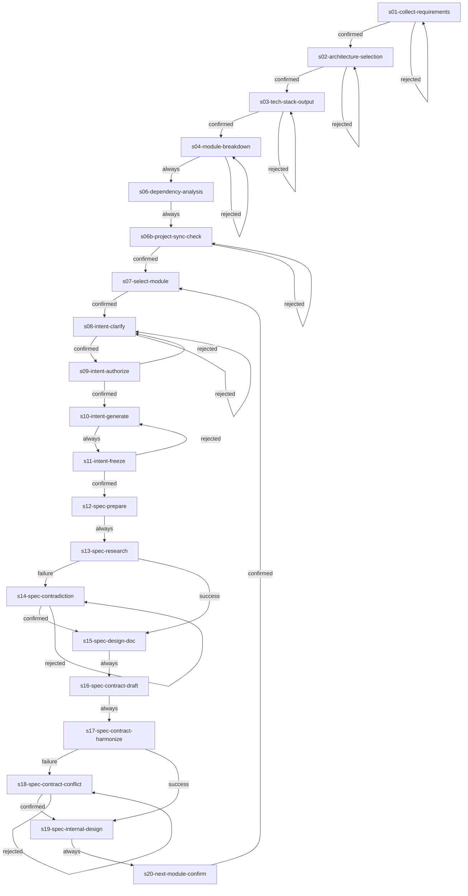

# project-design-pipeline

## 概览

- **目标**：将项目设计全流程（技术栈设计 → 模块拆解 → 依赖分析 → 模块意图 → 模块规格）整合为一条可循环工作流
- **并发上限**：1 个 Agent（默认串行执行）
- **适用场景**：新项目从零开始设计，或已有项目需要补充/重构模块设计文档

## 流程图

## Stage 说明

### s01-collect-requirements —— 收集需求与上下文
- **目的**：收集团队技术背景、部署环境、预期规模、运维能力等约束
- **输入**：用户提供的功能文档（如有）
- **输出**：需求约束清单（内部中间产物）
- **对应 Skill**：`design-tech-stack`
- **注意**：此阶段结束后需用户确认。confirmation_point 处呈现收集到的约束摘要，用户确认后解锁下游。

### s02-architecture-selection —— 架构关节点选型
- **目的**：在关键技术选型关节向用户提问并确认
- **输入**：s01 收集的约束
- **输出**：已确认的技术选型清单
- **对应 Skill**：`design-tech-stack`
- **注意**：此阶段结束后需用户确认。根据需求特征选择性提问 8 个关节点（前端、后端、数据库、实时通信、认证、AI、部署、架构模式）。

### s03-tech-stack-output —— 技术栈方案确认与输出
- **目的**：分层细化方案、终审确认、输出技术栈设计文档
- **输入**：s02 已确认的选型
- **输出**：`docs/技术栈设计.md`
- **对应 Skill**：`design-tech-stack`
- **注意**：此阶段结束后需用户确认。呈现完整技术栈概览表格，用户终审确认后输出文档。

### s04-module-breakdown —— 功能模块拆解
- **目的**：对齐拆解需求后执行模块提取、边界检查、行业补充
- **输入**：`docs/` 目录下的设计文档、`docs/技术栈设计.md`
- **输出**：`docs/功能设计/功能模块全拆解.md`
- **对应 Skill**：`module-breakdown-designer`
- **注意**：此阶段结束后需用户确认。先对齐范围与偏好，确认后自动执行拆解并输出。

### s06-dependency-analysis —— 模块依赖分析输出
- **目的**：分析模块间的依赖关系，产出多维视图
- **输入**：`docs/功能设计/功能模块全拆解.md`
- **输出**：`docs/功能设计/模块依赖关系分析.md`
- **对应 Skill**：`module-dependency-analyzer`
- **注意**：纯分析型 Stage，无 confirmation_point。自动执行。

### s06b-project-sync-check —— 项目级同步检查
- **目的**：进入模块循环前的检查点，确保项目级设计已就绪
- **输入**：项目级设计文档
- **输出**：同步状态汇报
- **对应 Skill**：`pipeline-director`
- **注意**：此阶段结束后需用户确认。汇报当前项目级设计状态，检查是否有待同步矛盾。用户可选择继续或先同步项目级设计。

### s07-select-module —— 选择目标模块
- **目的**：模块级循环入口，选择下一个要处理的模块
- **输入**：`docs/功能设计/功能模块全拆解.md`
- **输出**：选中的模块编号/名称
- **对应 Skill**：`module-intent-writer`
- **注意**：此阶段结束后需用户确认。用户可选择具体模块或结束工作流。

### s08-intent-clarify —— 模块意图澄清
- **目的**：通过多轮问答澄清模块业务需求
- **输入**：模块拆解表、全局设计文档、原始设计文档
- **输出**：澄清共识摘要
- **对应 Skill**：`module-intent-writer`
- **注意**：此阶段结束后需用户确认。Skill 内部通过多次 PENDING_CONFIRM 实现多轮澄清（核心模块多轮、一般模块快速确认）。rejected 时本地循环迭代。

### s09-intent-authorize —— 意图文档书写授权
- **目的**：汇总澄清共识，请求用户授权生成意图文档
- **输入**：s08 的澄清共识
- **输出**：授权状态
- **对应 Skill**：`module-intent-writer`
- **注意**：此阶段结束后需用户确认。关键门控：仅当用户授权后方可进入生成阶段。

### s10-intent-generate —— 生成意图文档
- **目的**：按模板生成业务意图文档
- **输入**：澄清共识、模板
- **输出**：`docs/功能设计/[分组]/[编号]-[名称]/[编号]-[名称]-意图文档.md`
- **对应 Skill**：`module-intent-writer`
- **注意**：纯生成型 Stage，无 confirmation_point。

### s11-intent-freeze —— 意图文档冻结授权
- **目的**：请求用户冻结确认，锁定意图文档
- **输入**：生成的意图文档
- **输出**：冻结状态
- **对应 Skill**：`module-intent-writer`
- **注意**：此阶段结束后需用户确认。最重要的门控：冻结后方可进入规格编写阶段。rejected 时回退到生成阶段修改。

### s12-spec-prepare —— 规格编写材料准备
- **目的**：定位所有输入材料路径
- **输入**：已冻结的意图文档、全局设计文档、契约索引
- **输出**：材料路径清单
- **对应 Skill**：`module-spec-writer`
- **注意**：纯准备型 Stage，无 confirmation_point。

### s13-spec-research —— 技术决策预研
- **目的**：独立 SubAgent 读取全部设计文档，做出技术决策
- **输入**：材料路径清单
- **输出**：《技术决策完整报告》
- **对应 Skill**：`spec-researcher`
- **注意**：由原 module-spec-writer 的内部 SubAgent 提升为独立 Stage。retry_policy 允许超时/错误时重试。

### s14-spec-contradiction —— 业务矛盾处理
- **目的**：处理 spec-researcher 发现的业务矛盾
- **输入**：《技术决策完整报告》中的矛盾清单
- **输出**：用户裁决结论
- **对应 Skill**：`module-spec-writer`
- **注意**：条件触发 Stage（condition: failure）。此阶段结束后需用户确认。矛盾解决后进入设计文档生成。

### s15-spec-design-doc —— 生成设计文档瘦身版
- **目的**：生成面向维护者的技术思路文档
- **输入**：技术决策报告、用户裁决结论
- **输出**：`docs/功能设计/[分组]/[编号]-[名称]/[编号]-[名称]-设计文档.md`
- **对应 Skill**：`module-spec-writer`
- **注意**：纯生成型 Stage，无 confirmation_point。

### s16-spec-contract-draft —— 对外接口契约草案
- **目的**：提取对外接口类型为 JSON 草案
- **输入**：设计文档
- **输出**：`.tmp/contract-draft/{module_id}/*.json`
- **对应 Skill**：`module-spec-writer`
- **注意**：纯生成型 Stage，无 confirmation_point。

### s17-spec-contract-harmonize —— 契约协调审查
- **目的**：扫描已有契约，检查冲突和可复用项
- **输入**：契约草案、已有契约目录
- **输出**：《契约协调报告》
- **对应 Skill**：`contract-harmonizer`
- **注意**：由原 module-spec-writer 的内部 SubAgent 提升为独立 Stage。retry_policy 允许超时/错误时重试。

### s18-spec-contract-conflict —— 契约冲突处理
- **目的**：处理 contract-harmonizer 发现的契约冲突
- **输入**：《契约协调报告》中的冲突清单
- **输出**：用户裁决结论
- **对应 Skill**：`module-spec-writer`
- **注意**：条件触发 Stage（condition: failure）。此阶段结束后需用户确认。

### s19-spec-internal-design —— 对内设计与规格输出
- **目的**：在锁定对外接口内设计内部实现，输出最终规格
- **输入**：设计文档、契约文件、对内设计约束
- **输出**：`docs/功能设计/[分组]/[编号]-[名称]/[编号]-[名称]-落地规范.md`
- **对应 Skill**：`module-spec-writer`
- **注意**：纯生成型 Stage，无 confirmation_point。同时更新契约索引。

### s20-next-module-confirm —— 下一模块确认
- **目的**：循环控制节点，询问是否继续处理下一个模块
- **输入**：当前模块完成状态
- **输出**：用户选择（继续/结束）
- **对应 Skill**：`pipeline-director`
- **注意**：此阶段结束后需用户确认。confirmed → 跳回 s07 处理下一个模块；用户也可选择结束工作流。

## 技能清单

| Skill ID | 来源 | 说明 |
|----------|------|------|
| `design-tech-stack` | 旧 Skill 改造 | 技术栈设计与输出 |
| `module-breakdown-designer` | 旧 Skill 改造 | 功能模块拆解 |
| `module-dependency-analyzer` | 旧 Skill 改造 | 模块依赖分析 |
| `module-intent-writer` | 旧 Skill 改造 | 模块意图文档编写 |
| `module-spec-writer` | 旧 Skill 改造 | 模块规格文档编写 |
| `spec-researcher` | SubAgent 提升 | 技术决策预研 |
| `contract-harmonizer` | SubAgent 提升 | 契约协调审查 |
| `pipeline-director` | 新增 | 循环控制与同步检查 |

## 项目级同步与回退机制

当模块级设计发现与项目级设计矛盾时：
1. Skill 会记录同步问题到 `docs/功能设计/_sync-issues.md`
2. 用户可在任意时刻通过自然语言指令要求回退到任意项目级 Stage（如"回退到 s03 修改技术栈"）
3. 编排器启用 `git_anchors`，确保回退安全
4. 修改完成后，Workflow 可从当前位置继续或重新执行相关模块级 Stage

## 共享资源

工作流级共享目录：
- `references/`：输出模板、目录规范、数据字典等
- `scripts/`：`get_timestamp.py` 等跨 Skill 通用脚本
