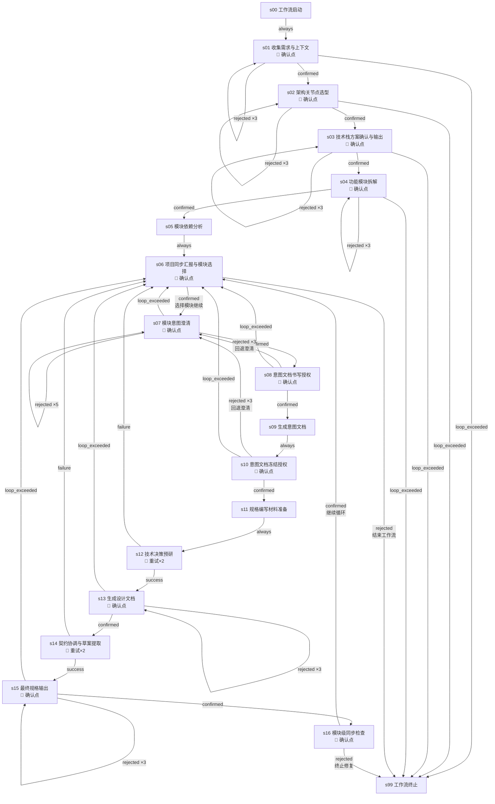

# project-design-pipeline

## 概览

- **目标**：将项目设计全流程（技术栈设计 → 模块拆解 → 依赖分析 → 逐模块循环（意图编写 + 规格编写）→ 项目同步验收）整合为一条可循环工作流
- **版本**：2.1.1（目录格式硬化自 v2.1.0）
- **并发上限**：1 个 Agent（串行执行）
- **适用场景**：新项目从零开始设计，或已有项目需要补充/重构模块设计文档
- **核心改进（v2.1.0）**：
  - 重新编号 Stage，消除编号漏洞（s05 缺失）和分叉编号（s06b）
  - 合并冗余确认点：s06b + s07 → s06（项目同步汇报同时选择模块），s20 去除
  - 条件触发 Stage 内嵌化：s14/s18 冲突处理合并入 s13/s15 的 PENDING_CONFIRM
  - s16 契约草案提取合并入 s14（contract-harmonizer 自行提取）
  - 所有 max_loop 循环增加 loop_exceeded 应急出口
  - 增加 s99-workflow-end 终止虚拟 Stage，所有退出路径统一汇聚
- **核心改进（v2.1.1）**：
  - 硬化 `directory-convention.md`：增加禁止格式清单、序号标准化映射表、路径自检清单与红线警告
  - `module-breakdown-designer` 输出模板章节标题从中文数字改为 `## 01-[分组名]` 格式，从源头消除中文数字路径
  - `module-intent-writer` / `module-spec-writer` 路径构建逻辑强制引用 `directory-convention.md`，禁止复制章节标题原文

## 流程图

## Stage 说明

### 虚拟起止

#### s00-workflow-start —— 工作流启动
- **目的**：虚拟起始点，工作流入口
- **输入**：无
- **输出**：无
- **对应 Skill**：无（纯流转）
- **注意**：不可跳过，立即流转到 s01。

#### s99-workflow-end —— 工作流终止
- **目的**：虚拟终止点，所有退出路径汇聚于此
- **输入**：无
- **输出**：无
- **对应 Skill**：无（纯流转）
- **注意**：不可跳过。到达此 Stage 视为工作流正常或异常结束。

---

### 阶段一：技术栈设计（s01-s03）

#### s01-collect-requirements —— 收集需求与上下文
- **目的**：收集技术背景、部署环境、预期规模、运维能力等约束
- **输入**：用户提供的功能文档（如有）
- **输出**：需求约束清单（内部中间产物）
- **对应 Skill**：`design-tech-stack`
- **注意**：项目级确认点（用户红线）。确认后解锁架构选型。rejected 时本地循环修订（最多 3 次），超限后终止工作流。

#### s02-architecture-selection —— 架构关节点选型
- **目的**：在 8 个关键技术关节点逐一提问确认选型
- **输入**：s01 收集的约束
- **输出**：已确认的技术选型清单
- **对应 Skill**：`design-tech-stack`
- **注意**：项目级确认点（用户红线）。根据需求特征选择性提问前端、后端、数据库、实时通信、认证、AI 集成、部署方式、架构模式。rejected 时本地循环修订（最多 3 次），超限后终止工作流。

#### s03-tech-stack-output —— 技术栈方案确认与输出
- **目的**：分层细化方案，用户终审后输出技术栈设计文档
- **输入**：s02 已确认的选型
- **输出**：`docs/技术栈设计.md`
- **对应 Skill**：`design-tech-stack`
- **注意**：项目级确认点（用户红线）。呈现完整技术栈概览表格供用户终审。rejected 时本地循环修订（最多 3 次），超限后终止工作流。

---

### 阶段二：模块拆解与依赖分析（s04-s05）

#### s04-module-breakdown —— 功能模块拆解
- **目的**：对齐拆解需求后执行模块提取、边界检查、行业补充
- **输入**：`docs/` 目录下的设计文档、`docs/技术栈设计.md`
- **输出**：`docs/功能设计/功能模块全拆解.md`
- **对应 Skill**：`module-breakdown-designer`
- **注意**：项目级确认点（用户红线）。先对齐范围与偏好，用户确认后自动拆解。rejected 时本地循环修订（最多 3 次），超限后终止工作流。也是 s16 同步检查的回退目标。

#### s05-dependency-analysis —— 模块依赖分析
- **目的**：分析模块间的数据依赖、调用依赖、时序依赖、共享资源依赖
- **输入**：`docs/功能设计/功能模块全拆解.md`
- **输出**：`docs/功能设计/模块依赖关系分析.md`（含依赖列表、Mermaid 图、依赖矩阵、实现分层）
- **对应 Skill**：`module-dependency-analyzer`
- **注意**：纯分析型 Stage，无确认点。自动执行后进入模块循环。

---

### 阶段三：模块循环入口（s06）

#### s06-select-module —— 项目同步汇报与模块选择
- **目的**：汇报项目级设计状态和已有模块进度，用户选择下一个目标模块或结束工作流
- **输入**：`docs/功能设计/功能模块全拆解.md`、`docs/功能设计/模块依赖关系分析.md`、已有模块的完成状态
- **输出**：选中的模块编号/名称，或结束信号
- **对应 Skill**：`module-intent-writer`
- **注意**：合并了原 v1.0.0 的 s06b（项目同步）和 s07（选择模块）。confirmed = 选择模块继续 → s07；rejected = 结束工作流 → s99。⚠️ [U3] rejected 同时覆盖"正常结束"和"主动终止"两种语义。

---

### 阶段四：模块意图编写（s07-s10）

#### s07-intent-clarify —— 模块意图澄清
- **目的**：通过多轮问答澄清模块业务需求
- **输入**：模块拆解表、全局设计文档、原始需求文档
- **输出**：澄清共识摘要
- **对应 Skill**：`module-intent-writer`
- **注意**：确认点。核心模块多轮澄清、一般模块快速确认。Skill 内部通过多次 PENDING_CONFIRM 实现多轮迭代。rejected 时本地循环（最多 5 次），超限后回到 s06 选择其他模块。

#### s08-intent-authorize —— 意图文档书写授权
- **目的**：汇总澄清共识，请求用户授权生成意图文档
- **输入**：s07 的澄清共识
- **输出**：授权状态
- **对应 Skill**：`module-intent-writer`
- **注意**：确认点。用户红线：澄清→授权分步确认。关键门控——仅当用户授权后方可进入生成阶段。rejected 时回退到 s07 继续澄清（最多 3 次往返），超限后回到 s06 选择其他模块。

#### s09-intent-generate —— 生成意图文档
- **目的**：按模板生成业务意图文档
- **输入**：澄清共识、输出模板
- **输出**：`docs/功能设计/[序号]-[分组]/[编号]-[名称]/[编号]-[名称]-意图文档.md`（格式见 `directory-convention.md`）
- **对应 Skill**：`module-intent-writer`
- **注意**：纯生成型 Stage，无确认点。自动执行。

#### s10-intent-freeze —— 意图文档冻结授权
- **目的**：呈现意图文档，请求用户冻结确认
- **输入**：已生成的意图文档
- **输出**：冻结状态
- **对应 Skill**：`module-intent-writer`
- **注意**：确认点。用户红线：最重要的门控。冻结后方可进入规格编写阶段。rejected 时回退到 s07 重新澄清（最多 3 次往返），超限后回到 s06 选择其他模块。

---

### 阶段五：模块规格编写（s11-s15）

#### s11-spec-prepare —— 规格编写材料准备
- **目的**：定位所有输入材料路径
- **输入**：已冻结的意图文档、全局设计文档、契约索引
- **输出**：材料路径清单
- **对应 Skill**：`module-spec-writer`
- **注意**：纯准备型 Stage，无确认点。自动扫描路径后进入技术预研。

#### s12-spec-research —— 技术决策预研
- **目的**：独立 SubAgent 读取全部设计文档，做出技术上最优决策
- **输入**：s11 的材料路径清单
- **输出**：《技术决策完整报告》（含兼容性审查、技术边界分析、自主决策、矛盾标记）
- **对应 Skill**：`spec-researcher`
- **注意**：无确认点。允许超时/错误时重试最多 2 次。success → s13 进入设计文档生成；failure → s06 放弃当前模块。

#### s13-spec-design-doc —— 生成设计文档
- **目的**：基于技术决策报告生成面向维护者的设计文档，同时处理可能的业务矛盾
- **输入**：《技术决策完整报告》
- **输出**：`docs/功能设计/[序号]-[分组]/[编号]-[名称]/[编号]-[名称]-设计文档.md`（格式见 `directory-convention.md`）
- **对应 Skill**：`module-spec-writer`
- **注意**：确认点。用户审批设计文档产出。若有业务矛盾（原 v1.0.0 s14 的逻辑），内嵌 PENDING_CONFIRM 请用户裁决。rejected 时本地循环修订（最多 3 次），超限后回到 s06。

#### s14-contract-harmonize —— 契约协调与草案提取
- **目的**：提取对外接口 JSON 草案，扫描已有契约检查冲突或可复用项
- **输入**：s13 的设计文档、已有契约目录
- **输出**：《契约协调报告》+ 契约草案
- **对应 Skill**：`contract-harmonizer`
- **注意**：无确认点。合并了原 v1.0.0 的 s16（草案提取）和 s17（协调审查），contract-harmonizer 自行在协调前提取草案。允许超时/错误时重试最多 2 次。success → s15；failure → s06。

#### s15-spec-final —— 最终规格输出
- **目的**：生成落地实现规范，同时处理可能的契约冲突
- **输入**：s13 的设计文档、s14 的契约协调报告
- **输出**：`docs/功能设计/[序号]-[分组]/[编号]-[名称]/[编号]-[名称]-落地规范.md`（格式见 `directory-convention.md`），更新契约索引
- **对应 Skill**：`module-spec-writer`
- **注意**：确认点。用户审批最终规格产出。若有契约冲突（原 v1.0.0 s18 的逻辑），内嵌 PENDING_CONFIRM 请用户裁决。rejected 时本地循环修订（最多 3 次），超限后回到 s06。

---

### 阶段六：模块循环收尾（s16）

#### s16-module-sync-check —— 模块级同步检查
- **目的**：检查模块处理过程中是否积累了对项目级设计的矛盾，由用户决定下一步
- **输入**：`_sync-issues.md`（如有）
- **输出**：PENDING_CONFIRM 汇报矛盾情况
- **对应 Skill**：`module-spec-writer`
- **注意**：确认点。confirmed = 回到 s06 继续模块循环；rejected = 终止工作流。若需修复矛盾，用户 confirmed 回到 s06 后手动导航到对应项目级 Stage（如"回退到 s02 修改架构选型"）。

---

## 技能清单

| Skill ID | 来源 | 对应 Stage | 说明 |
|----------|------|-----------|------|
| `design-tech-stack` | 旧 Skill 改造 | s01, s02, s03 | 技术栈设计与输出。三阶段式调用，中间经确认点传递状态。Phase 2 优先优化。 |
| `module-breakdown-designer` | 旧 Skill 改造 | s04 | 功能模块拆解。对齐需求范围后自动拆解并输出全拆解文档。 |
| `module-dependency-analyzer` | 旧 Skill 改造 | s05 | 模块依赖分析。纯分析型，读取全拆解输出多维依赖视图。 |
| `module-intent-writer` | 旧 Skill 改造 | s06, s07, s08, s09, s10 | 模块意图文档编写。覆盖模块选择、澄清、授权、生成、冻结全流程。 |
| `spec-researcher` | SubAgent 提升 | s12 | 技术决策预研。独立读取设计文档，自主技术决策，标记矛盾。⚠️ [U2] Phase 2 优化。 |
| `module-spec-writer` | 旧 Skill 改造 | s11, s13, s15, s16 | 模块规格文档编写。覆盖材料准备、设计文档生成、最终规格输出、同步检查。 |
| `contract-harmonizer` | SubAgent 提升 | s14 | 契约协调与草案提取。提取契约草案 + 扫描已有契约检查冲突。⚠️ [U2] Phase 2 优化。 |

## 共享资源

工作流级共享目录（Phase 2 首个需要它们的 Skill 负责建立）：

| 资源 | 路径 | 说明 | 负责 Skill |
|------|------|------|-----------|
| 目录规范 | `references/directory-convention.md` | 全局目录结构约定 | `design-tech-stack` |
| 时间戳脚本 | `scripts/get_timestamp.py` | 统一时间戳生成 | `module-intent-writer` |
| 同步问题格式 | `references/sync-issues-format.md` | `_sync-issues.md` 格式约定 | `module-intent-writer` |

## Loop Exceeded 应急路径

当某个确认点的 rejected 循环达到 max_loop 上限时，工作流按以下策略退出：

| 来源 Stage | 循环含义 | loop_exceeded 目标 | 理由 |
|-----------|---------|-------------------|------|
| s01-collect-requirements | 需求收集反复修订 | s99（终止） | 项目基础约束无法敲定，继续无意义 |
| s02-architecture-selection | 架构选型反复修订 | s99（终止） | 技术栈无法确定，后续阶段无法执行 |
| s03-tech-stack-output | 技术栈方案反复修订 | s99（终止） | 同上 |
| s04-module-breakdown | 模块拆解反复修订 | s99（终止） | 模块拆解是后续所有工作的基础，无法确定则终止 |
| s07-intent-clarify | 意图澄清无果 | s06（换模块） | 当前模块需求无法澄清，换一个模块继续 |
| s08-intent-authorize | 澄清-授权往返无果 | s06（换模块） | 用户反复不授权，放弃当前模块 |
| s10-intent-freeze | 冻结-澄清往返无果 | s06（换模块） | 意图文档反复不能冻结，放弃当前模块 |
| s13-spec-design-doc | 设计文档反复修订 | s06（换模块） | 设计文档无法通过审批，放弃当前模块 |
| s15-spec-final | 最终规格反复修订 | s06（换模块） | 规格无法通过审批，放弃当前模块 |

## 项目级同步与回退机制

当模块级设计发现与项目级设计矛盾时：

1. Skill 会记录同步问题到 `docs/功能设计/_sync-issues.md`
2. 每个模块循环结束后，s16（模块级同步检查）读取此文件并上报 PENDING_CONFIRM：
   - 无矛盾 → 用户 confirmed，回到 s06 继续选择下一个模块
   - 有矛盾 → 用户 confirmed 回到 s06，然后手动导航到对应项目级 Stage 修复
3. 编排器启用 `git_anchors`，每次成功产出的 Stage 自动打 tag（如 `wf-s04-complete`），确保回退安全
4. 修改完成后，从 s04 继续正常流转，重新进入模块循环

## 已知问题（⚠️ UNCERTAIN）

以下问题在决策文档中信息不足以完成精确设计，已按最合理方案处理，建议在使用前确认：

**[U1] s16 同步检查改为确认点，用户手动导航回退（已解决）**

s16 现在为确认点，PENDING_CONFIRM 汇报矛盾详情。用户 confirmed 回到 s06，然后手动导航到需要修复的项目级 Stage。此方案利用编排器的原生命令跳转能力，无需 v2 edge 支持动态路由。

**[U2] spec-researcher 和 contract-harmonizer 的 skill 状态**

s12 使用 `spec-researcher`，s14 使用 `contract-harmonizer`。这两个 skill 当前处于 Phase 2 待优化队列（尚未按新规范重写）。v2.0.0 工作流直接引用它们，若 Phase 2 优化过程中重命名、合并或拆分这些 skill，需同步更新 WORKFLOW.yaml。

**[U3] s06 rejected 语义双义**

s06（项目同步汇报与模块选择）的 rejected 边指向 workflow-end，同时覆盖两种场景：
- 用户正常完成所有模块，选择"结束工作流"
- 用户对项目状态不满意，选择"终止工作流"

两种场景在工作流引擎视角下行为一致（都结束），但在日志/审计层面可能需要区分。若需要语义区分，可考虑将 s06 改为非确认点，用 success（选择模块→s07）/ failure（结束→s99）分支。
