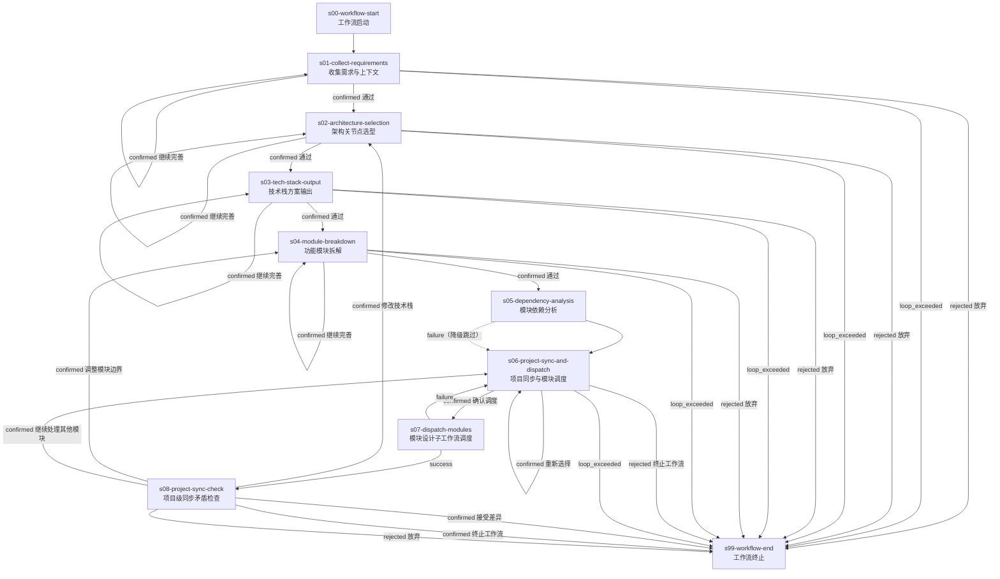

# project-design-pipeline@3.0.0

> 技术栈设计 -> 模块拆解 -> 依赖分析 -> 多模块并行调度 -> 项目级同步矛盾聚合

---

## 工作流概览

- **工作流 ID**：`project-design-pipeline`
- **版本**：`3.0.0`
- **Stage 数量**：10（含 2 个虚拟 stage）
- **确认点数量**：6
- **最大并发**：10（父工作流阶段串行推进；子工作流并行调度由 wfctl 按 `parallel` + `workflow` 声明机械执行）

### 适用场景

1. 新项目从零开始的技术栈选型与模块拆解
2. 已有项目的模块设计补充或增量更新
3. 需要对多个模块并行执行完整设计流水线（意图编写 -> 规格编写 -> 契约协调）
4. 项目级跨模块同步矛盾检测与汇总

### 与 v2.1.1 的主要变化

| 维度 | v2.1.1（旧） | v3.0.0（新） |
|------|-------------|-------------|
| 工作流模型 | 18 stage 单体流水线 | 父工作流（10 stage）+ 子工作流（15 stage） |
| 模块处理 | 串行逐模块循环 | 多模块并行 dispatch，worktree 隔离 |
| 增量支持 | Skill 内部判断 | 子工作流 Stage 级路由 6 种增量场景 |
| 同步矛盾 | s16 模块级检查 | s08 项目级聚合 + 子工作流 s12 模块级上报 |
| 调度器 | workflow-orchestrator Skill | wfctl 命令行工具 |
| Schema | v2.0.0 | v3.0.0 |

---

## 流程图

---

## Stage 说明

### s00-workflow-start -- 工作流启动

虚拟起始点，无条件流转到下游。

---

### s01-collect-requirements -- 收集需求与上下文

- **Skill**：`design-tech-stack`
- **确认点**：是
- **描述**：收集技术背景、部署环境、规模、运维等约束。通过多轮问答明确项目需求全景，为后续架构选型提供输入材料。
- **输出**：需求收集记录（注入到下一 stage 上下文）

---

### s02-architecture-selection -- 架构关节点选型

- **Skill**：`design-tech-stack`
- **确认点**：是
- **描述**：在 8 个关键技术关节点（前端框架、后端语言、数据库、部署方式、认证方案、实时通信、AI 集成、架构模式）逐一提问确认选型，汇总后上报确认。
- **输出**：架构选型汇总

---

### s03-tech-stack-output -- 技术栈方案输出

- **Skill**：`design-tech-stack`
- **确认点**：是
- **重试**：1 次
- **描述**：呈现完整技术栈概览，用户终审确认后输出 `docs/项目名称-技术栈设计.md`，作为后续所有模块设计的全局参考。
- **输出**：`docs/项目名称-技术栈设计.md`

---

### s04-module-breakdown -- 功能模块拆解

- **Skill**：`module-breakdown-designer`
- **确认点**：是
- **重试**：1 次
- **描述**：基于技术栈方案和需求，执行模块提取、边界检查、功能分组。输出模块全拆解表，新增 `design_status` 列标记各模块设计进度。
- **输出**：`docs/功能设计/功能模块全拆解.md`

---

### s05-dependency-analysis -- 模块依赖分析

- **Skill**：`module-dependency-analyzer`
- **确认点**：否
- **重试**：1 次
- **描述**：读取模块全拆解表，逐对扫描推断模块间依赖（数据依赖、调用依赖、时序依赖、共享资源依赖），输出多维依赖视图。若执行失败（含重试耗尽），沿 `failure` edge 降级跳过，不阻塞后续模块调度（s06 的 project-dispatch-manager 可在无依赖分析文档时继续运行）。
- **输出**：`docs/功能设计/模块依赖关系分析.md`

---

### s06-project-sync-and-dispatch -- 项目同步与模块调度

- **Skill**：`project-dispatch-manager`（NEW）
- **确认点**：是
- **描述**：汇报项目级设计状态和所有模块的设计进度。用户选择目标模块（可多选），确认后将模块清单作为 `parallel_targets` 上报，由 wfctl 在 s07 按 `parallel` 声明为每个模块启动独立子工作流。支持以下决策：
  - **确认调度**：将选定模块的 `parallel_targets` 上报，进入 s07
  - **重新选择**：调整模块选择（最多 3 轮）
  - **终止工作流**：所有模块已完成设计，结束工作流
- **输出**：`parallel_targets`（选定模块清单 + 各模块增量场景参数）

---

### s07-dispatch-modules -- 模块设计子工作流调度

- **类型**：子工作流（`workflow: module-design-pipeline@1.0.0`）+ 并行扇出（`parallel: {source: s06}`）
- **确认点**：否
- **描述**：wfctl 读取 s06 上报的 `parallel_targets`（选定模块清单），为每个模块：
  1. 创建独立 git worktree
  2. 启动 `module-design-pipeline@1.0.0` 子工作流实例，注入模块标识和增量场景参数
  3. 等待所有子工作流实例完成
  4. 将各 worktree 变更合并回实例 worktree
  5. 全部成功 → 解锁 s08；任一失败 → 回 s06 让用户重新选择
- **最大并发实例**：10

---

### s08-project-sync-check -- 项目级同步矛盾检查

- **Skill**：`project-sync-aggregator`（NEW）
- **确认点**：是
- **描述**：汇总所有已完成模块的同步矛盾报告（各模块子工作流在其 s12 阶段产出的 `_sync-issues.md`），以项目级视角呈现冲突全景。用户决定：
  - **修改技术栈**：回到 s02 重新进行架构选型，级联重置 s02–s07，修正后重新走完整流水线
  - **调整模块边界**：回到 s04 重新拆解模块，级联重置 s04–s07
  - **继续处理其他模块**：回到 s06 选择下一批模块，级联重置 s06–s07
  - **接受差异**：接受当前所有同步矛盾的差异（标注 `accepted`），结束工作流
  - **终止工作流**：接受当前状态，结束工作流
  - **放弃**（rejected）：放弃本次同步检查，终止工作流

### s99-workflow-end -- 工作流终止

虚拟终止点，所有退出路径汇聚于此。

---

## Skill 清单

| Skill ID | 名称 | 使用 Stage | 状态 |
|----------|------|-----------|------|
| `design-tech-stack` | 技术栈设计 | s01, s02, s03 | 现有（从 v2.1.1 继承） |
| `module-breakdown-designer` | 功能模块拆解设计 | s04 | 现有（从 v2.1.1 继承） |
| `module-dependency-analyzer` | 模块依赖分析 | s05 | 现有（从 v2.1.1 继承） |
| `project-dispatch-manager` | 项目调度管理器 | s06 | **NEW** |
| `project-sync-aggregator` | 项目同步矛盾聚合器 | s08 | **NEW** |

---

## 共享资源

以下资源部署在消费者项目的 `.claude/workflows/project-design-pipeline/` 目录下，父工作流和子工作流均可访问（worktree 自动携带 `.claude/` 目录）：

| 路径 | 类型 | 说明 |
|------|------|------|
| `.claude/workflows/project-design-pipeline/references/directory-convention.md` | 规范 | 全局目录结构约定（`docs/` 路径格式为硬性约束） |
| `.claude/workflows/project-design-pipeline/references/sync-issues-format.md` | 规范 | 同步矛盾上报格式 |
| `.claude/workflows/project-design-pipeline/scripts/get_timestamp.py` | 脚本 | 时间戳生成工具 |

---

## 故障与回退机制

### 循环超限（loop_exceeded）

所有确认点的 `rejected` 循环达到 `max_loop` 上限后，流转到 `s99-workflow-end` 终止工作流。用户可在终止后重新启动新实例。

### 依赖分析失败降级

s05（`module-dependency-analyzer`，`retry: 1`）执行失败且重试耗尽后，沿 `failure` edge 降级跳过，仍进入 s06 继续模块调度。s06 的 `project-dispatch-manager` 设计为在缺少依赖分析文档时仍可正常运行（跳过依赖分层展示）。此降级策略确保单个分析环节的失败不会阻塞整体项目推进。

### 子工作流调度失败

s07（`parallel` + `workflow`）中任意子工作流实例进入 FAILED 终态时，wfctl 将 s07 置为 ERROR，沿 `failure` edge 流转回 s06，让用户重新选择模块或终止。子工作流实例的 worktree 由 wfctl 保留以便排查，已成功完成的模块变更正常合并。

### 跨模块同步矛盾

子工作流在其 s12 阶段上报模块级同步问题。父工作流 s08 汇总所有模块的矛盾报告，由用户逐一裁决。解决后可继续调度剩余模块。

### 回边级联重置

s08 确认点提供三条回边路由（s02/s04/s06），均由 wfctl 自动执行级联重置：目标 Stage 及其下游直到 s08 之前的 Stage 全部折叠为 PENDING，重新调度执行。此机制替代了 v3.0.0 初版中的手动编排器导航。
