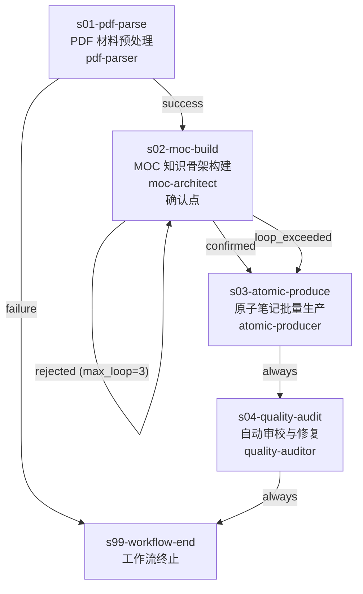

# 学习笔记处理工作流（study-note-processor）

## 概览

| 属性 | 值 |
|------|-----|
| 工作流 ID | study-note-processor |
| 版本 | 1.0.0 |
| 目标 | 将 PDF 教材/讲义自动转化为 Obsidian 可用的结构化原子笔记体系（MOC + 原子笔记） |
| 核心红线 | 强绑定 Obsidian 原生语法（`[[]]` 双链 / Callout / Mermaid）；"原子知识点 + 知识地图"双层体系不可动摇 |
| 并发上限 | 最多 3 个 SubAgent 并行（主要用于 s03 原子笔记批量生产） |
| 输入 | 一份 PDF 文件 + 用户指定的领域（当前仅支持 `math`）+ 作用域（一章/一节） |
| 输出 | MOC 文件 + N 篇原子笔记 .md + 质量报告 |
| 适用场景 | 教材研读、课程笔记结构化、知识库建设 |

## 流程图



## Stage 说明

### s01-pdf-parse — PDF 材料预处理

- **类型**：外部调用 Stage
- **mandatory**：是
- **confirmation_point**：否
- **目的**：调用 MinerU Precision Extract API，将 PDF 教材/讲义解析为结构化 Markdown
- **输入**：用户提供的 PDF 文件路径、作用域参数（一章/一节）
- **输出**：结构化 Markdown 文件（保留标题层级、公式、表格等结构）
- **对应 Skill**：`pdf-parser`
- **Retry 策略**：max_attempts=3，on [timeout, error]。3 次失败后跳转到 s99 终止，向用户报告具体错误码（网络问题 / Token 失效 / 文件超限）
- **注意事项**：
  - Token 存放于 `.env.example`，用户需自行配置
  - MinerU API 文档随 Skill 自包含

### s02-moc-build — MOC 知识骨架构建

- **类型**：业务分析 Stage（含确认点）
- **mandatory**：是
- **confirmation_point**：**是**（工作流唯一确认点）
- **目的**：消费领域配置 + s01 产出的 Markdown，分析并产出带层级 `[[双链]]` 的 MOC（Map of Content），附 Mermaid 逻辑脉络图
- **输入**：s01 产出的结构化 Markdown、`references/domain-config/{domain}/` 领域配置
- **输出**：MOC 文件（含 H2 模块划分、原子点 `[[]]` 占位、Mermaid 逻辑图）
- **对应 Skill**：`moc-architect`
- **确认点决策内容**：
  - MOC 的 H2 模块划分是否合理（层级拆分是否过粗/过细）
  - 关键原子知识点是否有遗漏（对照 PDF 原文）
- **Rejected 路径**：用户拒回后重新生成 MOC，最多 3 次循环。超过 3 次（loop_exceeded）强制接受当前 MOC 进入 s03
- **Retry 策略**：max_attempts=2，on [timeout, error]
- **注意事项**：
  - MOC 是后续所有原子笔记的骨架，确认点的决策直接影响最终产物质量
  - rejected 循环的 `loop_counter_stage` 为自身（s02-moc-build）

### s03-atomic-produce — 原子笔记批量生产

- **类型**：并行生产 Stage
- **mandatory**：是
- **confirmation_point**：否
- **目的**：按 MOC 的 H2 模块拆分任务，启动多 SubAgent 并行生产符合领域写作规范的原子笔记 .md 文件
- **输入**：s02 确认后的 MOC、`references/domain-config/{domain}/` 领域配置
- **输出**：N 篇原子笔记 .md（存放在 `{vault}/{主题}/笔记/` 下），每篇携带所属模块信息
- **对应 Skill**：`atomic-producer`
- **并行策略**：每个 H2 模块分配一个 SubAgent。各 SubAgent 独立运行，失败互不影响。失败模块单独重试
- **Retry 策略**：max_attempts=3，on [timeout, error]
- **注意事项**：
  - 原子笔记文件名采用 `{分类}-{知识点}.md` 格式
  - 每篇笔记需包含 `[[]]` 指向 MOC 及相关原子笔记

### s04-quality-audit — 自动审校与修复

- **类型**：自动审校 Stage
- **mandatory**：是
- **confirmation_point**：否
- **目的**：对照领域配置的格式契约与质量清单，自动检查原子笔记的格式合规性和内容质量，对能自动修复的问题执行修复，最终输出质量报告
- **输入**：s03 产出的全部原子笔记 .md、`references/domain-config/{domain}/` 领域配置
- **输出**：修复后的原子笔记 .md + 质量报告（含格式合规率和内容质量评分）
- **对应 Skill**：`quality-auditor`
- **修复循环**：Skill 内部自动修复 → 再审校，最多 3 轮。3 轮后仍有残留问题则在质量报告中标注"有残留问题"
- **Retry 策略**：max_attempts=2，on [timeout, error]
- **注意事项**：
  - 质量检查清单（`quality-checklist.md`）随 Skill 自带
  - 不同类别（定义/定理/性质/方法）的检查标准来自领域配置

### s99-workflow-end — 工作流终止

- **类型**：虚拟终止节点
- **mandatory**：是
- **confirmation_point**：否
- **目的**：标记工作流结束
- **输入**：s04 的质量报告（正常终止）或 s01 的错误码（异常终止）
- **输出**：无
- **对应 Skill**：无

## 技能清单

| Skill ID | 对应 Stage | 来源 | 说明 |
|----------|-----------|------|------|
| pdf-parser | s01-pdf-parse | Phase 2 待开发 | 自包含 MinerU Precision API 调用脚本，含 `.env.example` 与 API 文档。输入 PDF 路径，轮询提取，输出结构化 Markdown |
| moc-architect | s02-moc-build | Phase 2 待开发 | 读取领域配置 + Markdown，分析知识结构，产出带 `[[双链]]` 的 MOC 与 Mermaid 逻辑图 |
| atomic-producer | s03-atomic-produce | Phase 2 待开发 | 按 H2 模块拆分任务，多 SubAgent 并行生产符合领域写作规范的原子笔记 .md |
| quality-auditor | s04-quality-audit | Phase 2 待开发 | 对照格式契约与质量清单自动审校原子笔记，自动修复→再审校→输出质量报告 |

## 共享资源

| 资源 | 路径 | 说明 | 使用者 |
|------|------|------|--------|
| 领域配置（math） | `references/domain-config/math/` | 数学领域的原子分类体系、格式契约、各类别写作规范 | moc-architect, atomic-producer, quality-auditor |
| 输出目录规范 | `references/output-directory-spec.md` | 定义 Obsidian 仓库中的产物目录结构 | moc-architect, atomic-producer |
| 质量检查清单 | `skills/quality-auditor/references/quality-checklist.md` | 原子笔记审校的检查项与评分标准 | quality-auditor |
| MinerU API 文档 | `skills/pdf-parser/references/MinerU_API文档.md` | MinerU Precision Extract API 使用说明 | pdf-parser |

领域配置目录结构（`references/domain-config/math/`）：

```
math/
├── atom-classification.md    # 原子知识分类体系
├── format-contract.md        # 格式契约（标题、双链、Callout 规范）
└── categories/
    ├── definition.md         # 定义类原子写作规范
    ├── theorem.md            # 定理类原子写作规范
    ├── property.md           # 性质类原子写作规范
    └── method.md             # 方法类原子写作规范
```

## Loop Exceeded 应急路径

| 循环 Stage | max_loop | loop_exceeded 出口 | 应急行为 |
|-----------|----------|-------------------|---------|
| s02-moc-build（rejected 循环） | 3 | → s03-atomic-produce | 用户 3 次拒回 MOC 后，强制接受当前版本 MOC，继续进入原子笔记生产。用户可在后续阶段手动修正 MOC |

> s04-quality-audit 的内部修复循环（max_loop=3）由 Skill 自身管理，不属于工作流级 Edge 循环。达到上限后质量报告标注"有残留问题"，不阻塞工作流终止。

## 产物目录结构

工作流运行时的完整产物树：

```
results/workflows/study-note-processor@1.0.0/
├── WORKFLOW.yaml
├── WORKFLOW.md
├── references/
│   ├── output-directory-spec.md
│   └── domain-config/
│       └── math/
│           ├── atom-classification.md
│           ├── format-contract.md
│           └── categories/
│               ├── definition.md
│               ├── theorem.md
│               ├── property.md
│               └── method.md
└── skills/
    ├── pdf-parser/
    │   ├── SKILL.md
    │   ├── .env.example
    │   ├── scripts/
    │   │   └── mineru_parse.py
    │   └── references/
    │       └── MinerU_API文档.md
    ├── moc-architect/
    │   └── SKILL.md
    ├── atomic-producer/
    │   └── SKILL.md
    └── quality-auditor/
        ├── SKILL.md
        └── references/
            └── quality-checklist.md
```

> 最终用户可用的 Obsidian 产物（MOC + 原子笔记 + 质量报告）由各 Skill 在运行期间写入用户指定的 Obsidian Vault 目录，不包含在上述工作流产物树中。
