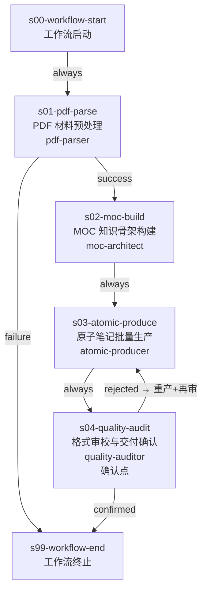

# 学习笔记处理工作流（study-note-processor）

## 概览

| 属性 | 值 |
|------|-----|
| 工作流 ID | study-note-processor |
| 版本 | 1.2.0 |
| 目标 | 将 PDF 教材/讲义自动转化为 Obsidian 可用的结构化原子笔记体系（MOC + 原子笔记 + 质量报告），最终由用户审视质量报告决定交付 |
| 核心红线 | 强绑定 Obsidian 原生语法（`[[]]` 双链 / Callout / Mermaid）；"原子知识点 + 知识地图"双层体系不可动摇 |
| 并发上限 | 1 个 SubAgent 串行（自 v1.1.1 取消 fan-out） |
| 输入 | 一份 PDF 文件 + 用户指定的领域（动态加载 `references/domain-config/` 下任意符合接口规范的领域）+ 作用域（一章/一节） |
| 输出 | MOC 文件 + N 篇原子笔记 .md + 质量报告 |
| 适用场景 | 教材研读、课程笔记结构化、知识库建设 |

## 流程图



## Stage 说明

### s01-pdf-parse — PDF 材料预处理

- **类型**：外部调用 Stage
- **mandatory**：是
- **confirmation_point**：否（v1.1.0 降级，原 v1.0.0 为 true）
- **目的**：调用 MinerU Precision Extract API，将 PDF 教材/讲义解析为结构化 Markdown。环境缺失时自动报错并提供修复指引，不占用用户确认点
- **输入**：用户提供的 PDF 文件路径、作用域参数（一章/一节）
- **输出**：结构化 Markdown 文件（保留标题层级、公式、表格等结构），落盘到 `<work_dir>/.tmp/study-note-processor-<timestamp>/parsed_markdown.md`
- **对应 Skill**：`pdf-parser`
- **Retry 策略**：max_attempts=3，on [timeout, error]。3 次全部失败后跳转到 s99 终止，向用户报告具体错误码（网络问题 / Token 失效 / 文件超限）
- **注意事项**：
  - Token 存放于 `.env.example`，用户需自行配置
  - MinerU API 文档随 Skill 自包含
  - v1.1.0 移除了 rejected 自循环（旧版 max_loop=5），环境问题与 API 错误统一由 retry_policy 处理

### s02-moc-build — MOC 知识骨架构建

- **类型**：业务分析 Stage（自动执行）
- **mandatory**：是
- **confirmation_point**：**否**（v1.1.1 取消，原 v1.1.0 为 true）
- **目的**：消费领域配置 + s01 产出的 Markdown，自动分析并产出带层级 `[[双链]]` 的 MOC（Map of Content），附 Mermaid 逻辑脉络图
- **输入**：s01 产出的结构化 Markdown、`references/domain-config/{domain}/` 领域配置
- **输出**：MOC 文件（含 H2 模块划分、原子点 `[[]]` 占位、Mermaid 逻辑图）
- **对应 Skill**：`moc-architect`
- **Retry 策略**：max_attempts=2，on [timeout, error]
- **注意事项**：
  - v1.1.1 取消确认点后，MOC 质量由 `moc-architect` 内部自检清单保证
  - MOC 是后续所有原子笔记的骨架，Skill 内部仍执行完整质量自检
  - 原 rejected 循环和 loop_exceeded 应急路径已移除

### s03-atomic-produce — 原子笔记批量生产

- **类型**：生产 Stage（单实例串行）
- **mandatory**：是
- **confirmation_point**：否
- **目的**：单实例顺序处理 MOC 中全部 H2 模块，生产符合领域写作规范的原子笔记 .md 文件
- **输入**：s02 产出的 MOC、`references/domain-config/{domain}/` 领域配置
- **输出**：N 篇原子笔记 .md（存放在 `{vault}/{主题}/Atoms/` 下），每篇携带所属模块信息。失败模块在 MOC 中标注 `> [!warning] 此模块笔记生成失败`
- **对应 Skill**：`atomic-producer`
- **处理策略**：v1.1.1 取消 fan-out，改为单实例顺序遍历 MOC 中所有 H2 模块，逐个生成原子笔记。Skill 内部按模块顺序处理，失败隔离（单个模块失败不影响其他模块）
- **Retry 策略**：max_attempts=3，on [timeout, error]
- **注意事项**：
  - 原子笔记文件名采用 `{学术描述性名称}.md` 格式，禁止编号化命名
  - 每篇笔记需包含 `[[]]` 指向 MOC 及相关原子笔记
  - 失败模块的 warning 标注仍在 MOC 中保留，供 s04 确认点感知

### s04-quality-audit — 格式审校与交付确认

- **类型**：轻量审计 Stage（含确认点）
- **mandatory**：是
- **confirmation_point**：是（v1.1.1 保留，但确认内容大幅简化）
- **目的**：轻量格式审计——检查原子笔记格式合规、文件存在性、MOC 双链有效性。输出简化质量报告，用户决定是否交付
- **输入**：s03 产出的全部原子笔记 .md、`references/domain-config/{domain}/` 领域配置
- **输出**：修复后的原子笔记 .md（仅格式修复）+ 简化质量报告
- **对应 Skill**：`quality-auditor`
- **确认点决策内容**：
  - 格式合规率是否达标
  - MOC 中是否标注了失败模块（warning）
  - 双链目标文件是否都存在
- **Rejected 路径**：用户打回后回退到 s03（重新生产全部原子笔记）
- **Retry 策略**：max_attempts=2，on [timeout, error]
- **注意事项**：
  - v1.1.1 **取消 3 轮修复循环和内容质量审校**（证明逻辑、术语一致性、数学断言等不再检查）
  - 仅保留格式合规、文件存在性、双链有效性检查
  - 质量检查清单（`quality-checklist.md`）随 Skill 同步简化

### s99-workflow-end — 工作流终止

- **类型**：虚拟终止节点
- **mandatory**：是
- **confirmation_point**：否
- **目的**：标记工作流结束
- **输入**：s04 的质量报告（正常终止）、s01 的错误码（解析异常终止）、或 s02 的 loop_exceeded（MOC 未通过终止）
- **输出**：无
- **对应 Skill**：无

## 技能清单

| Skill ID | 对应 Stage | 状态 | 说明 |
|----------|-----------|------|------|
| pdf-parser | s01-pdf-parse | 已实现 | 自包含 MinerU Precision API 调用脚本，含 `.env.example` 与 API 文档。输入 PDF 路径，轮询提取，输出结构化 Markdown |
| moc-architect | s02-moc-build | 已实现 | 读取领域配置 + Markdown，分析知识结构，产出带 `[[双链]]` 的 MOC 与 Mermaid 逻辑图。仅保留核心判定逻辑，速查表引用领域配置 |
| atomic-producer | s03-atomic-produce | 已实现 | 按 H2 模块拆分任务，多 SubAgent 并行生产符合领域写作规范的原子笔记 .md。仅保留核心判定逻辑，速查表引用领域配置 |
| quality-auditor | s04-quality-audit | 已实现 | 对照格式契约与质量清单自动审校原子笔记，自动修复→再审校（3 轮）→输出质量报告 |

## 共享资源

| 资源 | 路径 | 说明 | 使用者 |
|------|------|------|--------|
| 领域配置接口规范 | `references/domain-config/README.md` | 定义任何领域必须遵循的文件结构、必备章节、命名约定 | 工作流编排器、领域配置作者 |
| 领域配置（动态加载） | `references/domain-config/{domain}/` | 领域原子分类体系、格式契约、各类别写作规范——唯一真相源（single source of truth） | moc-architect, atomic-producer, quality-auditor |
| Obsidian 通用格式规则 | `references/obsidian-format-rules.md` | 所有领域通用的 Obsidian 格式规则（frontmatter 结构、双链、标题层级、列表、表格嵌套、高亮避让、文本格式化） | moc-architect, atomic-producer, quality-auditor |
| 输出目录规范 | `references/output-directory-spec.md` | 定义 Obsidian 仓库中的产物目录结构 | moc-architect, atomic-producer |
| 质量检查清单 | `skills/quality-auditor/references/quality-checklist.md` | 原子笔记审校的检查项与评分标准 | quality-auditor |
| MOC 模板 | `skills/moc-architect/references/moc-template.md` | MOC 文件的标准模板 | moc-architect |
| MinerU API 文档 | `skills/pdf-parser/references/MinerU_API文档.md` | MinerU Precision Extract API 使用说明 | pdf-parser |

## 领域发现与动态加载

本工作流**彻底独立于具体学科领域**。新增一个领域无需修改任何 Skill 或工作流代码，只需按接口规范创建领域配置目录即可。

### 领域发现机制

1. **扫描**：工作流启动时扫描 `references/domain-config/` 下所有子目录
2. **验证**：检查每个领域是否包含必需文件：
   - `atom-classification.md`（分类总表、Mermaid 节点形状、命名后缀）
   - `format-contract.md`（frontmatter 规范、Callout 映射、类型特定格式规则）
   - `categories/{type}.md`（与 `atom-classification.md` 分类总表一一对应）
3. **加载**：用户指定领域后，工作流将 `{domain}` 注入所有 Skill，Skill 运行时动态读取

### 领域配置接口规范

完整接口定义见 `references/domain-config/README.md`。核心要求：

```
domain-config/
├── README.md                 # 接口规范（必须）
└── {domain}/                 # 领域目录（如 math、programming、physics）
    ├── atom-classification.md    # 必须：分类体系 + Callout 映射 + Mermaid 形状 + 命名后缀
    ├── format-contract.md        # 必须：frontmatter + Callout + 类型特定格式规则
    └── categories/
        └── {type}.md             # 必须：每个 YAML type 对应一个写作规范
```

### 现有领域

| 领域 ID | 目录 | 分类数 | 说明 |
|---------|------|--------|------|
| math | `math/` | 8 类 | 定义/定理/性质/引理/推论/方法/反例 |
| programming | `programming/` | 7 类 | 语法/语义/API/惯用法/工具链/原则/对比 |

> 新增领域示例：创建 `domain-config/physics/` 并按接口规范填充，工作流自动识别。Skill 不做任何代码修改。

## Loop Exceeded 应急路径

> v1.1.1 变更：s02-moc-build 的 rejected 循环和 loop_exceeded 应急路径已移除。当前工作流级已无循环 Edge。
>
> s04-quality-audit 的 rejected 路径（→ s03 重新生产）仍保留，但无 max_loop 限制，用户可无限次打回重做。

## 产物目录结构

工作流运行时的完整产物树：

```
results/workflows/study-note-processor@1.2.0/
├── WORKFLOW.yaml
├── WORKFLOW.md
├── references/
│   ├── obsidian-format-rules.md  # 通用 Obsidian 格式规则
│   ├── output-directory-spec.md
│   └── domain-config/
│       ├── README.md           # 领域配置接口规范
│       ├── math/
│       │   ├── atom-classification.md
│       │   ├── format-contract.md
│       │   └── categories/
│       │       ├── definition.md
│       │       ├── theorem.md
│       │       ├── property.md
│       │       └── method.md
│       └── programming/
│           ├── atom-classification.md
│           ├── format-contract.md
│           └── categories/
│               ├── syntax.md
│               ├── semantics.md
│               ├── api.md
│               ├── idiom.md
│               ├── toolchain.md
│               ├── principle.md
│               └── comparison.md
└── skills/
    ├── pdf-parser/
    │   ├── SKILL.md
    │   ├── .env.example
    │   ├── scripts/
    │   │   └── mineru_parse.py
    │   └── references/
    │       └── MinerU_API文档.md
    ├── moc-architect/
    │   ├── SKILL.md
    │   └── references/
    │       └── moc-template.md
    ├── atomic-producer/
    │   └── SKILL.md
    └── quality-auditor/
        ├── SKILL.md
        └── references/
            └── quality-checklist.md
```

> 最终用户可用的 Obsidian 产物（MOC + 原子笔记 + 质量报告）由各 Skill 在运行期间写入用户指定的 Obsidian Vault 目录，不包含在上述工作流产物树中。

## v1.2.0 变更摘要

| 变更项 | v1.1.1 | v1.2.0 | 理由 |
|--------|--------|--------|------|
| 领域支持模式 | 硬编码支持 math / programming | **动态加载任意领域** | 彻底解耦工作流与具体领域，新增领域无需改代码 |
| 领域配置接口 | 无 | **新增 `domain-config/README.md` 接口规范** | 明确领域作者必须提供的文件结构和必备章节 |
| 领域配置自包含 | Mermaid 形状和命名后缀在 `moc-template.md` 硬编码 | **下沉到各领域 `atom-classification.md`** | 每个领域自己定义渲染规则， Skill 完全通用化 |
| Skill 通用化 | 内置 math 的分类列表和格式假设 | **所有 Skill 声明"不内置任何领域假设"** | moc-architect / atomic-producer / quality-auditor 全部动态读取 |
| 新增领域 | — | **programming 领域配置（9 文件）** | 覆盖语法/语义/API/惯用法/工具链/原则/对比七类 |
| s02 edges | 残留 rejected 循环和 loop_exceeded（与文档不一致） | **彻底移除** | YAML 与文档同步，s02→s03 改为 `condition: always` |
| quality-checklist | math 导向的固定检查项 | **重构为通用检查框架** | 检查项从领域配置动态推导，示例仅供参考 |

## v1.1.1 变更摘要

| 变更项 | v1.1.0 | v1.1.1 | 理由 |
|--------|--------|--------|------|
| s02 confirmation_point | true | **false** | 实践表明 MOC 质量足够优秀，用户确认成为瓶颈 |
| s02 rejected 自循环 | max_loop=3 | **移除** | 取消确认点后不再需要 rejected 循环 |
| s02 loop_exceeded 出口 | → s99（终止） | **移除** | 取消确认点后不再需要 loop_exceeded 应急路径 |
| s03 fan-out 并发 | max_instances=3 | **移除** | 单实例速度足够，取消并发降低复杂度 |
| s03 处理模式 | 多实例并行（每实例一个 H2 模块） | **单实例顺序处理全部模块** | 用户实践验证速度可接受，Skill 内部遍历 MOC 中所有 H2 |
| concurrency_rules.max_parallel_agents | 5 | **1** | 取消并发后全局只需 1 个 Agent |
| s04 审校职责 | 3 轮全面审校（格式+结构+内容质量） | **轻量格式审计** | 实践表明内容质量在生成阶段已足够，s04 只需格式把关 |
| s04 质量报告 | 含格式合规率+内容质量评分+分模块汇总 | **简化报告** | 仅输出格式合规率、文件存在性清单、双链有效性 |

## v1.1.0 变更摘要

| 变更项 | v1.0.0 | v1.1.0 | 理由 |
|--------|--------|--------|------|
| s01 confirmation_point | true | false | 环境预检不应占用确认点，改为自动报错+修复指引 |
| s01 rejected 自循环 | max_loop=5 | 移除 | 环境缺失与 API 错误本质不同，统一由 retry_policy 处理 |
| s02 loop_exceeded 出口 | → s03（强制接受） | → s99（终止） | 骨架错误将导致全部原子笔记偏离，不应强制推进 |
| s04 confirmation_point | false | true | 增加最终交付确认点，用户基于质量报告做知情决策 |
| s04 新增 rejected 路径 | 无 | → s03（重产+再审） | 用户可打回重做，不满足质量要求的产物不会漏出 |
| s03 失败模块标注 | 无 | MOC warning 标注 | 用户可在 s04 确认点感知缺失模块 |
| 技能清单状态 | Phase 2 待开发 | 已实现 | 文档与代码同步 |
| 共享资源权威性 | Skill 内嵌速查表 | 引用领域配置为唯一真相源 | 避免信息重复与不同步 |
