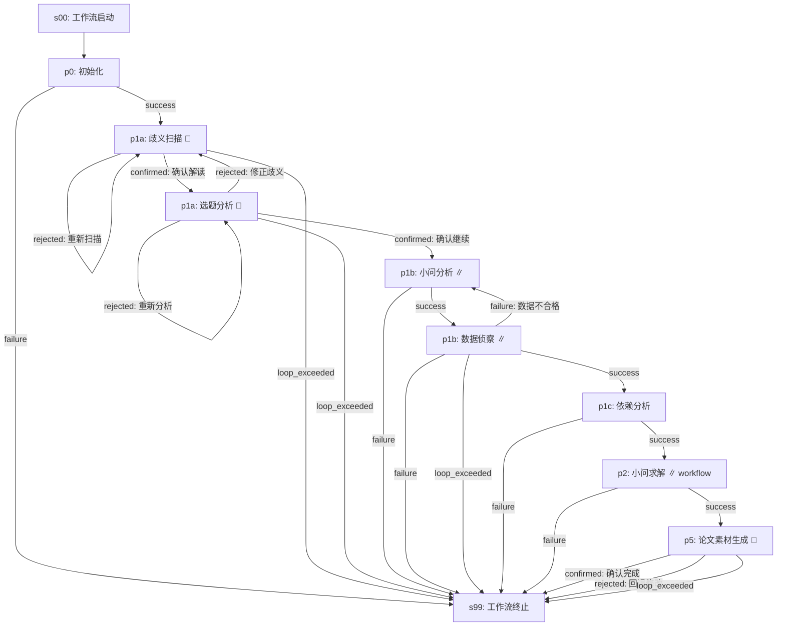

# 数学建模竞赛工作流 (mathematical-model@3.0.0)

## 概览

| 属性 | 值 |
|------|-----|
| 工作流 ID | `mathematical-model` |
| 版本 | `3.0.0` |
| 业务 Stage 数 | 8 |
| 确认点数 | 3（p1a-ambiguity-scan, p1a-topic-analysis, p5-paper-materializer） |
| 并发上限 | 6 |
| 子工作流 | `question-solution@1.0.0`（per-question fan-out, max 6 实例） |
| 适用场景 | 数学建模竞赛（多小问、跨小问依赖、需双层对抗审查） |

### v3.0.0 核心变更

与 v2.3.0 相比的架构变更：

1. **子工作流架构**：将原 p2→p3→p4 的 6 级 `parallel.source` 链条（per-question）整体抽取为子工作流 `question-solution@1.0.0`，消除多实例 source 的 fan-out 坍缩问题。
2. **独立 worktree 隔离**：每个子工作流实例在独立 git worktree 中运行，从父 worktree HEAD 继承 `GLOBAL_SHARED/` 和已完成 `problem_N/` 目录，产物 merge 回父。
3. **确认点透传**：子工作流内的确认点（s01 方案锁定、s06 验证确认）通过 `wfctl status` 的 `child_instance` 字段透传到父工作流面板。
4. **跨小问软依赖**：子工作流 s01 启动时检查上游依赖小问的产物文件是否存在，不存在则等待（不阻塞其他小问）。

## 流程图

> 注：`∥` 表示该 stage 以 parallel 模式运行（多实例 fan-out）。`🔔` 表示确认点。`workflow` 表示该 stage 运行子工作流。

## Stage 说明

### s00-workflow-start — 工作流启动
- **类型**：虚拟节点
- **目的**：工作流入口，触发调度器启动
- **输入**：用户指令
- **输出**：触发 p0-init

### s99-workflow-end — 工作流终止
- **类型**：虚拟节点
- **目的**：工作流出口，所有正常/异常终止路径汇聚于此

### p0-init — 初始化
- **Skill**：`init`
- **确认点**：否
- **目的**：创建 workspace 目录结构、读取赛题 PDF、初始化 GLOBAL_SHARED/ 上下文
- **输入**：用户提供的赛题文件路径
- **输出**：`workspace/` 目录树、`GLOBAL_SHARED/` 全局共享数据

### p1a-ambiguity-scan — 歧义扫描
- **Skill**：`topic-analyst`
- **确认点**：是
- **目的**：扫描赛题中的歧义术语，提出歧义解读方向供人工确认
- **输入**：赛题 PDF 内容
- **输出**：歧义清单 + 候选解读方向
- **确认选项**：
  - **确认解读** → 进入选题分析
  - **重新扫描**（max_loop: 2）→ 重新执行扫描

### p1a-topic-analysis — 选题分析
- **Skill**：`topic-analyst`
- **确认点**：是
- **目的**：分析所有候选赛题的可行性、难度、数据可得性，推荐最佳选题。若赛题含多个可选题目，为每个题目产出独立分析文件 `P1a-选题分析_题X.md`。
- **输入**：歧义扫描结果
- **输出**：选题分析报告 + 推荐选题 + 各题独立分析文件（per-question）
- **确认选项**：
  - **确认继续** → 用户选定题目后进入小问分析（并行 fan-out，实例数由用户选定的题目数决定）
  - **重新分析**（max_loop: 2）→ 重新分析
  - **修正歧义** → 回退到歧义扫描重新解读
- **aggregation: all** — 确认继续时等待所有并行实例完成
- **并行拆分语义**：用户确认选题后，由编排器根据选定的小问列表驱动 p1b 的 per-question 并行拆分（而非从 p1a 产出文件自动解析）。p1a 的 per-question 分析文件提供选题依据，并行目标由用户在确认点显式指定。

### p1b-problem-analysis — 小问分析
- **Skill**：`problem-decomposer`
- **确认点**：否
- **并发**：`parallel { source: p1a-topic-analysis, max_instances: 6 }`
- **目的**：逐小问分析问题结构、识别数学子问题、拆解解题路径
- **输入**：选题分析结果
- **输出**：per-question 问题分析文档
- **aggregation: all** — 全部小问分析完成后才进入数据侦察

### p1b-data-exploration — 数据侦察
- **Skill**：`data-scout`
- **确认点**：否，retry: 1
- **并发**：`parallel { source: p1b-problem-analysis, max_instances: 6 }`
- **目的**：逐小问扫描和评估可用数据质量，识别数据缺口
- **输入**：问题分析结果
- **输出**：per-question 数据侦察报告
- **失败回退**：数据不合格 → 回退到 p1b-problem-analysis 重新分析（max_loop: 2）；其他失败（基础设施错误等）→ 终止工作流

### p1c-dependency-analysis — 依赖分析
- **Skill**：`dependency-analyst`
- **确认点**：否
- **目的**：分析跨小问依赖关系（顺序依赖、数据依赖、结果依赖），生成有向无环图
- **输入**：所有小问的分析结果 + 数据侦察报告
- **输出**：依赖图、求解顺序建议、跨小问约束清单

### p2-question-solution — 小问求解
- **子工作流**：`question-solution@1.0.0`
- **确认点**：否（确认点在子工作流内部）
- **并发**：`parallel { source: p1c-dependency-analysis, max_instances: 6 }`
- **目的**：每个小问独立运行完整求解流程（方案设计→对抗审查→建模→编码→验证→对抗审查）
- **输入**：p1c 依赖分析结果 + 对应小问的问题分析 + 数据侦察报告
- **输出**：per-question 完整求解产物（方案文档、模型、代码、验证报告）
- **aggregation: all** — 全部子实例完成后汇聚到 p5
- **隔离机制**：每个实例在独立 git worktree 中运行，产物通过 merge 合并回父 worktree

### p5-paper-materializer — 论文素材生成
- **Skill**：`paper-materializer`
- **确认点**：是
- **目的**：收集全部小问求解产物，生成为论文排版准备的素材包（图表、公式、文字段落）
- **输入**：全部小问的求解结果
- **输出**：论文素材集合
- **确认选项**：
  - **确认完成** → 工作流结束
  - **回退修改**（max_loop: 1）→ 终止

## 技能清单

| Skill ID | 使用 Stage | 实例数 | 确认点 |
|----------|-----------|--------|--------|
| `init` | p0-init | 1 | 否 |
| `topic-analyst` | p1a-ambiguity-scan | 1 | 是 |
| `topic-analyst` | p1a-topic-analysis | 1 | 是 |
| `problem-decomposer` | p1b-problem-analysis | 1~6 | 否 |
| `data-scout` | p1b-data-exploration | 1~6 | 否 |
| `dependency-analyst` | p1c-dependency-analysis | 1 | 否 |
| `paper-materializer` | p5-paper-materializer | 1 | 是 |
| *(子工作流)* | p2-question-solution | 1~6 | 透传 |

> 子工作流 `question-solution@1.0.0` 内部使用 5 个 Skill：`model-architect`、`scheme-reviewer`、`math-modeler`、`code-builder`（2 次）、`quality-inspector`、`validation-reviewer`。

## 循环机制说明

| 循环 | Stage | 触发条件 | 回退目标 | 最大循环次数 |
|------|-------|---------|---------|-------------|
| 歧义重扫 | p1a-ambiguity-scan | rejected | p1a-ambiguity-scan（自身） | 2 |
| 选题重分析 | p1a-topic-analysis | rejected: 重新分析 | p1a-topic-analysis（自身） | 2 |
| 修正歧义 | p1a-topic-analysis | rejected: 修正歧义 | p1a-ambiguity-scan | — |
| 数据不合格 | p1b-data-exploration | failure: 数据不合格 | p1b-problem-analysis | 2 |
| 数据侦察通用失败 | p1b-data-exploration | failure | s99（终止） | — |
| 回退修改 | p5-paper-materializer | rejected | s99（终止） | 1 |

> 子工作流内部循环（方案重设计、调参修复、假设修正、对抗审查致命缺陷回退等）见 `child-WORKFLOW.md`。

## 并发规则

| 并发 Stage | source Stage | 最大实例数 | 实例标识 |
|-----------|-------------|-----------|---------|
| p1b-problem-analysis | p1a-topic-analysis | 6 | per-question |
| p1b-data-exploration | p1b-problem-analysis | 6 | per-question |
| p2-question-solution | p1c-dependency-analysis | 6 | per-question |

- **实例数确定**：由用户在 p1a-topic-analysis 确认点选定的小问数量动态决定，上限 6。若赛题仅一道，则平行 stage 以单实例模式运行。
- **aggregation 规则**：所有并行汇聚边（`aggregation: all`）等待全部实例完成。
- **故障隔离**：p1b-problem-analysis 单个实例失败 → 全局 failure → s99；p1b-data-exploration 单个实例 failure → 触发循环回退；p2-question-solution 单个子实例失败 → 全局 failure → s99。
- **子工作流内部无并行**：子工作流内所有 Stage 串行执行（`max_parallel_agents: 1`）。

## 确认点汇总

1. **p1a-ambiguity-scan**：确认歧义解读方向。rejected → 重扫（最多 2 次）。
2. **p1a-topic-analysis**：确认选题。双 rejected 路由："重新分析"（自身循环）或"修正歧义"（回退 p1a）。
3. **p5-paper-materializer**：确认论文素材。rejected → 回退修改（最多 1 次）。

> 子工作流内部还有 2 个确认点（s01 方案锁定、s06 验证确认），通过 wfctl child_instance 状态透传。
