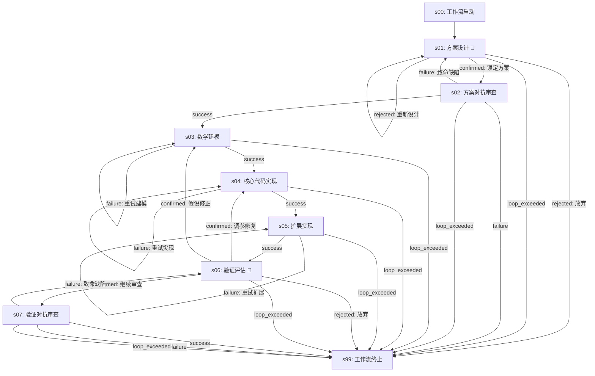

# 单小问求解子工作流 (question-solution@1.0.0)

## 概览

| 属性 | 值 |
|------|-----|
| 工作流 ID | `question-solution` |
| 版本 | `1.0.0` |
| 业务 Stage 数 | 7 |
| 确认点数 | 2（s01 方案锁定、s06 验证确认） |
| 并发上限 | 1（子工作流内部串行） |
| 父工作流 | `mathematical-model@3.0.0` |
| 适用场景 | 数学建模竞赛中单个子问题的完整求解 |

### v1.0.0 设计要点

1. **双层对抗审查**：s02 对方案做对抗性审查，s07 对验证结果做对抗性审查，形成前后双层防御。
2. **多级回退路径**：验证阶段（s06）提供三条路由：继续前进（→ s07）、调参修复（→ s04）、假设修正（→ s03），覆盖从代码层到建模层的修复范围。
3. **自动重试**：s03 数学建模、s04 核心代码、s05 扩展实现均支持 1 次自动重试，减少人工介入。
4. **独立 worktree 隔离**：在父工作流为每个小问创建的独立 git worktree 中运行，避免并行实例间文件冲突。

## 流程图



> 注：`🔔` 表示确认点。实线表示正常前进，虚线（回退边）表示循环/修复路径。

## Stage 说明

### s00-workflow-start — 工作流启动
- **类型**：虚拟节点
- **目的**：子工作流入口。从父工作流 worktree 继承环境（GLOBAL_SHARED/ + 上游 problem_N/ 产物），启动跨小问软依赖检查。
- **输入**：父 worktree 的 HEAD 快照
- **输出**：触发 s01-scheme-design

### s99-workflow-end — 工作流终止
- **类型**：虚拟节点
- **目的**：子工作流出口。产物通过 git merge 合并回父 worktree。

### s01-scheme-design — 方案设计
- **Skill**：`model-architect`
- **确认点**：是
- **目的**：为该小问设计求解方案，包括模型选型、算法路线、数据需求、预期输出
- **输入**：问题分析文档、数据侦察报告、依赖分析结果、上游小问产物文件（软依赖）
- **输出**：方案设计文档（含备选方案对比）
- **确认选项**：
  - **锁定方案** → 进入方案对抗审查
  - **重新设计**（max_loop: 2）→ 重新设计
  - **放弃** → 终止子工作流
- **软依赖**：启动时检查上游依赖小问的产物文件，不存在则 `AWAITING_CONFIRM` 等待或降级为不考虑依赖的独立方案

### s02-adversarial-review — 方案对抗审查
- **Skill**：`scheme-reviewer`
- **确认点**：否
- **目的**：以对抗视角审查方案设计的合理性、完整性、可行性。检查数学假设的严谨性、算法选择的适用性、数据需求的满足性。
- **输入**：方案设计文档
- **输出**：审查报告（含缺陷分类：致命/严重/轻微）
- **aggregation: all** — 等待审查完全结束后前进
- **失败回退**：致命缺陷 → 回退到 s01 重新设计（max_loop: 3）；非致命缺陷（基础设施错误等）→ 终止子工作流

### s03-math-modeling — 数学建模
- **Skill**：`math-modeler`
- **确认点**：否，retry: 1
- **目的**：将方案转化为严格的数学模型。推导公式、建立约束条件、定义目标函数、选择合适的求解算法。
- **输入**：通过审查的方案设计文档
- **输出**：数学模型文档（含公式推导、算法伪代码）
- **失败回退**：自动重试 → 自身（max_loop: 2，含 1 次自动重试）。重试耗尽后直接终止子工作流——数学建模失败表示核心能力不足，不应无限循环。

### s04-code-core — 核心代码实现
- **Skill**：`code-builder`
- **确认点**：否，retry: 1
- **目的**：实现模型的核心求解代码。注重正确性和可复现性。
- **输入**：数学模型文档
- **输出**：核心代码 + 单元测试
- **失败回退**：自动重试 → 自身（max_loop: 2）。重试耗尽后直接终止子工作流——代码实现失败表示模型无法被正确编码，不应无限循环。

### s05-code-extension — 扩展实现
- **Skill**：`code-builder`
- **确认点**：否，retry: 1
- **目的**：扩展代码功能（敏感性分析、可视化、边界条件处理、批量运行等）
- **输入**：核心代码
- **输出**：扩展代码 + 分析脚本
- **失败回退**：自动重试 → 自身（max_loop: 2）。重试耗尽后直接终止子工作流——扩展实现失败不应无限循环。

### s06-validation — 验证评估
- **Skill**：`quality-inspector`
- **确认点**：是，retry: 1
- **目的**：运行代码、生成结果、评估质量。产出验证报告（含指标、图表、缺陷清单）
- **输入**：核心代码 + 扩展代码 + 数学模型
- **输出**：验证报告、运行结果、质量评分
- **确认选项（四选一）**：
  - **继续审查** → 进入验证对抗审查（正常前进）
  - **调参修复**（max_loop: 3, loop_counter: s06）→ 回退到 s04 调整实现参数
  - **假设修正**（max_loop: 3, loop_counter: s06）→ 回退到 s03 修正模型假设
  - **放弃** → 终止子工作流
- **loop_exceeded** → 所有修复路径耗尽，子工作流终止

### s07-adversarial-review — 验证对抗审查
- **Skill**：`validation-reviewer`
- **确认点**：否
- **目的**：以对抗视角审查验证结果的完整性和可信度。检查是否有遗漏的验证维度、结果是否存在过拟合、图表是否误导等。
- **输入**：验证报告
- **输出**：验证审查报告 + 通过/不通过结论
- **aggregation: all** — 审查完成后汇聚
- **失败回退**：致命缺陷 → 回退到 s06 重新验证（max_loop: 3）；非致命缺陷（基础设施错误等）→ 终止子工作流

## 技能清单

| Skill ID | 使用 Stage | 确认点 |
|----------|-----------|--------|
| `model-architect` | s01-scheme-design | 是 |
| `scheme-reviewer` | s02-adversarial-review | 否 |
| `math-modeler` | s03-math-modeling | 否 |
| `code-builder` | s04-code-core | 否 |
| `code-builder` | s05-code-extension | 否 |
| `quality-inspector` | s06-validation | 是 |
| `validation-reviewer` | s07-adversarial-review | 否 |

> 注意：`code-builder` 在两处使用（核心实现 + 扩展实现），通过不同的 stage context（前序产物、任务描述）区分行为。

## 循环机制说明

| 循环 | Stage | 触发条件 | 回退目标 | 最大循环次数 |
|------|-------|---------|---------|-------------|
| 方案重设计 | s01 | rejected: 重新设计 | s01（自身） | 2 |
| 方案放弃 | s01 | rejected: 放弃 | s99（终止） | — |
| 方案致命缺陷 | s02 | failure: 致命缺陷 | s01 | 3 |
| 方案通用失败 | s02 | failure | s99（终止） | — |
| 建模重试 | s03 | failure | s03（自身） | 2（含 1 次自动） |
| 核心代码重试 | s04 | failure | s04（自身） | 2（含 1 次自动） |
| 扩展代码重试 | s05 | failure | s05（自身） | 2（含 1 次自动） |
| 调参修复 | s06 | confirmed: 调参修复 | s04 | 3（s06 计数） |
| 假设修正 | s06 | confirmed: 假设修正 | s03 | 3（s06 计数） |
| 验证放弃 | s06 | rejected: 放弃 | s99（终止） | — |
| 验证致命缺陷 | s07 | failure: 致命缺陷 | s06 | 3 |
| 验证通用失败 | s07 | failure | s99（终止） | — |

### 循环计数策略

- **s01~s05 的自循环**：每次 re-trigger 该 stage 即计数。loop_exceeded 直接终止子工作流。
- **s06 的调参/修正循环**：使用 `loop_counter_stage: s06-validation`，即不论回退到 s04 还是 s03，均在 s06 层面统一计数。用户每次在 s06 选择修复路径都消耗一次循环配额。当累计达到 max_loop 时触发 loop_exceeded。

### 自动重试 vs 手动循环

- **自动重试**（retry=1）：s03、s04、s05 的第一次 failure 自动重试，不消耗 max_loop 配额。仅第二次及以后的 failure 才计入循环计数。
- **手动循环**：确认点（s01 rejected、s06 confirmed 修复选择）均为手动触发，每次消耗 max_loop 配额。
- **重试耗尽即终止**：s03、s04、s05 的 failure 路径不设回退到上游 Stage 的边。这是设计意图——数学建模和代码实现属于核心执行能力，若自动重试+手动重试全部耗尽仍失败，说明当前方案存在根本性缺陷，继续回退上游也无法解决，应终止实例由用户重新评估方案方向。s06 的两条修复路径（调参修复→s04、假设修正→s03）提供了从验证阶段回退到建模/编码的上游通道，覆盖了"发现问题后回到上游修复"的合法场景。

## 并发规则

子工作流内部无并行（`max_parallel_agents: 1`），所有 Stage 严格串行执行。并行能力由父工作流的 `p2-question-solution` Stage 通过 `parallel { max_instances: 6 }` 提供——同一时刻最多 6 个子工作流实例并发运行，每个实例内部串行。

## 子工作流生命周期

```
父 p1c-dependency-analysis 完成
  └→ 父工作流引擎为每个小问创建子 worktree
     └→ 每个 worktree 独立运行 question-solution@1.0.0
        ├→ 实例正常完成 → git merge 产物到父 worktree
        ├→ 实例 FAILED → 父 stage 标记失败 → 父 failure 路由
        └→ 实例 loop_exceeded → 子 s99 → 父对应实例标记失败
  └→ aggregation: all 等待全部实例完成
     └→ 汇聚到父 p5-paper-materializer
```

## 确认点汇总

1. **s01-scheme-design**：锁定方案 / 重新设计 / 放弃。rejected → 重新设计（最多 2 次）或直接放弃。
2. **s06-validation**：四选一 — 继续审查（前进）、调参修复（回退至代码实现）、假设修正（回退至数学建模）、放弃（终止）。两个修复路径共享 loop_counter（共 3 次机会）。

> 子工作流确认点通过父 `wfctl status` 的 `child_instance` 字段透传，用户可以在父工作流面板中直接操作子实例确认。
