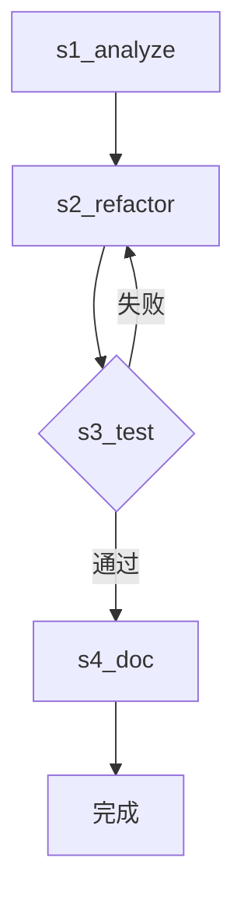

> **v1.0（已归档）** —— 以 `workflow规范v2.md` 为准。本文件保留供历史参考。
>
> v1.0 中工作流 Reference 为单文件（`.claude/workflows/<id>@<version>.md`，Markdown 内嵌 YAML）。
> v2 已拆分为 `WORKFLOW.md` + `WORKFLOW.yaml` 双文件，见新规范。

# **Workflow 规范完整版 v1.0.0**

---

## 1. 文件体系

```
.agent/
├── references/
│   └── workflows/
│       └── <workflow_id>@<version>.md      # Reference（Markdown + YAML）
├── workflows/
│   ├── instances/
│   │   └── <instance_id>.json              # Instance 状态机
│   └── registry.json                        # 活跃实例索引
└── scripts/
    └── validate_instance.py                 # Instance 检测脚本
```

---

## 2. Reference 工作流规范

### 2.1 文件路径
`.agent/references/workflows/<workflow_id>@<version>.md`

### 2.2 格式
Markdown 为主，嵌入式 YAML 块为机器规范。Mermaid 图供人类阅读，机器以 YAML 块为准。

### 2.3 完整模板

```markdown
# <工作流名称>

## 概览
- 目标：<一句话描述>
- 并发上限：<N> 个 Agent

## 流程图


## 机器规范
```yaml
schema_version: "1.0.0"
workflow_id: "refactor-pipeline"
version: "1.2.0"
description: "模块重构标准工作流"

stages:
  - stage_id: s1_analyze
    name: "依赖分析"
    skill_id: analyze-deps
    mandatory: true
    confirmation_point: false
    retry_policy:
      max_attempts: 1
      on: []
    description: "分析目标模块的依赖关系"

  - stage_id: s2_refactor
    name: "代码重构"
    skill_id: refactor-module
    mandatory: true
    confirmation_point: true
    retry_policy:
      max_attempts: 1
      on: []
    description: "执行代码重构，需用户确认关键变更"

  - stage_id: s3_test
    name: "测试验证"
    skill_id: run-tests
    mandatory: true
    confirmation_point: false
    retry_policy:
      max_attempts: 2
      on: [timeout, error]
    description: "运行测试套件验证重构正确性"

  - stage_id: s4_doc
    name: "文档更新"
    skill_id: update-docs
    mandatory: false
    confirmation_point: false
    retry_policy:
      max_attempts: 1
      on: []
    description: "同步更新相关文档"

edges:
  - from: s1_analyze
    to: s2_refactor
    condition: always

  - from: s2_refactor
    to: s3_test
    condition: always

  - from: s3_test
    to: s4_doc
    condition: success

  - from: s3_test
    to: s2_refactor
    condition: failure
    max_loop: 3
    loop_counter_stage: s3_test

  - from: s3_test
    to: s_error_handler
    condition: loop_exceeded

concurrency_rules:
  max_parallel_agents: 4
  allowed_parallel_stages:
    - [s3_test, s4_doc]
  resource_conflict_check: true

conflict_resolution:
  user_override_requires_confirm: true
  mandatory_stage_skip_forbidden: true
  report_deviation_required: true

git_anchors:
  enabled: true
  tag_prefix: "wf"
  preserve_paths:
    - ".agent/"
```

### 2.4 字段约束

| 字段 | 类型 | 约束 |
|------|------|------|
| `workflow_id` | `string` | 与文件名 `<workflow_id>` 严格一致 |
| `version` | `string` | 语义化版本，与文件名 `@<version>` 严格一致 |
| `stages[].stage_id` | `string` | 全局唯一，kebab-case |
| `stages[].skill_id` | `string` | 必须存在于 `.agent/skills/` |
| `stages[].mandatory` | `boolean` | `true` 时不可被用户跳过 |
| `stages[].confirmation_point` | `boolean` | `true` 时该 stage 结束后必须触发 AskUserQuestion |
| `stages[].retry_policy.max_attempts` | `integer` | ≥ 1，默认 1（不重试） |
| `stages[].retry_policy.on` | `string[]` | 触发重试的条件：`timeout`, `error` |
| `edges[].from` / `to` | `string` | 必须存在于 `stages[].stage_id` |
| `edges[].condition` | `string` | 枚举：`always`, `success`, `failure`, `confirmed`, `rejected`, `loop_exceeded` |
| `edges[].max_loop` | `integer` | `condition=failure/success` 回跳时必填，≥ 1 |
| `edges[].loop_counter_stage` | `string` | 记录循环次数的 stage，通常等于 `from` |
| `concurrency_rules.allowed_parallel_stages` | `string[][]` | 每组内的 stage 可并发执行 |
| `git_anchors.enabled` | `boolean` | 是否自动打 git tag 锚点 |
| `git_anchors.preserve_paths` | `string[]` | 回退时不随 git 回退的目录 |

### 2.5 Edge 条件语义

| 条件 | 触发场景 |
|------|---------|
| `always` | stage 完成后无条件流转 |
| `success` | SubAgent 上报 `status=DONE` |
| `failure` | SubAgent 上报 `status=ERROR` 或测试未通过等 |
| `confirmed` | `confirmation_point=true` 且用户选择"确认" |
| `rejected` | `confirmation_point=true` 且用户选择"拒绝/跳过" |
| `loop_exceeded` | 循环次数达到 `max_loop` |

---

## 3. Workflow 实例状态机规范

### 3.1 文件路径
`.agent/workflows/instances/<instance_id>.json`

### 3.2 字段定义

```json
{
  "schema_version": "1.0.0",
  "instance_id": "wf-001",
  "reference": {
    "workflow_id": "refactor-pipeline",
    "version": "1.2.0",
    "snapshot_hash": "sha256:abc123..."
  },
  "status": "EXECUTING",
  "created_at": "2026-05-09T10:00:00+08:00",
  "updated_at": "2026-05-09T11:00:00+08:00",
  "current_stage": "s2_refactor",
  "stages": [
    {
      "stage_id": "s1_analyze",
      "status": "DONE",
      "skill_id": "analyze-deps",
      "assigned_agent_id": "agent-analyze-01",
      "input_message_ids": ["20260509-001-x2a1"],
      "output_message_id": "20260509-002-b4e1",
      "history_message_ids": ["20260509-002-b4e1"],
      "git_anchor_tag": "wf-001-s1_analyze-20260509-002-b4e1-pre",
      "start_time": "2026-05-09T10:05:00+08:00",
      "end_time": "2026-05-09T10:20:00+08:00",
      "deviation_flag": false,
      "blocked_by_confirm": false,
      "loop_counter": 0
    },
    {
      "stage_id": "s2_refactor",
      "status": "RUNNING",
      "skill_id": "refactor-module",
      "assigned_agent_id": "agent-refactor-01",
      "input_message_ids": ["20260509-002-b4e1"],
      "output_message_id": null,
      "history_message_ids": [],
      "git_anchor_tag": "wf-001-s2_refactor-20260509-003-a7f3-pre",
      "start_time": "2026-05-09T10:25:00+08:00",
      "end_time": null,
      "deviation_flag": false,
      "blocked_by_confirm": false,
      "loop_counter": 0
    }
  ],
  "pending_confirmations": [],
  "deviation_log": [],
  "execution_summary": {
    "completed_stages": 1,
    "total_stages": 4,
    "active_agents": 1,
    "last_message_id": "20260509-003-a7f3",
    "total_loops": 0
  }
}
```

### 3.3 关键字段约束

| 字段 | 类型 | 约束 |
|------|------|------|
| `status` | `enum` | `PLANNING` / `EXECUTING` / `SUSPENDED` / `COMPLETED` / `FAILED` / `CANCELLED` |
| `reference.snapshot_hash` | `string` | 绑定 Reference 时的 SHA256 哈希，防止漂移 |
| `stages[].status` | `enum` | `PENDING` / `RUNNING` / `BLOCKED` / `DONE` / `ERROR` / `SKIPPED` / `CANCELLED` / `SUPERSEDED` |
| `stages[].output_message_id` | `string` | 当前生效的 message，可为 null |
| `stages[].history_message_ids` | `string[]` | 该 stage 所有历史 message（含被回退的），按时间顺序 |
| `stages[].git_anchor_tag` | `string` | 该 stage 开始前的 git tag，回退锚点 |
| `stages[].loop_counter` | `integer` | 当前循环次数，从 0 开始 |
| `stages[].blocked_by_confirm` | `boolean` | 是否因等待确认而阻塞 |
| `pending_confirmations` | `string[]` | 当前 `PENDING_CONFIRM` 的 message_id 列表 |
| `deviation_log` | `object[]` | 偏差记录，见 3.4 |

### 3.4 偏差记录（Deviation Log）

```json
{
  "timestamp": "2026-05-09T10:45:00+08:00",
  "type": "USER_OVERRIDE",
  "reason": "用户要求跳过 s3_test 测试验证阶段",
  "user_confirmed": true,
  "original_stage_id": "s3_test",
  "impact_stages": ["s4_doc"],
  "resolution": "编排器已记录偏差，继续执行 s4_doc，测试责任由用户承担",
  "reported_in_summary": true
}
```

**type 枚举**：`USER_OVERRIDE` / `USER_ROLLBACK` / `SKILL_FAILURE` / `TIMEOUT` / `RESOURCE_CONFLICT` / `MANUAL_ADJUSTMENT` / `LOOP_EXCEEDED`

---

## 4. Registry 注册表规范

```json
{
  "schema_version": "1.0.0",
  "last_updated": "2026-05-09T11:00:00+08:00",
  "active_instances": [
    {
      "instance_id": "wf-001",
      "status": "EXECUTING",
      "current_stage": "s2_refactor",
      "reference": "refactor-pipeline@v1.2.0",
      "last_message": "20260509-003-a7f3",
      "pending_confirmations": 1,
      "active_agents": 1
    }
  ],
  "suspended_instances": [],
  "completed_today": [],
  "failed_instances": []
}
```

---

## 5. Git 锚点与回退机制

### 5.1 锚点创建

每个 stage 的 SubAgent **开始执行前**，编排器自动执行：

```bash
git tag -a wf-<instance_id>-<stage_id>-<message_id>-pre -m "Anchor before stage <stage_id> of <instance_id>"
```

### 5.2 回退操作

当需要回退到 stage `s_target` 时：

1. **保存当前 `.agent/` 状态**：
   ```bash
   cp -r .agent /tmp/.agent-backup-<instance_id>
   ```

2. **回退业务代码**（保留 `.agent/`）：
   ```bash
   git checkout wf-<instance_id>-<s_target>-<msg>-pre -- .
   ```

3. **恢复 `.agent/`**：
   ```bash
   rm -rf .agent && mv /tmp/.agent-backup-<instance_id> .agent
   ```

4. **重置 Instance 状态机**：
   - `s_target` 及之后所有 stage 的 `status` 重置为 `PENDING`；
   - `s_target` 的 `output_message_id` 置 null，`history_message_ids` 保留；
   - 依赖 `s_target` 的并发活跃 stage 标记为 `CANCELLED`；
   - `current_stage` 指向 `s_target`。

5. **生成新 message**：SubAgent 重新执行时创建全新 message，旧 message 保留在 `history_message_ids` 中。

### 5.3 用户驱动回退

编排器在每次 AskUserQuestion 的选项中**固定提供**：
- `{"label": "确认继续", ...}`
- `{"label": "回退到上一阶段重新执行", ...}`
- `{"label": "取消工作流", ...}`

此外，编排器持续监听用户自然语言。若识别出回退意图（如"回到上一步"、"重新做 s2"）：
1. 提取目标 stage（如未明确，默认为 `current_stage` 的前置 stage）；
2. 通过 AskUserQuestion 向用户确认："检测到回退意图，是否回退到 stage `<target>`？";
3. 用户严格确认后，执行 5.2 的回退操作。

---

## 6. 状态流转

### 6.1 Stage 状态流转

```
PENDING → RUNNING → DONE
   ↓        ↓        ↓
BLOCKED  ERROR    SKIPPED
   ↑        ↓
   └──── CANCELLED
```

- **PENDING → RUNNING**：前置 `depends_on` 全部 `DONE`，无资源冲突，编排器调度。
- **RUNNING → BLOCKED**：SubAgent 上报 `PENDING_CONFIRM`。
- **BLOCKED → RUNNING**：用户确认，编排器恢复 SubAgent。
- **RUNNING → DONE**：SubAgent 上报 `DONE`。
- **任意 → CANCELLED**：回退时强制取消依赖该 stage 的并发任务。
- **任意 → SUPERSEDED**：回退后，原 `DONE` 的 stage 被新执行覆盖，旧记录标记为 `SUPERSEDED`。

### 6.2 Instance 状态流转

```
PLANNING → EXECUTING → COMPLETED
              ↓            ↓
          SUSPENDED      FAILED
              ↓
          CANCELLED
```

- **SUSPENDED**：存在未处理的 `PENDING_CONFIRM`、用户指令冲突等待仲裁、或回退确认等待中。

---

## 7. 循环机制

### 7.1 Stage 重试（Skill 内部失败）
在 stage 定义中配置，不体现在 `edges`：
```yaml
retry_policy:
  max_attempts: 3
  on: [timeout, error]
```
编排器在 SubAgent 上报 `ERROR` 且 `attempt_count < max_attempts` 时，原地重启同一 stage，不修改 `loop_counter`。

### 7.2 Workflow 循环（图跳转）
在 `edges` 中配置：
```yaml
- from: s3_test
  to: s2_refactor
  condition: failure
  max_loop: 3
  loop_counter_stage: s3_test
```
每次触发该 edge 时，`loop_counter_stage` 对应的 `loop_counter` +1。达到 `max_loop` 后，改走 `condition: loop_exceeded` 的 edge。

### 7.3 Skill 内部循环
不暴露给 Workflow 层，由 Skill 自行处理，对外只上报一次 `DONE` 或 `ERROR`。

---

## 8. `validate_instance.py` 规范

### 8.1 路径
`.agent/scripts/validate_instance.py`

### 8.2 调用接口
```bash
python .agent/scripts/validate_instance.py \
  --instance <instance_id> \
  [--strict]  # 严格模式：检查 git tag 存在性
```

### 8.3 校验项

| 类别 | 校验内容 |
|------|---------|
| **语法** | JSON 格式合法，字段类型匹配 |
| **引用完整性** | `reference.workflow_id@version` 文件存在于 `.agent/references/workflows/` |
| **版本一致性** | `reference.snapshot_hash` 与当前 Reference 文件内容哈希匹配 |
| **Stage 合法性** | 所有 `stages[].stage_id` 存在于绑定的 Reference 中 |
| **Message 存在性** | `output_message_id` 和 `history_message_ids` 指向的 message 文件存在于 `.agent/messages/` |
| **Git 锚点** | `status=DONE` 或 `RUNNING` 的 stage，`git_anchor_tag` 必须在 `git tag -l` 中存在 |
| **状态流转** | 不允许 `DONE` → `PENDING` 除非 `metadata.rolled_back_at` 存在 |
| **循环计数器** | `loop_counter` ≤ Reference 中对应 edge 的 `max_loop` |
| **并发一致性** | `active_agents` 数量与 `status=RUNNING` 的 stage 数量一致 |

### 8.4 返回
- **成功**：stdout `{"valid": true}`，退出码 `0`
- **失败**：stdout `{"valid": false, "errors": [...]}`，退出码 `1`

---

## 9. 编排器调度核心逻辑（伪代码）

```python
while True:
    # 1. 扫描 Registry 发现活跃实例
    for instance in registry.active_instances:
        # 2. 读取 Instance
        state = load_instance(instance.instance_id)
        
        # 3. 校验（安全网）
        if not validate_instance(state):
            mark_failed(instance)
            continue
        
        # 4. 处理确认
        for msg_id in state.pending_confirmations:
            msg = load_message(msg_id)
            if msg.status == "PENDING_CONFIRM":
                ask_user_question(msg)  # 映射为 AskUserQuestion 格式
                update_instance_status(state, msg_id, "AWAITING_USER")
        
        # 5. 处理用户意图（自然语言回退识别）
        if detect_rollback_intent(user_input):
            target = extract_target_stage(user_input, state)
            ask_user_question_rollback_confirm(target)
        
        # 6. 调度就绪 stage
        for stage in state.stages:
            if stage.status == "PENDING" and dependencies_satisfied(stage):
                if stage.git_anchor_tag is None:
                    create_git_anchor(state.instance_id, stage)
                agent_id = spawn_subagent(stage.skill_id, stage)
                update_instance_stage(state, stage.stage_id, "RUNNING", agent_id)
        
        # 7. 处理完成 message
        for stage in state.stages:
            if stage.status == "RUNNING":
                msg = load_message(stage.output_message_id)
                if msg.status == "DONE":
                    update_instance_stage(state, stage.stage_id, "DONE")
                    unlock_downstream(state)
                elif msg.status == "ERROR":
                    handle_error(state, stage, msg)
                elif msg.status == "PENDING_CONFIRM":
                    add_pending_confirmation(state, msg.message_id)
        
        # 8. 保存 Instance
        save_instance(state)
    
    sleep(POLL_INTERVAL)
```

---

## 10. 与 Message 规范的衔接

- Instance 的 `stages[].output_message_id` 必须指向 `.agent/messages/` 下存在的 message。
- `pending_confirmations` 由编排器根据 Message 池中 `status=PENDING_CONFIRM` 且 `workflow_instance_id` 匹配本实例的 message 动态维护。
- 回退时生成新 message，旧 message 保留，`history_message_ids` 追加。
- 编排器轮询时：Registry → Instance → Message，三层级联读取。

