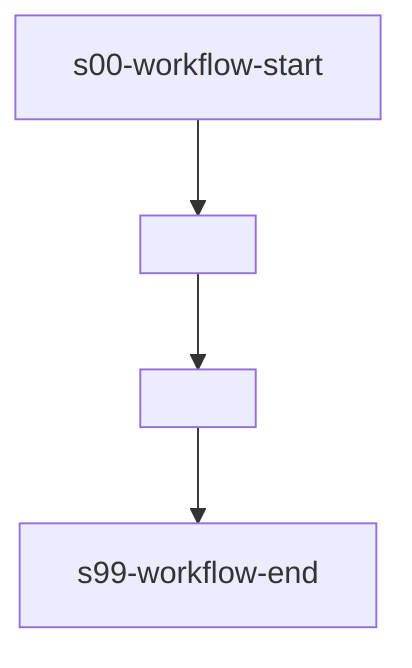

# <name>

> <description>

---

## 工作流概览

- **工作流 ID**：`<workflow-id>`
- **版本**：`<version>`
- **Stage 数量**：N
- **确认点数量**：N
- **最大并发**：N

### 适用场景

<描述什么情况下使用此工作流>

### 流程图

---

## Stage 说明

### s00-workflow-start — 工作流启动
虚拟起始点，无条件流转到下游。

### s01 — <展示名称>
- **目标**：`<skill_id>` 或子工作流 `<workflow-id>@<version>`
- **确认点**：是 / 否
- **描述**：<自然语言描述>

### s99-workflow-end — 工作流终止
虚拟终止点，所有路径汇聚于此。
